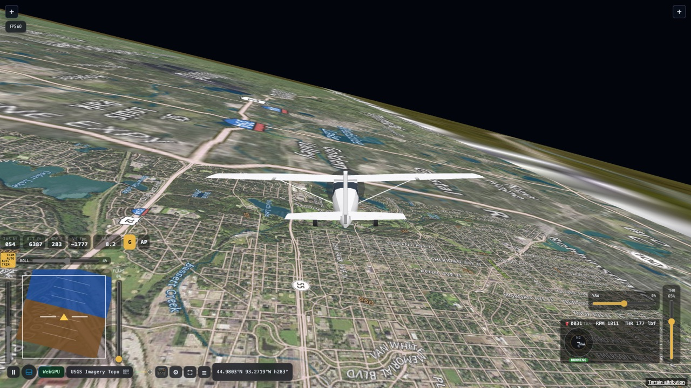
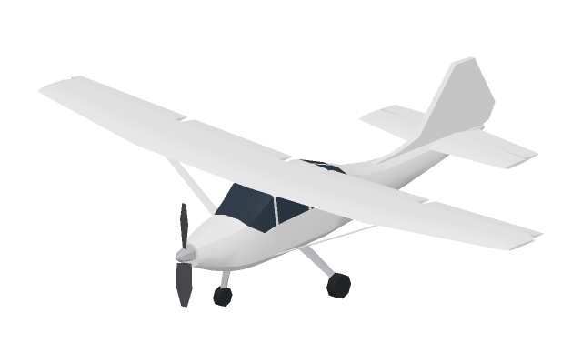
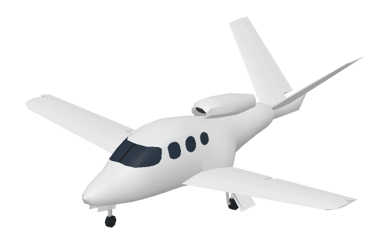

# ✈️ OSFS — Open Source Flight Simulator

**A real-world browser flight simulator built to be explored, extended, and shared.**

[](https://0sfs.github.io/fly/)
[](LICENSE)



### **[→ Start flying](https://0sfs.github.io/fly/)**

There's nothing to install and no account to create. It runs in a browser tab.

OSFS puts Google Photorealistic 3D Tiles beneath your wings and JSBSim in charge of the flight physics.
Bank over a city you recognize and follow the streets below. Change the wind, line up an approach,
and switch to the chase camera to take it all in.

[Run it locally](#run-it-locally) · [How it compares](docs/open-source-competitors.md) · [Documentation](#documentation) · [Issues](https://github.com/0SFS/0SFS.github.io/issues)

## Features

- **Fly over the real world in 3D.** Google Photorealistic 3D Tiles brings detailed cities and terrain into the scene. You can also fly without a Google API key: free raster basemaps drape over streamed elevation.
- **Physics from JSBSim.** The flight dynamics run in WebAssembly at 120 Hz and simulate the aircraft, engine, propeller, fuel and controls.
- **Take off and land on the terrain you see.** The streamed ground is fed to JSBSim's landing gear, and airport presets start you on a runway or on a straight-in approach. See [Ground contact](docs/ground-contact.md).
- **Cockpit or chase camera.** Switch views, orbit around the aircraft, and zoom out to see where you're headed.
- **Set up your next flight.** Reposition from the location panel, choose an airport preset, and set the wind direction and speed.
- **Fly with a keyboard, a controller or your phone.** You can rebind the keyboard and controllers. To fly with your phone, pair it over a QR code and use it as a touch controller; see [Phone controller](docs/phone-controller.md).
- **Autopilot.** An in-sim autopilot handles roll and yaw stabilization, pitch hold and auto-throttle.
- **Engine sound** for the Vision Jet, synthesized in the browser. It stays off until you turn it on in the Sound tab.
- **Built to tinker with.** TypeScript, Babylon.js and the shared FOSS Earth globe runtime put the scenery, controls and simulation within reach.

## Aircraft

|  |  |
| --- | --- |
| **Cessna 172 Skyhawk.** The default aircraft. Its JSBSim flight model and its visual model are both bundled. | **Cirrus Vision Jet.** Available in G1, G2, G2+ and G3 variants from the **Aircraft** tab. They share one development flight model rather than a calibrated one for each generation. |

## Controls

| Input | Action |
| --- | --- |
| `W` / `S` | Pitch |
| `A` / `D` | Roll |
| `Q` / `E` | Yaw / rudder |
| `Shift` / `Control` | Increase / decrease throttle |
| `F` / `R` | Extend / retract flaps |
| `G` | Raise / lower the landing gear |
| `B` | Brake |
| `P` | Pause |
| `V` | Toggle first- and third-person camera |

Throttle and pitch trim are also vertical sliders in the lower-right corner. The gear has a `G`
button in the instrument row above the attitude indicator. In mouse input mode, right-drag to orbit
the chase camera and scroll to zoom. In trackpad mode, scroll to orbit and pinch to zoom.

The **Controls** tab in the flight panel rebinds both the keyboard and a controller. It comes with two
built-in controller profiles, **Xbox** and **Classic**, and you can export your own profiles as JSON and
import them again. Stick response is **Smooth** by default, taking 375 ms to approach a held stick, or
**Direct**. The same tab can invert the chase camera's orbit on either axis. It also chooses whether
the camera holds its angle or returns behind the aircraft when you let go.

Departure presets start paused. Press `P` when you're ready.

## Run it locally

You need Node.js 22 or newer. OSFS depends on [FOSS Earth](https://github.com/foss-earth/foss-earth.github.io)
and [gamepad-tools](https://github.com/Felipegalind0/gamepad-tools) as sibling checkouts, and
gamepad-tools must be built first:

```sh
git clone https://github.com/Felipegalind0/gamepad-tools.git Felipegalind0/gamepad-tools
(cd Felipegalind0/gamepad-tools && npm install && npm run build)
git clone https://github.com/foss-earth/foss-earth.github.io.git foss-earth
git clone https://github.com/0SFS/0SFS.github.io.git 0sfs
cd 0sfs
npm install
npm run dev
```

The simulator is at `/fly/` on the URL Vite prints, for example `http://127.0.0.1:5173/fly/`. To use
Google Photorealistic 3D Tiles, add `?key=YOUR_GOOGLE_MAPS_API_KEY`; to choose a basemap, add
`?mapSource=osm-standard`. JSBSim comes from a tarball in `deps/`, so it needs no separate checkout.
[Development](docs/development.md) covers the folder layout, tests and building your own copy.

## Limits

- OSFS is not a training device. Its flight models are approximations, and the Vision Jet's is a
  development model.
- There is no sky yet: everything above the horizon is black. Weather is wind direction and speed only.
- The world streaming and flight physics work today. The broader simulator is still taking shape.

## The road ahead

- **More aircraft** with matching visual models. The [FlightGear import proposal](docs/proposals/flightgear-aircraft-import.md)
  measures which FlightGear aircraft could be brought over.
- **ArduPilot.** Today the **AP** button beside the gear button engages the in-sim autopilot.
  ArduPilot can already be selected in the Autopilot tab, but it won't fly until a local SITL bridge
  connects, and the sim won't pretend otherwise. The plan keeps JSBSim as the flight model and adds a
  small local bridge to ArduPilot Plane SITL. The first milestone is a C172P that circles in LOITER
  after a manual climb. See the [ArduPilot SITL proposal](docs/proposals/ardupilot-sitl.md).
- **A sky and clouds.** See [the rendering research](docs/proposals/skies.md).

## How it compares

The closest open-source project is [Aeronaut](https://github.com/vinny-palumbo/FlightSim), which
also pairs Google 3D Tiles with JSBSim in WebAssembly. It needs a Google key to fly, however, and
doesn't give JSBSim the ground. [FlightGear](https://www.flightgear.org/) is the reference for depth,
but it is a desktop install. [Open-source competitors](docs/open-source-competitors.md) has the full
tables of browser and desktop simulators.

## Documentation

| Document | What it covers |
| --- | --- |
| [Development](docs/development.md) | Local setup, tests, the FOSS Earth dependency, building your own copy |
| [Deploying to GitHub Pages](docs/deploying.md) | Publishing the live site with one command, `npm run deploy` |
| [Open-source competitors](docs/open-source-competitors.md) | Other open-source flight simulators, and where OSFS stands |
| [Phone controller](docs/phone-controller.md) | Pairing a phone as a touch controller, and its limits |
| [Phone controller UI](docs/phone-controller-ui.md) | How the `/rc/` screen is built and checked |
| [FOSS Earth relationship](docs/foss-earth-relationship.md) | How OSFS and the shared globe runtime divide responsibilities |
| [How JSBSim runs in the browser](docs/jsbsim.md) | The WebAssembly flight dynamics pipeline |
| [Ground contact](docs/ground-contact.md) | Terrain collision and gear contact against streamed meshes |
| [Aircraft assets](docs/aircraft-assets.md) | Aircraft asset structure and provenance requirements |
| [Creating an aircraft model](docs/creating-an-aircraft-model.md) | Modeling guide for contributing new aircraft |
| [Software dependency graph](docs/software-dependency-graph.md) | What OSFS is built on, and under which licenses |
| [Contributing](CONTRIBUTING.md) | Review expectations, asset provenance, pull request scope |
| [Design proposals](docs/proposals/) | ArduPilot SITL, phone controller protocol, collision, and elevation proposals |
| [Historical records](docs/old/) | Dated snapshots and completed prompts; not current procedure |
| [Release checklist](RELEASE_CHECKLIST.md) | What to verify before publishing a build |

## Built with

- [JSBSim](https://github.com/JSBSim-Team/jsbsim) for flight dynamics, compiled to WebAssembly. See [How JSBSim runs in the browser](docs/jsbsim.md).
- [FOSS Earth](https://github.com/foss-earth/foss-earth.github.io) for the globe, terrain, map sources and windowing.
- [Babylon.js](https://www.babylonjs.com/) for rendering.
- [gamepad-tools](https://github.com/Felipegalind0/gamepad-tools) for controllers.

## Contributing

Bug reports and pull requests are welcome. Start with [Development](docs/development.md) for setup
and [CONTRIBUTING.md](CONTRIBUTING.md) for what a reviewable change looks like. Aircraft and other
creative assets need an explicit provenance record; see [ASSET_LICENSES.md](ASSET_LICENSES.md).

Security reports go through [SECURITY.md](SECURITY.md). Participation is covered by the
[Code of Conduct](CODE_OF_CONDUCT.md).

## License

OSFS is licensed under [AGPL-3.0-only](LICENSE). See [NOTICE](NOTICE) for third-party terms,
[THIRD_PARTY_LICENSES.md](THIRD_PARTY_LICENSES.md) for bundled dependencies,
[ASSET_LICENSES.md](ASSET_LICENSES.md) for aircraft and creative assets, and
[COMMERCIAL_LICENSE.md](COMMERCIAL_LICENSE.md) for commercial arrangements.
