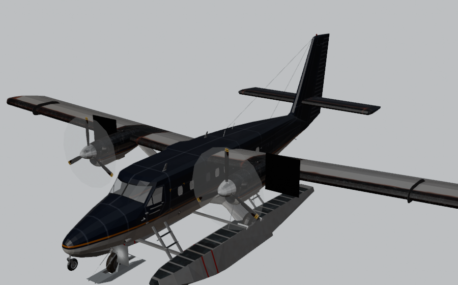

# Adding aircraft from FlightGear

Date: 2026-09-19. Status: research and measurements. No FlightGear aircraft has
been added to 0sfs, nothing here changes the app, and the licence question in
[Licences](#licences) needs the owner's decision before any aircraft ships.

This answers one question: **what gets 0sfs the most aircraft for the least
work per aircraft?** The candidate answer was to use FlightGear's aircraft,
directly or through a converter. This document says whether that is possible,
how a converter would work, what 0sfs has to change first, and which aircraft
are easiest. The inventory is measured, not guessed: every JSBSim aircraft in
FlightGear's catalogue was loaded into the JSBSim WASM build 0sfs ships and
flown.

## The answer

**Yes, for FlightGear's JSBSim aircraft, and the flight model is the easy
half.** FlightGear runs the same JSBSim that 0sfs runs. A FlightGear JSBSim
aircraft's flight model is ordinary JSBSim XML, and it loads into 0sfs's WASM
build unchanged. Of the 289 JSBSim variants in FlightGear's catalogue, **259
load, 213 settle on their gear, 180 make thrust, and 165 fly level for 30
seconds under a simple stand-in pilot. 140 do all of stand, thrust and fly,
across 98 of the 180 packages.** No aircraft was edited to get there: they all
ran under one generic stand-in for FlightGear. Running one costs a median 2.9 ms
of CPU per simulated second, 16 ms at the worst, against the 1,000 ms a second
of real time allows.

**The 3D model converts too, but it is the expensive half.** FlightGear models
are AC3D, a simple text format. A feasibility converter written for this study
turned the DHC-6 Twin Otter's exterior into a GLB in 0sfs's export
frame, textured, with left and right parts on the correct sides
([render](#what-the-converted-model-looks-like)). The cost is size: FlightGear
exteriors run 12,500 to 64,000 triangles (quartiles of 126 measured; median
27,600, and the F-16's 780,000 is the extreme), against 1,016 for 0sfs's
Cessna 172 and 1,514 for its Vision Jet. At best they fit in as opt-in "HD" levels, like the
Sketchfab Vision Jet, with cheap levels still needed under them.

**Three things do not come across:**

- **Nasal.** FlightGear aircraft script their systems in Nasal: engine start,
  fuel transfer, electrics, autopilots, fly-by-wire. The flight model still
  loads without them, but it reads the values Nasal would have written, and
  those have to be supplied. That is the per-aircraft work. See
  [What the smoke test found](#what-the-smoke-test-found).
- **Cockpits, instruments and sounds.** 3D cockpits are most of a FlightGear
  model's triangles and all of its instrument logic. Sounds are sample sets;
  0sfs synthesises engine sound ([docs/sound.md](sound.md)). Neither is worth
  importing.
- **YASim aircraft.** 486 of FlightGear's 673 packages use YASim, a different
  flight model that 0sfs does not run. Their 3D models could still be used over
  a JSBSim flight model from somewhere else. See [YASim aircraft](#yasim-aircraft).

**Per-aircraft work after a converter exists** is a mapping file (which
FlightGear properties stand for which 0sfs controls, and what the rest default
to), a look at the result, and a licence record. For the aircraft at the top of
the inventory that is hours. The one-time work is in 0sfs: it hard-codes its
aircraft today (see [What 0sfs has to change first](#what-0sfs-has-to-change-first)).

## What a FlightGear aircraft is

A FlightGear aircraft is a directory in the FGAddon repository, distributed as
one zip per aircraft through a catalogue
(`https://mirrors.ibiblio.org/flightgear/ftp/Aircraft-trunk/catalog.xml`).

| Part | Where it is | Format | What 0sfs would do with it |
| --- | --- | --- | --- |
| Entry point | `<variant>-set.xml` | FlightGear property XML with `include=` | Read it: flight model type, aero file, model path, author, description, variants |
| Flight model | `<aero>.xml`, `Engines/`, `Systems/` | JSBSim XML (or YASim) | Load unchanged into JSBSim WASM |
| 3D model | `Models/*.xml` + `*.ac` + textures | Model XML tree, AC3D meshes, PNG/SGI `.rgb`/DDS | Convert the exterior to GLB |
| Animations | `<animation>` blocks in the model XML | Object name, property, axis, centre, factor | Drive the GLB's parts; this is already data |
| Systems | `Nasal/*.nas`, `Systems/*.xml` property rules | Nasal scripts, FlightGear autopilot XML | Not imported; stand in for their outputs |
| Cockpit | `Models/Flightdeck`, `Models/Interior`, 2D panels | AC3D + instrument XML | Not imported |
| Sounds | `Sounds/*.xml` + `.wav`/`.ogg` | FlightGear sound XML | Not imported |
| Thumbnail | `thumbnail.jpg`, `Previews/` | JPEG/PNG | Gallery card, with credit |
| Liveries | `Models/Liveries/*.xml` | Texture swaps | Later, if ever |

Variants share a directory. The DHC-6 package holds seven: six YASim and one
JSBSim (`dhc6jsb`), all over the same model. The scan reads every variant's
`-set.xml`, which is how that JSBSim variant was found.

## How a converter would work

A converter is a script in `scripts/` that turns one FlightGear variant into a
0sfs aircraft package. It would run in seven steps. Steps 1, 2 and 7 exist now
as the triage tools listed under [Reproducing](#reproducing). Step 4 exists as a
feasibility converter.

### 1. Read the package

Fetch the zip (or read it by HTTP range, as the scan does) and read the
variant's `-set.xml` with its includes. The including file's values win over
what it includes. The scan found `<flight-model>`, `<aero>`, `<model><path>`,
author, status and ratings for all 971 variants with no parse failures.

### 2. The flight model

Copy the aero file and everything it reaches through `file=` attributes. In
0sfs's layout that is `public/jsbsim-data/aircraft/<id>/` plus an entry in
`manifest.json`. JSBSim's engine and systems paths are configurable per model,
so FlightGear's `Engines/` and `Systems/` folders can stay where they are.

Then stand in for FlightGear. This is the part that needs care:

- **Properties nobody writes.** JSBSim throws "The property … does not exist"
  the first time it evaluates a property nothing has created. Inside FlightGear
  that property would be in FlightGear's tree, written by Nasal or an
  instrument. The converter lists every property a model reads that the model
  does not define, and creates each with a default. **The default matters.**
  0 is right for most. It is wrong for a factor: the 787 multiplies its lift by
  `/controls/ice/wing/lift-coefficient`, which FlightGear's icing code holds at
  1, and at 0 the wing makes no lift. It is also wrong the other way: the 737's
  `/engines/engine[n]/reverser-pos-norm` is a factor, and at 1 the reversers
  deploy. A generic rule gets most of them right. Each aircraft needs a short
  override list for the rest.
- **Controls.** 0sfs writes `fcs/*-cmd-norm`. Many FlightGear models read
  FlightGear's controls tree as well or instead. Of the 180 JSBSim packages,
  136 read at least one property from FlightGear's tree and 104 read something
  under `/controls/`. A throttle there (`/controls/engines/engine[n]/throttle`)
  appears in 61, a stick axis (`/controls/flight/elevator`, `aileron` or
  `rudder`) in 40, and a trim in 19. Mentioning one does not always mean the
  flight controls depend on it. Those are FlightGear's standard names, so one
  table covers them. The rest are per aircraft: the 737-800's pitch
  channel reads `/controls/flight/elevator-sum`, which a FlightGear script
  computes from stick and trim, and until that is supplied its elevator never
  moves.
- **Engines and fuel.** JSBSim's `propulsion/set-running` starts most engines.
  Where fuel reaches the engine through a Nasal pump (the DHC-6 feeds its PT6s
  from two virtual collector tanks that Nasal fills), the engine starves
  standalone. The converter can rewire the feed, or 0sfs can freeze fuel for
  that aircraft.
- **Shared system files.** A model can say `<system file="hydrodynamics"/>` and
  mean a file in neither its own package nor FlightGear's making: JSBSim's own
  `systems/` directory, which FlightGear bundles and serves as JSBSim's global
  systems path. Supplying it made 9 more models load here and 5 more fly, the
  Grand Caravan and the Boeing 314 among them, with no regressions. 0sfs would
  ship those files the same way (they are JSBSim's, under its LGPL-2.1), and
  JSBSim searches the aircraft's own `Systems/` first, so they are a fallback
  rather than an override.
- **Data errors newer JSBSim rejects.** The J3 Cub has `-32.5.0` as a number.
  FlightGear's older parser read it; the JSBSim 0sfs ships refuses it. These are
  one-line fixes, and they belong upstream in FGAddon too.

### 3. The profile

Most of `FdmProfile` in [fdmProfiles.ts](../src/flight/jsbsim/fdmProfiles.ts)
can be measured instead of written:

| Field | Source |
| --- | --- |
| `stance.staticMeters`, `staticPitchRad` | JSBSim ground trim, then 5 s settling. The smoke test already records them |
| `engine`, `gauges` | Engine element type: piston, turbine, turboprop, electric, rocket |
| `initialGearDown`, retraction | `<retractable>` on the BOGEY contacts |
| `flapPosition` | Whether the FCS writes `fcs/flap-pos-deg` or `-norm` |
| `rudderSign` | A 2 s rudder step in flight: which way does it yaw? |
| `bodyCollisionProbes` | The model's STRUCTURE contact points (wingtips, tail) |
| `modelOffset` | The FDM's visual reference point minus the CG. FlightGear reports the aircraft's position from `FGAuxiliary::GetLocationVRP()` (`src/FDM/JSBSim/JSBSim.cxx`), so its model origin sits at the VRP declared in `<metrics><location name="VRP">`, and the offset comes straight from the data rather than being tuned by eye |

### 4. The 3D model

[`survey-flightgear-model.py`](../scripts/validation/aircraft/survey-flightgear-model.py) is the
feasibility version of this step. It walks the model XML tree, parses the AC3D
files, and writes the exterior as a GLB.

- **Frame.** FlightGear loads an `.ac` file rotated +90° about X. Its model
  frame is therefore (x aft, y right, z up) = (x_ac, −z_ac, y_ac). 0sfs's export
  frame ([aircraft-assets.md](aircraft-assets.md#coordinate-conventions)) is
  (+X starboard, +Y up, +Z aft), which is that frame's (y, z, x). Both steps
  are rotations, never mirrors, so a propeller keeps its twist. The DHC-6's
  `L.aileron` lands at x = −7.76 m and `R.aileron` at +7.76 m.
- **Exterior only.** FlightGear keeps cockpits, cabins, pilots and ground
  equipment in their own files, so choosing files by path does most of the
  work. The DHC-6: 28,491 exterior triangles (16,032 airframe, 8,750 wheels,
  3,709 floats); 138,901 cockpit, cabin and pilots; 18,933 equipment and light
  cones.
- **Variants and options.** `select` animations choose between parts, such as
  floats or wheels. The feasibility converter ignores them, so its DHC-6 has
  both. A real converter evaluates each `select` condition for the variant
  being converted.
- **Textures.** PNG and JPEG embed as they are. SGI `.rgb` and DDS need
  converting (KTX2 for the GPU); the feasibility converter falls back to the
  material colour.
- **Levels of detail.** Keep the FlightGear exterior as an opt-in `hd` level
  with its credit (the mechanism already exists; see
  [aircraft-assets.md](aircraft-assets.md#levels-the-user-has-to-switch-on)).
  Generate the default levels from it with a mesh simplifier such as
  meshoptimizer's (`gltfpack -si`). That is untested here. It will not match
  the hand-built procedural meshes, and it does not have to for "more aircraft".

#### What the converted model looks like

The DHC-6 exterior as converted, rendered headless in Blender from the GLB. The
floats and wheels are both present because `select` is ignored. The dark
panels near the nacelles are parts whose textures are SGI `.rgb`.



### 5. The rig

FlightGear animations are data: object name, driving property, axis or hinge
line, centre, factor, and limits. 0sfs's rig
([aircraftAnimation.ts](../src/flight/aircraft/aircraftAnimation.ts)) binds by
fixed node names (`Aileron_Left`, `Elevator`, `Propeller`…) with each part's
axis in code. The converter can either rename and re-pivot FlightGear objects
to fit, or 0sfs can read the bindings as data. Reading them as data is the
better change, because it also removes the one-propeller limit. FlightGear's
properties map onto JSBSim's through a short fixed table:
`surface-positions/*-pos-norm` ← `fcs/*-pos-norm`,
`gear/gear[n]/position-norm` ← `gear/unit[n]/pos-norm`,
`engines/engine[n]/rpm` ← `propulsion/engine[n]/engine-rpm`,
`thruster/rpm` ← `propeller-rpm`. Some models animate from the controls instead
(`controls/flight/*`); 0sfs has those as input state.

The DHC-6's model XML has 374 rotate, 153 translate and 11 spin animations. It
also has 388 select, 361 cockpit pick and 288 material animations, which the
rig would ignore. Its control surfaces, gear, propellers and spinners are all
among the rotate and spin ones.

### 6. Credits and licence

Author from `-set.xml`, licence from the package's COPYING/README, source URL
and FGAddon revision from the catalogue. They go into `AircraftModelCredit` per
level and into `ASSET_LICENSES.md` per asset, as that file requires.

### 7. Check it

[`smoke-test-flightgear-fdm.mjs`](../scripts/validation/aircraft/smoke-test-flightgear-fdm.mjs)
is the triage: load, stand, thrust, trim, fly level. A passing aircraft still
needs a person to fly it. Passing says the model is worth an afternoon, not
that it flies like the aircraft.

## What 0sfs has to change first

These are one-time changes, and they are what "least work per aircraft" is
bought with. Today 0sfs hard-codes its aircraft in 11 source files.

- **A data-driven catalogue.** `AircraftId` is a closed union
  ([aircraftIds.ts](../src/flight/aircraft/aircraftIds.ts)), and each aircraft
  has a hand-written `FdmProfile` and catalogue entry. A converted aircraft
  should arrive as data: one generated JSON per aircraft that the catalogue,
  profile lookup and data manifest read.
- **More than one engine.** `applyFlightControls` writes only
  `fcs/throttle-cmd-norm`, which is engine 0. There are 31 other `engine[0]`
  references outside tests (HUD gauges, sound, engine monitor). A twin gets
  only one engine's throttle.
- **Engine types.** `FdmProfile.engine` is `"piston" | "turbine"`. Of the 180
  FlightGear JSBSim packages, 61 have a piston variant and 57 a turbine one.
  20 are electric, 14 turboprop and 4 rocket, and 34 have no engine at all
  (gliders, balloons, payloads).
- **The rig as data** (step 5), with any number of propellers.
- **Sound** follows engine type, so turboprop and electric need at least a
  fallback voice.

## Licences

**An aircraft with no licence file is not an aircraft you may use freely.**
Copyright is automatic; a licence is the author's grant of permission. Absent a
grant, the default is all rights reserved, and public domain is a deliberate
dedication rather than what silence means. So "no licence" is the most
restrictive state, not the least.

Two things soften that here.

**FlightGear has a project-level policy.** A policy document written in August
2015 moved FGAddon from GPLv2-only to **GPLv2+**, and the wiki states that all
original content there is strongly recommended to be GPLv2+ licensed
([FGAddon](https://wiki.flightgear.org/FGAddon)). The catalogue itself declares
`<license>GPL</license>`. That is the intent an aircraft inherits by being in
FGAddon, and it is the version that suits 0sfs: "or later" allows GPLv3, and
GPLv3 §13 permits combining with AGPLv3.

**And most packages do say something.** Of the 180 JSBSim packages:

| Where the statement is | Packages |
| --- | --- |
| A file at the package root (COPYING, LICENSE, README) | 117 |
| A file in a subdirectory — the DHC-6's is `docs/COPYING` | 6 |
| Only in a file header | 20 |
| Nothing found anywhere | 37 |

| What it says (a package may say more than one) | Packages |
| --- | --- |
| GPL v2 text | 81 |
| GPL named, without reproducing its text | 66 |
| GPL v2 "or later" notice | 17 |
| GPL v3 text | 13 |
| Creative Commons | 4 |
| Non-commercial | 3 |
| Not to be sold | 2 |
| Public domain | 1 |

The exceptions matter more than the totals, and three are worth naming:

- **`f104` is CC-BY-NC-SA.** Its README says so outright. Non-commercial is
  incompatible with the GPL, with AGPLv3, and with
  [COMMERCIAL_LICENSE.md](../COMMERCIAL_LICENSE.md). **Do not use it**, despite
  it being one of the easiest aircraft to fly here. It also should not be in
  FGAddon under FlightGear's own policy, which is worth reporting upstream.
- **`CRJ700` is CC-BY 4.0** for models and textures, GPLv2+ for some files.
  Usable, with attribution, and its bundled GNU FDL is for its documentation.
- **`ogel` carries a LEGO trademark permission** for non-commercial use, which
  is a restriction rather than a licence.

Two aircraft (`c310`, `747-200`) carry "this model is not to be sold" inside
the flight model itself, as do three in the JSBSim repository (`Boeing314`,
`c172x`, `weather-balloon`). That is the same class of restriction
[ASSET_LICENSES.md](../ASSET_LICENSES.md) already records against the C172
data. It is not in the C172 files 0sfs ships today.

The JSBSim repository's aircraft are a separate question again: 14 of its 60
name a licence in their file header (GPL, two of them "v2+"), and 46 say
nothing at all. JSBSim's own code is LGPL-2.1, which does not license the
aircraft data contributed to it.

**What this means in practice.** ASSET_LICENSES.md already requires a per-asset
record: path, creator, exact licence, whether it was modified, and the
attribution shown in the UI. For an imported aircraft that record is: the
FGAddon revision, the package's own statement where it has one, FlightGear's
GPLv2+ policy where it does not, and the author list from `-set.xml`. An
aircraft whose own files contradict the policy does not get adopted. GPL for
the data also means shipping it in editable form: the source `.ac` and the
converter, which is one more reason the converter belongs in the repository.

None of this is legal advice, and the "combined work" question — whether
aircraft data shipped with the app merges with AGPL code or stays a separate
work — is the owner's to settle.

## The inventory

### How it was measured

1. [`scan-flightgear-aircraft.py`](../scripts/validation/aircraft/scan-flightgear-aircraft.py) read
   the FGAddon trunk catalogue: 673 packages, 971 variants, 502 MB fetched by
   HTTP range requests. For each variant it recorded the flight model type,
   ratings, licence evidence, model and texture sizes and Nasal file count.
   For JSBSim variants it also extracted the flight model with every file it
   references.
2. [`smoke-test-flightgear-fdm.mjs`](../scripts/validation/aircraft/smoke-test-flightgear-fdm.mjs)
   loaded each of the 289 extracted JSBSim variants, and the 60 aircraft in the
   JSBSim repository (commit 499c3832), into the JSBSim WASM package 0sfs
   installs (`1.2.4-fork.7`). For each it checked:
   - **load:** the model loads;
   - **stand:** JSBSim's ground trim, then 5 s with at least one wheel down,
     under 5 kt and a CG under 40 ft;
   - **thrust:** engines started with `propulsion/set-running`, at 70%
     throttle, make positive thrust;
   - **trim:** JSBSim's full trim at 5,000 ft succeeds at 120, 90, 160, 220, 70,
     300, 50 or 400 kt;
   - **fly:** 30 s level under a stand-in pilot. The pilot holds wings level and
     altitude with fixed-gain elevator, aileron and trim loops, from the trimmed
     state or untrimmed at 120, 180, 250 or 90 kt. After 5 s it must stay
     within 1,000 ft and 30° of bank, and within 50% of its starting speed.

   The stand-in pilot is there because 0sfs never flies an aircraft hands off.
   A player is on the stick, and 0sfs's auto-trim carries steady pitch moment.
   An airliner with its stabiliser at zero noses over hands off, which says
   nothing about whether it can be flown.
3. [`survey-flightgear-model.py`](../scripts/validation/aircraft/survey-flightgear-model.py)
   counted exterior triangles for every package with a variant that flew.

**What the harness stands in for, and what it does not test.** Missing
properties are created at 0, or at 1 where the model multiplies by them or
they are named like `serviceable`, excluding positions and failures. Every
tank is kept full and consumption frozen, so fuel systems are not tested. The
stand-in controls are written to both `fcs/` and FlightGear's `/controls/`
names. None of this measures fidelity. A model that passes may still fly badly.
A model that fails may need one line in its mapping file.

### What the smoke test found

| | FlightGear (289 JSBSim variants) | JSBSim repository (60 aircraft) |
| --- | --- | --- |
| Loads | 259 | 59 |
| Settles on its gear | 213 | 50 |
| Engines make thrust | 180 | 44 |
| JSBSim's full trim converges | 74 | 30 |
| Flies 30 s level | 165 | 39 |
| All of stand, thrust and fly | 140, in 98 packages | 35 |

The 30 that do not load are 10 packages, and two of them account for 19: every
J3 Cub and Piper Cub variant (the `-32.5.0` typo) and the Space Shuttle's
launch configurations. The rest miss an engine or propeller file that is in
neither the package nor JSBSim's shared set. 46 load but will not stand: 13
throw a native exception, 5 hit a JSBSim binding mismatch, and the other 28
simply do not settle — flying boats, airships, hang gliders and a jet-pack,
plus retractable gear that the stand-in leaves in the wrong state.

The median model needed 5 properties created for it, and the worst 739. The
settled CG height, which is what 0sfs's `stance.staticMeters` needs, comes out
between 0.31 m (a glider) and 5.63 m (the 747-400), median 1.27 m — measured
per aircraft, not guessed. One result is negative (a jet-pack, at −1.29 m),
which is the kind of thing that tells you the aircraft needs a look rather than
a number.

### Easiest: flies in the smoke test, and brings its own model

One row per package, chosen for recognisable types over the full list of 98.
"Trims at" is the speed JSBSim's own trim converged at, and a blank there still
flew under the stand-in pilot. Triangles are the exterior only. Licence is what
the package root says, which is not the whole answer (see
[Licences](#licences)). The full list is in
[`smoke-flightgear.json`](../validation/evidence/aircraft/flightgear-inventory-2026-09-19/smoke-flightgear.json).

| Aircraft | Variant | Engines | FG FDM/model rating | Trims at | Exterior triangles | Package | Licence at root |
| --- | --- | --- | --- | --- | --- | --- | --- |
| Cessna 172R | `c172r` | piston | —/— | 120 kt | 1,385 | 0.1 MB | none found — policy only |
| Cessna 182RG | `c182rg` | piston | 3/4 | 120 kt | 6,316 | 0.2 MB | none found — policy only |
| Cessna T-37 | `t37` | turbine ×2 | 3/4 | 120 kt | 4,735 | 0.9 MB | GPL-2.0 (`COPYING`) |
| Fokker 100 | `fokker100` | turbine ×2 | 3/5 | 160 kt | 7,091 | 16.7 MB | GPL named (`README.txt`) |
| Lockheed L-1011-500 TriStar | `L-1011-500` | turbine ×3 | 3/4 | 220 kt | 9,621 | 2.6 MB | none found — policy only |
| Boeing 747-100 | `747-100` | turbine ×4 | —/— | 160 kt | 9,145 | 1.9 MB | none found — policy only |
| de Havilland Beaver (wheels) | `dhc2F` | piston | 3/4 | 120 kt | 12,517 | 13.0 MB | none found — policy only |
| Boeing 737-600 (the `737NG` package) | `737-600` | turbine ×2 | —/— | 220 kt | 22,824 | 8.2 MB | none found — policy only |
| Mikoyan-Gurevich MiG-21bis | `MiG-21bis` | turbine | 3/5 | 220 kt | 22,201 | 52.8 MB | GPL-3.0 (`License.txt`) |
| Airbus A380 | `A380` | turbine ×4 | 2/2 | 160 kt | 16,061 | 17.1 MB | GPL named (`FMS/README`) |
| Supermarine Swift FR.5 | `SwiftFR5` | turbine | 5/5 | 160 kt | 27,548 | 32.0 MB | GPL-2.0 (`licence.txt`) |
| Robin DR400 Dauphin | `dr400-dauphin` | piston | 4/4 | 120 kt | 28,503 | 18.1 MB | GPL-2.0 (`COPYING`) |
| DHC-6-300 Twin Otter | `dhc6jsb` | turboprop ×2 | 4/5 | 90 kt | 28,491 | 159.6 MB | GPL-2.0 (`docs/COPYING`) |
| Bombardier CRJ700 | `CRJ900jsb` | turbine ×2 | 3/4 | 120 kt | 34,939 | 52.1 MB | CC-BY 4.0 + GPLv2+ (`LICENSE`) |
| Cessna 337G Skymaster | `Cessna337` | piston ×2 | 3/5 | 120 kt | 98,034 | 14.7 MB | GPL-2.0 (`COPYING`) |
| Cessna P210N Centurion | `p210n` | piston | 4/4 | 90 kt | 35,864 | 16.2 MB | GPL-3.0 (`LICENSE`) |
| Cessna 152 | `c152` | piston | 3/4 | 120 kt | 45,641 | 26.8 MB | GPL-2.0 (`LICENSE`) |
| Boeing 787-9 | `787-10-GEnx` | turbine ×2 | 4/4 | 220 kt | not measured | 221.8 MB | GPL-2.0 (`LICENSE`) |

**Not every import needs decimating.** The cheapest rows here are old
FlightGear models that are already close to 0sfs's budget: the C172R's mesh is
1,385 triangles, the T-37's 4,735, the 182RG's 6,316. Those could ship as
ordinary levels rather than opt-in HD ones.

FlightGear has two 737 families, and they do not behave alike: the `737NG`
package's -600 trims and flies, while the separate `738` package's 737-800 does
not (see [Worth doing, but not easy](#worth-doing-but-not-easy)).

"Policy only" means the package states nothing itself, so the only licence it
has is FlightGear's GPLv2+ policy for FGAddon. The F-104 flies well here and is
deliberately absent from this table: it is CC-BY-NC-SA, which 0sfs cannot use.

The 787's model lives in a separate `787-family` package, which is why its
triangles are not measured here: a converter has to follow that dependency.
The Concorde, 747-200 and Seneca II also fly, but their surveyed exteriors came
out implausibly small (300 triangles or fewer), meaning the survey did not find
their real meshes — another case for following the model XML more carefully
than the feasibility tool does.

### Flies, but needs a look first

25 variants in 20 packages fly level yet fail something else: their engines make
no thrust (the start sequence is Nasal's, so it needs mapping), or they will not
settle on their gear. These are the second wave, not rejects.

| Aircraft | Variant | Engines | FG FDM/model | What is wrong |
| --- | --- | --- | --- | --- |
| Cessna 208B Grand Caravan | `C208B` | turboprop | 4/4 | will not stand |
| McDonnell Douglas MD-82 | `MD-81` | turbine | 5/4 | will not stand |
| DHC-8-402 Dash 8 | `dhc-8-400` | turboprop | 2/4 | will not stand |
| Boeing 314-A flying boat | `Boeing314` | piston ×4 | —/— | will not stand |
| Lockheed 1049H Super Constellation | `Lockheed1049h` | piston ×4 | 4/4 | no thrust |
| Consolidated PBY Catalina | `Catalina` | piston | 3/3 | no thrust |
| Douglas DC-2 | `dc2` | piston | 2/3 | no thrust |
| Britten-Norman BN-2A Islander | `BN-2A-26` | piston | 1/2 | no thrust |
| Mitsubishi A6M2 Zero | `A6M2-jsbsim` | piston | —/— | no thrust |
| Zivko Edge 540 | `ZivkoEdge540` | piston | 5/4 | no thrust |

### JSBSim repository aircraft

These are maintained to run standalone, so most need no stand-in at all, and
0sfs already flies one of them (`c172p`). They ship no 3D model. 35 of the 60
stand, make thrust and fly, and two more fly without thrust. Where FlightGear has the type only as YASim, this
is the way to get it: **FlightGear's model over the JSBSim repository's flight
model.**

| JSBSim aircraft | Trims at | FlightGear model to pair with | That package's FDM and licence |
| --- | --- | --- | --- |
| Douglas A-4F Skyhawk | 160 kt | `a4f` (4.1 MB) | YASim — unusable, so this pairing is the only route; no licence statement |
| Boeing B-17 | — | `b17` (31.4 MB) | YASim; GPL-2.0 (`COPYING`) |
| C-130 Hercules | — | `c130` (74.1 MB) | YASim; GPL-2.0 (`COPYING`) |
| Sopwith Camel | 90 kt | `sopwithCamel-YASim` (8.2 MB) | YASim; GPL named |
| Lockheed F-104 Starfighter | 220 kt | `f-104` (47.5 MB) | YASim; GPL-2.0 — and **not** the CC-BY-NC `f104` package |
| Beechcraft Staggerwing | 120 kt | `model17` (23.1 MB) | YASim; GPL-2.0 (`COPYING`) |
| Piper PA-28 Cherokee Warrior | 120 kt | `pa28-161` (1.1 MB) | YASim; GPL named |
| Piper J-3 Cub | 70 kt | `J3Cub` (106.7 MB) | JSBSim, but it will not load (the `-32.5.0` typo); GPL named |
| Cessna 182 | 120 kt | `c182s` (94.5 MB) | JSBSim, but it will not load (missing engine file); GPL-2.0 |
| Cessna 310 | — | `c310` (0.6 MB) | JSBSim, and it flies; its FDM says "not to be sold" |
| Boeing 747 | 220 kt | `747-200` (3.2 MB) | JSBSim, and it flies; its FDM says "not to be sold" |
| Concorde | 220 kt | `Concorde` (11.5 MB) | JSBSim, and it flies; GPL named |
| DHC-6 Twin Otter | 120 kt | `dhc6` (159.6 MB) | JSBSim, and it flies; GPL-2.0 (`docs/COPYING`) |
| North American OV-10 Bronco | 120 kt | `OV10_USAFE` (14.0 MB) | JSBSim, and it flies; GPL-2.0-or-later |
| Cessna T-37 | 120 kt | `t37` (0.9 MB) | JSBSim, and it flies; GPL-2.0 (`COPYING`) |
| Fokker 100 | 160 kt | `fokker100` (16.7 MB) | JSBSim, and it flies; GPL named |
| Fokker Dr.1 | — | `fkdr1` (7.5 MB) | JSBSim, and it flies; GPL named |
| F-15C | 160 kt | `f15c` (40.1 MB) | JSBSim, and it flies; GPL named |
| Boeing 787-8, A320, MD-11, F-16, P-51D, PC-7, Global 5000, T-6 Texan II, AH-1S | various | none matched by name | — |

The JSBSim repository's own aircraft carry their own terms, or none: 14 of the
60 name a licence in their file header and 46 say nothing, so a pairing needs
both sides checked. `Boeing314`, `c172x` and `weather-balloon` there say "not
to be sold".

### Worth doing, but not easy

Well-known types that do not come through the smoke test. Each is a mapping
problem rather than a dead end, and the reason is usually FlightGear's scripts.

| Aircraft | Variant | FG FDM/model | What happens | Likely cause |
| --- | --- | --- | --- | --- |
| Airbus A320 family | `A320-200-CFM` | 5/5 | will not stand | fly-by-wire laws read a tree Nasal writes |
| Boeing 737-800 | `738` | 4/4 | will not fly level | pitch channel reads `/controls/flight/elevator-sum` |
| McDonnell Douglas MD-11 | `KMD-11` | 5/5 | will not stand | — |
| General Dynamics F-16 | `f16-block-20` | 5/4 | will not fly level | fly-by-wire; the `f16-simplified` variant does fly |
| Cessna 182S | `c182s` | 5/5 | will not load | engine file missing from the package |
| Grumman F-14B | `f-14a` | 5/5 | will not load | — |
| Piper J-3 Cub (and PA-18) | `J3Cub` | 4/4 | will not load | `-32.5.0` where a number belongs, 12 variants |
| Boeing 707 | `707` | 4/5 | will not fly level | — |
| MiG-15bis | `MiG-15bis` | 4/4 | will not stand | — |
| Extra 500 | `extra500` | 4/4 | will not fly level | — |
| Space Shuttle (launch) | `SpaceShuttle-TAEM` | 4/4 | will not load | 7 variants |

### YASim aircraft

486 packages, including most of FlightGear's airliners. Three routes, cheapest
first:

1. **Pair the model with an existing JSBSim flight model** where one exists:
   the JSBSim repository (above) or another FlightGear variant.
2. **Generate a JSBSim model.** The JSBSim repository ships Aeromatic++
   (`utils/aeromatic++`), which writes a plausible JSBSim model from an
   aircraft class and a handful of dimensions. A YASim file contains those
   dimensions. The result flies like a generic aircraft of its class, not like
   the type.
3. **Run YASim.** YASim is FlightGear C++ (GPL-2.0-or-later) and could be built
   to WASM beside JSBSim, which would bring the whole fleet at once. It is tied
   to FlightGear's property tree and is a second flight model to own. This is
   a project, not a step.

## Recommended order

The staged plan, with file-level changes, interfaces and acceptance criteria,
is in [the implementation proposal](proposals/flightgear-aircraft-import.md).
What follows is the order and the reasoning behind it.

**1. Settle the licence question before any aircraft ships.** It does not block
experimenting, and it decides whether this whole route is available. The two
sub-questions: do GPL aircraft data and meshes combine with the app into one
work, and for a given aircraft is the grant GPL-2.0-*or-later* rather than
GPL-2.0-only. FlightGear's own GPLv2+ policy answers the second for most, and
143 of the 180 packages say something themselves; 37 rely on the policy alone.
Aircraft that contradict it — `f104` is CC-BY-NC-SA — do not get adopted.

**2. Make 0sfs data-driven.** A generated package per aircraft, read by the
catalogue, the profile lookup and the data manifest; throttle and gauges for
more than one engine; turboprop and electric alongside piston and turbine; the
rig's bindings as data. This is the actual "least work per aircraft" lever, it
is a day or three, and it is worth doing even if no FlightGear aircraft is ever
imported — the Vision Jet's variants already strain the hard-coded shape.

**3. Build the flight-model half of the converter first**, with a per-aircraft
mapping file for property defaults, control wiring and engine start. It is the
half that is proven, and it is cheap: the flight model plus its shim is tens of
kilobytes per aircraft, against tens of megabytes of mesh.

**4. Prove it on three aircraft that already fly**, smallest first: `c172r`
(0.1 MB, trims at 120 kt, and directly comparable with the C172 0sfs already
flies), `t37` (0.9 MB, twin turbine), and `dhc2F` (the Beaver, 13 MB, a type
0sfs does not have). Fly each yourself before adding a fourth.

**5. Then the model pipeline**: `select` evaluation, texture conversion, and
simplified levels under an opt-in HD level. Expect this to be where the time
goes, and expect to keep hand-built meshes for the flagship airframes.

**6. Only then batch.** With steps 2 to 5 done, the 98 packages that already
fly are a queue, not a project each.

What not to do first: YASim in WASM, cockpits, and Nasal interpretation. Each is
a project on its own, and none of them is needed for more aircraft.

## Reproducing

```bash
# 1. Catalogue scan, with each JSBSim flight model extracted (about 10 min, 502 MB)
python3 scripts/validation/aircraft/scan-flightgear-aircraft.py --extract-fdm --out build/fg-aircraft-inventory/run

# 2. Smoke test the extracted flight models, and the JSBSim repository's.
#    --shared-systems is what FlightGear serves as JSBSim's global systems path.
node scripts/validation/aircraft/smoke-test-flightgear-fdm.mjs --fdm build/fg-aircraft-inventory/run/fdm \
  --shared-systems ../Felipegalind0/jsbsim/systems
node scripts/validation/aircraft/smoke-test-flightgear-fdm.mjs --jsbsim-root ../Felipegalind0/jsbsim

# 3. One aircraft's model: triangle counts, animations, and a GLB of its exterior
python3 scripts/validation/aircraft/survey-flightgear-model.py dhc6 --variant dhc6jsb --glb
```

The catalogue is FGAddon trunk and changes; the scan records each package's
revision and MD5. The runs behind this document used the JSBSim repository at
commit `499c3832` and the installed `1.2.4-fork.7` WASM package. The records behind this document are in
[validation/evidence/aircraft/flightgear-inventory-2026-09-19/](../validation/evidence/aircraft/flightgear-inventory-2026-09-19/).
