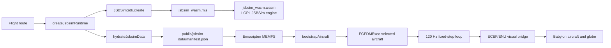

# How JSBSim runs in the browser

OSFS does not compile JSBSim itself. It consumes the prebuilt
[`@0x62/jsbsim-wasm`](https://github.com/0x62/jsbsim-wasm) npm package, version
`1.2.4-beta.4`. The wrapper project builds JSBSim with Emscripten, tracks the
JSBSim source as a submodule, generates bindings from `FGFDMExec.h`, and
publishes an ESM loader plus a `.wasm` binary. Its documented build requires
CMake and the Emscripten SDK. The package version is intended to match the
embedded JSBSim version.

## What this repository does

`src/flight/jsbsim/createJsbsimRuntime.ts` imports `JSBSimSdk` and the package
URLs `wasmModuleUrl` and `wasmBinaryUrl`. It calls `JSBSimSdk.create` with
browser persistence disabled, then forwards JSBSim stdout and stderr into an
optional application log handler.

Vite needs two deliberate configuration choices for that to work:

* `optimizeDeps.exclude: ['@0x62/jsbsim-wasm']` keeps Vite from prebundling the
  package, preserving the package-exported module and binary URLs.
* `assetsInclude: ['**/*.wasm']` makes the binary a build asset. The confirmed
  production build emits both `jsbsim_wasm.mjs` and `jsbsim_wasm.wasm`.

The SDK does **not** ship the OSFS aircraft data into its virtual filesystem.
The repository serves `public/jsbsim-data/manifest.json` with separate C172
and SF50 package closures. During startup `downloadJsbsimData` fetches the
manifest, and `resolveAircraftDataFiles` validates the selected aircraft's
relative file paths. It rejects missing or malformed packages instead of
silently falling back to C172. Only the selected package is fetched and
written with `sdk.writeDataFile(relativePath, text)` into Emscripten MEMFS.

`bootstrapAircraft` configures the paths and loads the selected `c172p` or
`sf50` model. It sets the native timestep with `setDt(1 / 120)`, checks the
reported timestep, and initializes geodetic latitude with `ic/lat-geod-deg`.
Actual gear/flap positions and their commands are initialized before `runIc`;
runway resets likewise use the selected profile's physical configuration.
The flight loop then advances the native engine at that fixed timestep.

The application reads native wheel and structure contact coordinates for
clearance, including retractability and current CG. Visible-body collision
probes remain application-owned, aircraft-specific approximations. The SF50
development model's integration tests establish initialization and physical
sign contracts, not calibrated AFM performance. See the
[SF50 proposal and implementation status](proposals/sf50-flight-model-v2.md).

The browser does not run a native executable, use a server-side flight
simulator, or send physics data to a remote service. The engine runs locally in
the browser's WebAssembly runtime; streamed map data and optional phone pairing
are separate concerns.

## Why it works in Vite

The wrapper's upstream README specifically calls out Vite: when using its
exported WASM URLs, dependency optimisation must be disabled for this package.
The configuration above follows that requirement. The module loader locates the
emitted binary, Emscripten instantiates it, and the JavaScript SDK exposes
`FGFDMExec` methods and filesystem helpers. That is the complete WASM path;
there is no local build script, CMake configuration, Emscripten SDK, or checked
in compiled JSBSim source in OSFS.

## Deployment requirement

Hydration derives its default from Vite's `BASE_URL`. The OSFS organization-site
build uses `/`, so it requests `/jsbsim-data/...`; local development also uses
`/jsbsim-data/...`. Verify the manifest and every XML request against
the deployed Pages URL before release.

## License and data boundary

The wrapper TypeScript SDK is MIT according to its package metadata. Its own
README identifies the compiled JSBSim and patches as LGPL-2.1. Preserve the
applicable LGPL notices and make the corresponding engine source and build
patch available with a release. The XML in `public/jsbsim-data` is separate
simulation data: the C172P file has an unknown author and a “not to be sold”
statement, so it is a release blocker until its provenance and redistribution
terms are resolved. Do not describe all JSBSim-related content as MIT.

## Repository ownership and upstream work

Use the existing canonical dependency checkouts, with ordinary branches for
separate changes rather than specially named checkout folders:

- JSBSim: `/Users/felg/gh/Felipegalind0/jsbsim`.
- jsbsim-wasm: `/Users/felg/gh/Felipegalind0/jsbsim-wasm`.
- Preferred layout for new checkouts: `/Users/felg/gh/owner/repo`.

Native flight dynamics and portability belong in JSBSim. Generic bindings,
native object ownership, model loading, and diagnostics belong in
jsbsim-wasm. Aircraft packages, scenarios, input mapping, scheduling, and
terrain/presentation adaptation belong in OSFS. Reusable globe, terrain,
and rendering functionality belongs in FOSS Earth. Consult
[the repository instructions](../AGENTS.md) before adding dependency workarounds.

Existing upstream work includes
[JSBSim wheel rotational dynamics #1502](https://github.com/JSBSim-Team/jsbsim/pull/1502),
[jsbsim-wasm batch properties and gear contacts #8](https://github.com/0x62/jsbsim-wasm/pull/8),
and [JSBSim Emscripten portability #1504](https://github.com/JSBSim-Team/jsbsim/pull/1504).
Check their current status before opening overlapping changes. The wrapper's
tracked `patches/jsbsim-emscripten-compat.patch` is applied to `vendor/jsbsim`
by its scripts and can make that submodule appear dirty; do not discard it
as unexplained local work. Native disposal and generic model-load diagnostics
now have a local source implementation and regression tests in the canonical
wrapper checkout. The local SDK build, typecheck and all 17 SDK tests passed;
browser lifecycle measurements remain outstanding. These changes have not
been published or adopted by the application's installed package. See the wrapper's
`docs/sdk-lifetime-and-diagnostics.md` and the
[SF50 validation guide](validation/sf50-performance.md).

## Maintenance checklist

1. Pin a tested package version rather than relying on a beta range for a
   public release.
2. Record the wrapper commit, JSBSim source revision, Emscripten version, and
   any applied patch in the release SBOM/notices.
3. Test a fresh production build on the actual deployment base path, including
   manifest and all XML requests.
4. Exercise repeated create/dispose cycles after fixing native ownership in
   jsbsim-wasm. The application unregisters its stored log listeners and calls
   `sdk.destroy()`, but the installed wrapper does not release the native
   executive through that call. The SF50 tests explicitly delete their native
   executive; this is not evidence that the application's lifecycle is fixed.
5. Preserve the geodetic contract: bootstrap/reset use `ic/lat-geod-deg`, not
   geocentric latitude. Preserve the native `setDt(1 / 120)` initialization;
   an application accumulator alone does not configure JSBSim's timestep.
