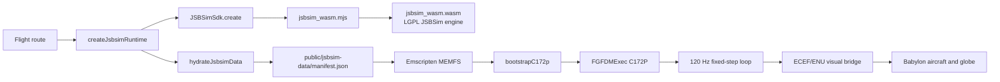

# How JSBSim runs in the browser

OSFS does not compile JSBSim itself. It consumes the prebuilt
[`@0x62/jsbsim-wasm`](https://github.com/0x62/jsbsim-wasm) npm package, version
`1.2.4-beta.4`. The wrapper project builds JSBSim with Emscripten, tracks the
JSBSim source as a submodule, generates bindings from `FGFDMExec.h`, and
publishes an ESM loader plus a `.wasm` binary. Its documented build requires
CMake and the Emscripten SDK. The package version is intended to match the
embedded JSBSim version.

## What this repository does

`src/flight/jsbsim/createJsbsimRuntime.ts` imports `JSBSimSdk` and the package
URLs `wasmModuleUrl` and `wasmBinaryUrl`. It calls `JSBSimSdk.create` with
browser persistence disabled, then forwards JSBSim stdout and stderr into an
optional application log handler.

Vite needs two deliberate configuration choices for that to work:

* `optimizeDeps.exclude: ['@0x62/jsbsim-wasm']` keeps Vite from prebundling the
  package, preserving the package-exported module and binary URLs.
* `assetsInclude: ['**/*.wasm']` makes the binary a build asset. The confirmed
  production build emits both `jsbsim_wasm.mjs` and `jsbsim_wasm.wasm`.

The SDK does **not** ship the OSFS C172 data into its virtual filesystem. The
repository serves `public/jsbsim-data/manifest.json` and five XML files. During
startup `hydrateJsbsimData` fetches that manifest, fetches every listed file,
and calls `sdk.writeDataFile(relativePath, text)`. This places the files in
Emscripten MEMFS. `bootstrapC172p` then configures the paths, loads `c172p`,
sets initial-condition and control properties, calls `runIc`, and the flight
loop advances the engine at its fixed timestep.

The browser does not run a native executable, use a server-side flight
simulator, or send physics data to a remote service. The engine runs locally in
the browser's WebAssembly runtime; streamed map data and optional phone pairing
are separate concerns.

## Why it works in Vite

The wrapper's upstream README specifically calls out Vite: when using its
exported WASM URLs, dependency optimisation must be disabled for this package.
The configuration above follows that requirement. The module loader locates the
emitted binary, Emscripten instantiates it, and the JavaScript SDK exposes
`FGFDMExec` methods and filesystem helpers. That is the complete WASM path;
there is no local build script, CMake configuration, Emscripten SDK, or checked
in compiled JSBSim source in OSFS.

## Deployment requirement

Hydration derives its default from Vite's `BASE_URL`. The OSFS Pages build uses
`/OSFS/`, so it requests `/OSFS/jsbsim-data/...`; local development continues
to use `/jsbsim-data/...`. Verify the manifest and every XML request against
the deployed Pages URL before release.

## License and data boundary

The wrapper TypeScript SDK is MIT according to its package metadata. Its own
README identifies the compiled JSBSim and patches as LGPL-2.1. Preserve the
applicable LGPL notices and make the corresponding engine source and build
patch available with a release. The XML in `public/jsbsim-data` is separate
simulation data: the C172P file has an unknown author and a “not to be sold”
statement, so it is a release blocker until its provenance and redistribution
terms are resolved. Do not describe all JSBSim-related content as MIT.

## Maintenance checklist

1. Pin a tested package version rather than relying on a beta range for a
   public release.
2. Record the wrapper commit, JSBSim source revision, Emscripten version, and
   any applied patch in the release SBOM/notices.
3. Test a fresh production build on the actual deployment base path, including
   manifest and all XML requests.
4. Exercise repeated create/dispose cycles. The current disposer does not keep
   the registered log-listener function references and does not destroy the
   SDK; decide the correct upstream lifecycle and test it before release.
5. Keep JSBSim coordinate terminology precise: the bootstrap writes
   `ic/lat-gc-deg`; calling it geodetic without conversion can create an
   accuracy discrepancy.
