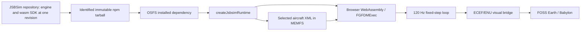

# How JSBSim runs in the browser

OSFS consumes a packaged WASM build from `Felipegalind0/jsbsim/wasm`.
Native engine code and the JavaScript/TypeScript SDK now share the canonical
`Felipegalind0/jsbsim` checkout and revision. Native changes belong in `src/`;
bindings, native lifetime, generic diagnostics and SDK build tooling belong in
`wasm/`. OSFS owns aircraft data, initial conditions, controls and scheduling.
FOSS Earth remains the separate terrain/rendering dependency.

**Application acceptance, 2026-09-14:** clean in-tree package
`1.2.4-fork.7` is installed and locked. It adds the configurable turbine idle
fuel flow described in [Idle fuel flow](#idle-fuel-flow) on top of fork.6's
turbine trim fuel-flow fix, described in [Trim fuel flow](#trim-fuel-flow), the
IDBFS-linkage
and native-exception build corrections described in
[the fork.4 adoption record](#adopted-idbfs-and-native-exception-corrections)
and the fork.5 rename. fork.6's acceptance run passed all 731
app/runtime/UI/artifact tests across 77 files. Production build/typecheck and emitted
asset checks passed; focused ESLint passed the five changed identity/artifact
and test-configuration files with no warnings. Headless Chrome verified actual SDK boot and loaded
bytes for C172 and all three SF50 runtime packages. The separate component
keyboard/layout check passed three viewports. These establish software and
artifact contracts, not aircraft calibration or terrain readiness. The
[in-tree execution record](old/jsbsim-in-tree-integration-2026-09-13.md)
and [centralization record](old/jsbsim-centralization-2026-09-13.md) are
historical snapshots; their checkout names and package identities are not the
starting state.



## Package name

The package is `@felipegalind0/jsbsim`, named after the repository it is built
from. It was called `@felipegalind0/jsbsim-wasm` through fork.4; that name
described a separate SDK source that no longer exists, since the engine and the
`wasm/` SDK have shared one repository and one revision since the in-tree
consolidation. The rename landed with fork.5 and changed no engine or SDK code.

There is no `jsbsim-wasm` dependency, checkout or source selector anywhere in
this project. The remaining `0x62/jsbsim-wasm` references are to the upstream
project this SDK derives from: its MIT notice and Benedict Lewis's copyright
travel with the distribution and must not be removed, and SDK PR #8 is still an
open review there.

Retained rollback tarballs keep the name they were published under, so
`jsbsimBuildIdentity.ts` pairs every accepted version with its exact name and
rejects a renamed package claiming an older version. A full rollback restores
that release's declaration, lock and identity module together from
[`validation/evidence/jsbsim/rollback/`](../validation/evidence/jsbsim/rollback);
fork.5 and fork.6 are at commits `f9a27c0d` and `9e22e168` instead, and
fork.7 is the installed declaration.

## Build and installation chain

The app requires Node **22.18 or newer** because its shared artifact validator
uses native TypeScript stripping. This integration was exercised with
**Node 26.8.2**; SDK compilation additionally uses its locked toolchain.

The application declares:

```json
"@felipegalind0/jsbsim": "file:deps/felipegalind0-jsbsim-1.2.4-fork.7.tgz"
```

The package scope and API imports stay the same. The wrapper version does not
identify the native engine version; `buildIdentity` records the actual common
source revision. No npm publication is implied or needed.

Stable installation requires a **clean in-tree** schema-2 identity. The engine
and SDK commit/dirty fields must agree, `sdk.path` must be `wasm`, and metadata
must identify that same repository with null external native archive/source-lock
fields. A dirty candidate is rejected even if its archive and installed bytes
agree. Explicit SDK diagnostics may use a checked candidate directory with
`validate-sf50.mjs --sdk-root=...`, labeled as a candidate.

The previous exact schema-1 `1.2.4-fork.1` and schema-2 `1.2.4-fork.2` and
`1.2.4-fork.3` contracts remain supported for deliberate rollback. Fork.1
requires clean pinned source; fork.2 and fork.3 require clean in-tree source. Schema/version pairs, archive
integrity and recorded distribution bytes remain checked, with no version
range or implicit runtime fallback. Use each retained tarball with its matching
declaration and lock, which are tracked per version under
[`validation/evidence/jsbsim/rollback/`](../validation/evidence/jsbsim/rollback).
Fork.3 replaced the earlier
accepted fork.2 package after an explicitly verified official emsdk compiler
banner was added to the toolchain lock. Fork.4 replaces fork.3 after adopting
the IDBFS and native-exception corrections. No earlier archive was overwritten.

Retain the accepted tarball under `deps/` together with `package.json` and
`package-lock.json`. `npm ci` then installs the same SDK without a JSBSim/SDK
source sibling, compiler or private package registry. Do not replace an accepted
tarball in place: a changed candidate requires an explicit dependency update
and new acceptance evidence. FOSS Earth still uses `file:../foss-earth`; its
checkout/build remains necessary, and it does not acquire a JSBSim dependency.

Build engine or SDK changes from `/Users/felg/gh/Felipegalind0/jsbsim` on
`master`. New work branches from there. The original `integration` branch is
the preserved pre-import reference, not the development tip. The PR branches
`feature/wasm-package`, `fix/emscripten-portability`, `fix/turbine-trim-spool`,
`fix/turbine-trim-fuel-flow` and `fix/model-reload-lifetime` are review slices of
work already on `master`, not more complete versions of it.

```sh
npm --prefix wasm ci
SOURCE_DATE_EPOCH=$(git log -1 --format=%ct) npm --prefix wasm run build
npm --prefix wasm run pack:build -- --release
```

For uncommitted development, use `npm --prefix wasm run build:dev` instead.
That produces an identified dirty diagnostic candidate; it cannot qualify for
release packing or stable app adoption. Default native CMake builds leave
`BUILD_WASM_MODULE=OFF` and do not require Node or Emscripten. The owning build
contract is `wasm/docs/centralized-builds.md` in JSBSim.

The build captures the enclosing repository once. Generator, compiler, tests
and metadata share that frozen source; the SDK digest is the `wasm/` subset of
the same snapshot. No native archive, vendor checkout or external source path is
selected. Successful builds produce an immutable package under
`wasm/build/artifacts/`; `wasm/build/last-package.json` identifies its checked
tarball and archive integrity. Failed attempts do not replace the accepted
artifact. Captured sources and output directories are not development checkouts
or implicit app overrides.

**The WASM build is not reproducible, because the engine embeds its compile
time.** `src/FGJSBBase.cpp` sets `JSBSim_version` to
`JSBSIM_VERSION " " __DATE__ " " __TIME__`, so every binary carries the local
time it was compiled at; fork.7's contains `1.3.2.dev1 Sep 14 2026 00:19:14`.
The fork.5 source revision `e727e6f1` was built twice with the same toolchain on
the same machine and gave
`d848696de238128cee41c34e7e63951af9563eebdef6ddb631adfb02f989f1b1` and
`950433d3036d1bb77c7f96b3b3cc4e96d3c7a04c7e7b6264a20cd71075a1f76a`, both
2,198,897 bytes. They differ in 1,728 bytes, and every one comes from that string:

- The two strings end `21:32:22` and `21:33:58`. wasm-ld sorts merged string
  constants by their endings, so one sits among strings ending in "2" and the
  other among strings ending in "8".
- Every string between those two places moves by 32 bytes, the timestamp's
  length with its terminator.
- What refers to those strings changes with them: 414 instruction operands and
  76 data pointers differ by exactly 32, and 8 operands follow the timestamp
  itself.

Nothing else differs. The binaries contain no build paths, and the emitted
`jsbsim_wasm.mjs` loader is byte-identical across builds.

When `SOURCE_DATE_EPOCH` is set, the compiler takes `__DATE__` and `__TIME__`
from it, in UTC; test compiles with the locked Emscripten 6.0.9 confirmed this.
The build command above sets it to the commit time, so the version string names
the commit instead of the build. Whether that makes a whole build identical has
not been tested: build the next package twice and compare `jsbsim_wasm.wasm`
before relying on it. This needs no JSBSim change, and none is worth proposing
upstream: dropping the timestamp would change the version banner, and builders
who need reproducible output already set `SOURCE_DATE_EPOCH`.

Consequences, for every package built so far: each build is still immutable,
hashed and gated once produced, and `verify:jsbsim` still rejects any
substituted or modified artifact. But a shipped binary cannot be re-derived from
its source revision, so **the tarball is the authority, not the commit**. Two
artifacts built from one revision are different artifacts and must be accepted
separately. Do not treat a hash difference between two builds of the same source
as evidence of a source or behaviour change.

## Installed and browser artifact checks

The accepted application artifact is:

| Identity | Value |
| --- | --- |
| Common native/SDK commit | `fea688020fb683c0696aa8339dbed9cdb238a39d` |
| Repository content SHA-256 | `688091cc93ad332d8e55ca376393dea3d544a80de0711a4781e10c7e1539ec35` |
| SDK subtree content SHA-256 | `b5d8ff6d2cc76d2b96c92aef1a3228bf6cfebe5dd8ddc4e571c6b713f3d5a93d` |
| Build input SHA-256 | `733a60a62ef3061dc254f6d4a3c8f3cf7f162a213b444e423e4ac3d6b18553f0` |
| Package tarball SHA-256 | `58afaf9fa575ec61838ba794b7b4a0919b8eaf516c7261e571700e8367b5217b` |
| Emitted/browser loader SHA-256 | `784e82c9cae536589f408a74abdda475fd72c56b18bb99129f66281ab3d53dc2` |
| Emitted/browser WASM SHA-256 | `6eae23db0fc26d4e02daa27eb95fba12932265164e4bb194cb3e183d04882806` |

That is fork.7, packed from `feature/jsbsim-package-rename`. The JSBSim checkout's
`master` (`f9082ee1`) is that commit merged with JSBSim-Team `master`. Earlier
fork identities remain in
[the adoption records](../validation/evidence/jsbsim/adoption/) and the
[historical in-tree execution record](old/jsbsim-in-tree-integration-2026-09-13.md).

The installed distribution's 14 recorded files and archive SHA-512 lock
integrity were verified. The current adoption record is
[`validation/evidence/jsbsim/adoption/fork7-adoption.json`](../validation/evidence/jsbsim/adoption/fork7-adoption.json).
Command logs, earlier per-fork browser and UI reports and screenshots stay in
the local, undistributed tree under `build/validation/jsbsim-in-tree-20260913/`.
Those ignored files are local evidence; they keep per-fork name prefixes.
The identities and outcomes above remain in documentation.

All app imports, type imports, mocks and SDK assets use the fork scope.
`createJsbsimRuntime` imports `JSBSimSdk` and `buildIdentity` from the package,
and `wasmModuleUrl`/`wasmBinaryUrl` from its `/wasm` export. Vite excludes the
fork from dependency optimization and includes `**/*.wasm` as build assets.

```sh
npm run verify:jsbsim
npm run build
```

`verify:jsbsim` checks the repository-relative tarball, lock resolution and
SHA-512 integrity; it rejects a live SDK symlink or ineligible source identity.
It compares installed and archived metadata/package identity, hashes every
recorded distribution file, rejects unrecorded files and checks the exported
identity against metadata. Schema-2 repository provenance is checked separately.
The complete distribution includes entry points, declarations, loader, WASM and
recorded notices. Schema-1 checks remain available for explicit rollback.

`npm run build` performs that preflight, app TypeScript checking, the Vite
production build and emitted loader/WASM SHA-256 comparisons. It writes
`dist/jsbsim-artifact.json` with `browserLoadedAssetsVerified: false`;
successful bundling alone does not prove browser instantiation.

Two bounded headless checks start no server or visible browser:

```sh
node scripts/check-aircraft-selection-headless.mjs
node scripts/check-jsbsim-browser-artifact.mjs
```

Each run writes a new dated folder under the gitignored
`build/validation/aircraft-selection/` or `build/validation/jsbsim-browser-artifact/`.
`--out=` chooses another folder, which must be new. The selection check bundles actual React
components and shell/CSS with a static flight snapshot, checks wide/narrow/short
viewports, family keyboard navigation, staged G2+ selection and keyboard Apply,
and saves screenshots. It does not instantiate an FDM. The built-app check
serves actual `dist/` bytes through headless Chrome request interception, boots
each runtime aircraft and compares diagnostic identity and fetched
loader/WASM/XML hashes to the installed package and build manifest.

The current component check passed all three viewports. It still records a
clipped lower LOD-select focus outline in wide/narrow shells; control bounds
and keyboard-reached Apply/outline remain visible. The actual built-app check
passed all four runtime aircraft with no missing local assets or runtime
exceptions. External terrain/font requests were blocked, the no-Google-key
warning was recorded and terrain stayed unready. Production builds retain the
large renderer-chunk warning; some jsdom app tests retain React act warnings.
These checks exclude terrain readiness, GPU performance and aircraft fidelity.

## Adopted IDBFS and native-exception corrections

Fork.4 carries the two build defects found while preparing the upstream package
contribution ([JSBSim #1507](https://github.com/JSBSim-Team/jsbsim/pull/1507),
branch `feature/wasm-package` at `c6d4063a`). They were ported selectively onto
the full integration as `feature/wasm-integration-idbfs-exceptions`
at `c328c7ab6d81e6de68b8db2115c35d350b226025`. The review package's
`@jsbsim/wasm@0.1.0` identity and its omission of the property-batch,
gear-contact and wheel features were **not** adopted.

| Correction | Adopted change |
| --- | --- |
| Native exception handling | The root `CMakeLists.txt` adds `-fexceptions` to C++ compilation whenever `BUILD_WASM_MODULE` is `ON`, before `add_subdirectory(src)`. Enabling exceptions only on the bindings target or the final link cannot restore engine catch blocks that were compiled away. |
| Browser persistence | `wasm/CMakeLists.txt` links `-lidbfs.js`, so the advertised optional IDBFS persistence actually exists in the module. The hand-written extension bindings are still compiled into the same target. |
| Persistence root safety | `WasmVfsManager.resolveRoots` normalizes `.`/`..` segments, rejects NUL and rejects equal or nested runtime/persistence roots. `JSBSimSdk.create` resolves both roots before loading the module, so an unsafe pair cannot reach tree copying or allocation. Sibling prefixes such as `/data/runtime` and `/data/runtime-cache` stay valid. |
| Lifecycle checks | `writeDataFile`, `readDataFile`, `mkdir`, `enablePersistence`, `syncFromPersistence` and `syncToPersistence` now reject use after `destroy()`. |

Native builds with the component disabled receive no additional exception flag:
148 native compile commands contain none, `BUILD_WASM_MODULE` defaults to `OFF`,
no `build/wasm` directory is generated, `JSBSim --version` starts, and enabling
the component with a native compiler is still rejected.

The added regressions are a malformed-propulsion recovery test, four
persistence-boundary cases and a pinned Playwright 1.63.0 browser check.
The propulsion test removes the standard C172's required `<thruster>`: native
`FGPropulsion::Load` must catch its own XML error, return `false`, and then load
a valid C172 and step it. A dirty diagnostic build with the engine flag removed
reproduces the defect at 49/50 with that test failing on an escaped native
exception (`excPtr: 278536`); that candidate was never promoted. With the flag,
all 50 SDK tests in nine suites pass.

The browser check serves only accepted artifact bytes through request
interception — no server, app checkout or aircraft data — and verifies across
three navigations in pinned Chromium 153.0.8010.12 that IDBFS is linked, that
text and binary files survive navigation, that deletions and updates persist,
that the downstream `PropertyBatch`/`GearContacts` bindings are still present in
the same artifact, and that the executive is disposed after each phase. The
application itself still does not enable persistence; this is an SDK capability
check. Run it after a build with:

```sh
# From the canonical JSBSim root, once per machine:
npm --prefix wasm exec -- playwright install --only-shell --no-remove chromium
npm --prefix wasm run test:browser
```

The older pinned Playwright 1.58.2 installer stalled during archive extraction,
so 1.63.0 is pinned and only its headless shell is requested. Build and check
runners now enumerate `test/*.test.mjs` explicitly, keeping this browser check
out of the unit-test run. Full adoption results, hashes and limitations are in
[`validation/evidence/jsbsim/adoption/fork4-adoption.json`](../validation/evidence/jsbsim/adoption/fork4-adoption.json).

## Trim fuel flow

`FGTurbine::Trim()` computes steady thrust and spool speeds without advancing
time. It never assigned `FuelFlow_pph`, so a zero-time evaluation reported
whatever the engine had last produced. This reaches the app directly:
`propulsion/set-running` forces the throttle to 1 and trims there, so every
later trim at a lower setting still read the full-throttle number.

On the retained fork.5 artifact the F16 fixture reports 1548.92 gph at every
throttle command, idle included. On fork.6 the same sweep gives 114.80, 284.34,
807.49 and 1485.99 gph across dry commands 0.00 to 0.49, and 7823.98 gph
augmented, with no dependence on the order the settings are trimmed in. The
script producing both is preserved as
[`scripts/validation/jsbsim/trim-fuel-flow/check.mjs`](../scripts/validation/jsbsim/trim-fuel-flow/check.mjs),
with its logs in
[`validation/evidence/jsbsim/trim-fuel-flow/`](../validation/evidence/jsbsim/trim-fuel-flow); it fails
on fork.5 and passes on fork.6, which is what attributes the change to this
package rather than to the harness.

The fix is submitted upstream as
[JSBSim PR #1508](https://github.com/JSBSim-Team/jsbsim/pull/1508). It assigns
the same steady products `Run()` seeks — pre-bleed dry thrust times corrected
TSFC, floored at idle flow, and augmented thrust times ATSFC in whichever
augmentation branch applies. Trim still leaves EGT, oil pressure, nozzle
position and EPR at their previous values.

This corrects *which operating point* trim reports. It does not settle the SF50
idle fuel flow, which fork.7 addresses below.
Full results and hashes are in
[`validation/evidence/jsbsim/adoption/fork6-adoption.json`](../validation/evidence/jsbsim/adoption/fork6-adoption.json).

### Known defect: shut-off engines after a zero-time reset

Found on 2026-09-14 and not fixed. `Calculate()` enters `Trim()` for every
zero-time evaluation, running or not. The spool change (`fc13a97b`, PR #1505)
and this fuel-flow change (PR #1508) assign N1, N2 and fuel flow there for every
engine. A shut-off engine therefore comes out of RunIC spooled to its throttle
setting, then winds down once time advances, burning a little fuel while the
fuel flow bleeds off.

The app hits this when `resetFlightLocation.ts` applies a location whose saved
engine is not running. On the SF50 at 5,000 ft and 150 kt with throttle 0.6:
- fork.5 comes out of the reset at N1 69.7 % and N2 81.4 %;
- fork.7 shows the same spool and also 344.7 lb/h of fuel flow.

The audio adapter reads that fuel flow as combustion for the first few steps.
Upstream `master` leaves the engine at rest. Evidence and the proposed direction
(assign only when `Running`) are in
[the open PR review](validation/jsbsim-open-pr-review-2026-09-14.md).
Do not add an app-level workaround; fix it in the engine and in both PRs.

## Idle fuel flow

`FGTurbine::Load()` always set `IdleFF` to `107 * milthrust^0.2`, an estimate
from rated thrust alone, and `Run()` floors steady fuel flow at it. For the
SF50's 1,846 lbf that floor is 481.5 lbm/hr, or 71.4 US gph: six times the
11.3 gph the WPR20FA051 recorder shows at ground idle, and above the two lowest
printed AFM cruise rows, so those rows were unreachable at any power setting.

fork.7 reads an optional `<idlefuelflow>` in lbm/hr and keeps the estimate when
it is absent. A negative value is rejected, before `FGEngine::Load` ties engine
properties: rejecting it afterwards left the ties behind for an engine that was
never constructed, and destroying the executive then crashed in
`FGPropertyManager::Unbind`.

The app's SF50 package declares the recorded 76 lbm/hr. Loading that package on
the retained fork.6 artifact reports 481.5 lbm/hr at ground idle; on fork.7 it
reports 76.0. The script producing both is preserved as
[`scripts/validation/jsbsim/idle-fuel-flow/check.mjs`](../scripts/validation/jsbsim/idle-fuel-flow/check.mjs),
with its logs in
[`validation/evidence/jsbsim/idle-fuel-flow/`](../validation/evidence/jsbsim/idle-fuel-flow);
it fails on fork.6 and passes on fork.7, which attributes the change to this
package rather than to the SF50 package or the harness. Full results and hashes
are in
[`validation/evidence/jsbsim/adoption/fork7-adoption.json`](../validation/evidence/jsbsim/adoption/fork7-adoption.json).

`TestTurbineIdleFuelFlow` covers the unchanged default, a configured value above
and below the estimate, a running engine settling on the configured value, and
rejection of a negative one.

The change is not submitted upstream. As of 2026-09-14 it is in use: the SF50
declares the element under fork.7. `c70be257` merges cleanly onto upstream
`master`. It is a candidate for its own PR; see
[the contribution policy](jsbsim-upstream-contribution-policy.md).

## Runtime diagnostics and native lifetime

The SDK exports schema-2 `buildIdentity` with package identity, the shared repository
origin/revision/content digest/dirty state, the SDK subtree path/content digest,
build mode/input digest, toolchain (including the Emscripten configuration SHA-256)
and build options. Its `/build-metadata` JSON
export records final relative distribution-file hashes and completed checks
separately, avoiding a self-referential SDK-entry hash.

The app validates the identity before allocation. A successful runtime exposes
`window.osfsJsbsimBuild` with the selected `aircraftId`, build identity and
actual module/binary URLs, and logs the identity in developer flight
diagnostics. This contains no native executive handle. Disposal removes that
runtime's global diagnostic reference and stored event listeners, then calls
`sdk.destroy()` once. Failed startup also releases a late successful
allocation. Native executive deletion is SDK-owned; no app `exec.delete()` or
optional `sdk.delete()` fallback completes cleanup.

`validate-sf50.mjs` reports schema 2 with the verified artifact identity and
file hashes. Its normal mode verifies the installed app dependency. An
explicit `--sdk-root` is labeled `explicit-sdk-root-candidate` and verified as
a candidate directory; it is not reported as the installed app runtime.
SF50 real-WASM tests now assert that SDK destruction deletes the native
executive and repeated destruction is safe. These checks passed against the
current in-tree package in the 144-test installed-app run; exact results remain
attached to that artifact in the execution record.

## Aircraft loading and initialization

The SDK does not bundle OSFS aircraft data into its virtual filesystem.
`downloadJsbsimData` fetches `public/jsbsim-data/manifest.json` independently of
WASM compilation. `resolveAircraftDataFiles` validates the selected closure,
rejecting missing/malformed paths rather than falling back to another model.
Only the selected files are written to Emscripten MEMFS with `writeDataFile`.

| Runtime aircraft ID | JSBSim model | Selection meaning |
| --- | --- | --- |
| `cessna-172` | `c172p` | C172 family |
| `cirrus-vision-jet` | `sf50` | Legacy/default G1 |
| `cirrus-vision-jet-g2` | `sf50-g2` | Original G2 development model; G2+ UI label retains this runtime alias |
| `cirrus-vision-jet-g3` | `sf50-g3` | Provisional G3 development model |

Family selection, generation labels, staged drafts, atomic Apply/persistence,
credits and presentation preferences remain app-owned. A G2+ label does not
make G2+ performance tables applicable to original G2 or G3. All three SF50
packages still share development physics and exterior meshes; selectable
packages and runtime agreement do not establish distinct calibration.

`bootstrapAircraft` configures paths, loads the selected model, sets and checks
native `setDt(1 / 120)`, and initializes geodetic `ic/lat-geod-deg`. Gear/flap
commands and physical positions agree before initial `runIc()`. Engine startup
via `propulsion/set-running` internally evaluates a full-power steady state.
Bootstrap, location reset and snapshot restoration therefore reapply requested
controls and run normal zero-time initialization after engine setup before
returning a sample. Native JSBSim owns N1/N2 updates; the application does not
write those engine properties. Location/reset recovery reapplies preserved
physical actuator positions after RunIC because that evaluation also visits
rate-limited actuator nodes. Saved fuel, controls, wind and partial gear remain
part of the restoration contract.

Diagnostic-only tests on SDK attempt `dd81bae46e74-F96sOJ` reproduced returned
N1 100 at throttle 0.35 in all three old sequences; re-evaluation gave 54.5.
After sequencing and actuator-preservation corrections, 39 tests across six
focused runtime files passed against that candidate. Those are software
initialization results, not measured aircraft targets or AFM calibration.
The earlier installed pinned artifact subsequently passed those initialization
and actuator regressions in its 97-test run. The current in-tree artifact passed
them again in the 144-test installed-app run described above.

The engine runs locally in browser WebAssembly. The app's coordinate/terrain
bridge, ground contact handling and 120 Hz fixed-step scheduling remain
separate from streamed map data and optional phone pairing. Hydration derives
its base from Vite `BASE_URL`; verify the deployed manifest and XML request
paths before release, including non-root deployments.

## Ownership, notices and continued work

Use the canonical repositories and ordinary branches:

- Native engine and WASM SDK: `/Users/felg/gh/Felipegalind0/jsbsim` (`src/` and `wasm/`).
- App/aircraft/evidence: `/Users/felg/gh/0sfs`.
- Reusable terrain/rendering: `/Users/felg/gh/foss-earth`.

Open [flight-development.code-workspace](../flight-development.code-workspace)
for the four labeled roots: 0sfs, JSBSim, FOSS Earth, and gamepad-tools. The old separate
SDK checkout was reversibly moved to
`/Users/felg/gh/.preservation/jsbsim-in-tree-20260913T233508Z/retired-jsbsim-wasm`;
its history and the fork.1/fork.2 tarballs remain migration/PR references. SDK
development belongs in the combined repository. The preferred checkout
layout remains `gh/owner/repo`. Captured sources and immutable packages are
build inputs/outputs, not extra editing checkouts. Historical SDK compatibility
patches remain provenance; no preparation script applies them.

The wrapper MIT notice and native JSBSim LGPL notices remain distinct and must
travel with the relevant package/source distribution. C172 XML and aircraft
models have their own unresolved provenance/redistribution requirements; see
[the software inventory](../THIRD_PARTY_LICENSES.md). Do not describe all
JSBSim-related content as MIT or redistribute AFM/dashboard evidence merely
because it is publicly accessible.

Continue existing upstream work under the
[contribution policy and dated PR ledger](jsbsim-upstream-contribution-policy.md).
Upstream review status, local correctness, installed app adoption and aircraft
fidelity are separate outcomes. Preserve the [validation guide](validation/sf50-performance.md), including
source identities, qualification ledgers and the 600-fit/220-same-source-check
allocation, when updating the dependency. The
[SF50 development handoff](old/sf50-development-handoff.md) is a dated snapshot.
