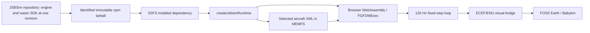

# How JSBSim runs in the browser

0SFS consumes a packaged WASM build from `Felipegalind0/jsbsim/wasm`.
Native engine code and the JavaScript/TypeScript SDK now share the canonical
`Felipegalind0/jsbsim` checkout and revision. Native changes belong in `src/`;
bindings, native lifetime, generic diagnostics and SDK build tooling belong in
`wasm/`. 0SFS owns aircraft data, initial conditions, controls and scheduling.
FOSS Earth remains the separate terrain/rendering dependency.

**Installed adoption, 2026-10-08:** clean in-tree package
`1.2.4-fork.20` is installed and locked at `ea6956b4`. It adds JSBSim's
optional coupled turbine plant (`<plant>` inside `<turbine_engine>`; contract in
JSBSim `doc/turbine-plant-model.md`). It models fuel, combustion, the matched
gas path, shafts, nozzle, metal temperatures and a shaft-driven lift system in
one transient, with a component reference algorithm and a reduced one.
Empirical turbines are unchanged. The F-35B's F135 uses it
([ledger](validation/f135-engine-plant.md)). The lift fan and roll posts are
now outlets of that one engine, applied as external forces. Their engines 1–3
are gone.

Ninety native tests, 52 SDK cases, 63 identity/artifact cases, all 14 installed
files and 238 application integration tests pass. The
[fork.20 adoption record](../validation/evidence/jsbsim/adoption/fork20-adoption.json)
keeps hashes, logs and three rejected candidates, each retained in `deps/` and
refused by the identity gate:

- **fork.17:** `set-running` put a plant engine at full throttle until the next step.
- **fork.18:** a steady converted point could not be solved above about 15 kt.
- **fork.19:** reheat permission used physical rather than corrected N2.

Rollback to fork.16 needs the F-35B data from before the plant migration;
the [rollback declaration](../validation/evidence/jsbsim/rollback/fork16/README.md)
retains it.

**Prior adoption, 2026-10-06:** clean in-tree package
`1.2.4-fork.16` was installed and locked at `97fe6ddf`. It adds read-only signed
heat accounting for every existing turbine solid without changing the thermal
solve, F135 coefficients, fuel, thrust, spool or nozzle schedules. Each region
publishes imposed bath temperatures, effective capacity, gas/coolant/radiative
rates in W, accepted step duration, stored/transferred energy and residual in J.
Positive power enters the solid. An explicit warm initialization records assigned
initial energy separately from integrated heat; a true cold start keeps finite lag.

The [native contract](../validation/evidence/jsbsim/adoption/fork16/native-thermal-model.md)
defines all property names and cached-receipt semantics: only accepted native
steps may accumulate energy, never repeated hold or render reads. Reset, zero-time
calls, warm/cold state restoration and the two-solid atomic solver remain intact.
These are local wall balances driven by imposed reservoirs, not a closed engine
energy budget. The core's 1,800 J/K and liner's 12,000 J/K are effective capacities;
neither is calibrated from the visual shells, their volume or an alloy density.

Twenty-five native thermal methods, five related turbine targets, 52 SDK cases,
59 identity/artifact cases and all 14 installed distribution files pass. Exact
source/archive hashes and logs are in the
[fork.16 adoption record](../validation/evidence/jsbsim/adoption/fork16-adoption.json).
The [installed physical thermal checks](../validation/evidence/aircraft/f35b/engine-physical-correction-2026-10-06/native/report.json)
audit 133,577 native steps across separate cold start, already-running seed,
hot restart, lifecycle restoration, powered lift and timestep convergence.
Maximum step residual is below 2.74e-9 J. Independent RK4 cooldown comparison
shows halving error with halving timestep; 240 Hz errors are 0.00370 K liner and
0.00792 K core. This verifies the declared reduced equations, not measured F135
hardware temperatures or radiance. Full application CI and any rendered visual
qualification belong to the combined physical-correction record.
Fork.15 declarations and its matching F135 XML are retained for rollback.

**Prior adoption, 2026-10-06:** clean in-tree package
`1.2.4-fork.15` was installed and locked at `b58a1855`. It adds optional named
solid thermal regions using one shared native bounded solver. The existing
wall properties and fork.14 lifecycle remain intact; each added region has its
own capacity, gas/coolant/radiation inputs, initialization and validated state
restoration. All candidate states commit only after every region validates.
No render clock advances heat and no thrust/fuel/spool/EGT/nozzle schedule changes.

The F135 now selects two provisional regions: the retained cooled downstream
liner/nozzle and a smaller, less-cooled core-facing region whose gas bath is
upstream of afterburner heat addition. New properties are
`propulsion/engine[0]/thermal/core/metal-temperature-k`,
`thermal/core/metal-temperature-state-k` and `thermal/core/initialized` beneath
the same engine prefix. Capture and restore both solids independently. Shared
`thermal/valid` and each region's `initialized` gate observations.

Twenty native thermal methods, five related turbine targets, all 52 SDK cases,
58 identity/artifact cases and all 14 installed distribution files pass. The
[fork.15 adoption record](../validation/evidence/jsbsim/adoption/fork15-adoption.json)
retains exact source/artifact identity and logs; the
[native model contract](../validation/evidence/jsbsim/adoption/fork15/native-thermal-model.md)
describes configuration and lifecycle. The
[propulsion/thermal audit](../validation/evidence/aircraft/f35b/engine-rebuild-2026-10-06/propulsion-thermal-audit.json)
records coefficients and why the coupled 28k/43k development ratings remain
unchanged. Eleven [installed two-solid lifecycle scenarios](../validation/evidence/aircraft/f35b/engine-rebuild-2026-10-06/implementation/native/acceptance.json)
pass, including stopped-hot runway relocation and powered-lift transients with
AB inhibited. The prior failed harness call and its targeted correction remain
retained. No measured F135 thermal/optical calibration is claimed. Combined
visual acceptance and full CI belong to the engine rebuild.
Fork.14 declarations and its single-solid engine XML are retained for rollback.

**Prior adoption, 2026-10-06:** clean in-tree package
`1.2.4-fork.14` was installed and locked at `399a5173`. It adds an optional,
data-driven native turbine thermal model: separate nozzle-gas energy balance,
persistent metal temperature and a validated native state property for recovery.
Existing thrust, fuel, spool and legacy EGT calculations retain their behavior.
Actual augmentation gates estimated excess burner fuel; an optional declared
stoichiometric ratio limits heat-releasing fuel while retaining all supplied
mass. The wall integrates convection, coolant and radiation with a bounded
backward-Euler solve on accepted native simulation time. Cold initialization,
first warm initialization, trim, zero-time RunIC, reset and state restoration are
explicit; no render clock advances heat.

The 15-method native temperature/thermal target passes; three existing related
turbine targets passed on the thermal feature source before its suspension-only
follow-up. The one clean locked-toolchain SDK build passes all 52
cases; 57 identity/artifact cases and all 14 installed files verify. The actual
public F135 profile at 1000 ft static hold-down reaches about 2,362 K gas and
1,270 K wall after sustained afterburner; after shutdown the gas approaches
ambient while the wall remains warm. These authored thermal coefficients are
estimates, not measured F135 station/material data. Exact contracts, hashes,
retained initial failures and qualification status are in the
[fork.14 adoption record](../validation/evidence/jsbsim/adoption/fork14-adoption.json)
and its [native model contract](../validation/evidence/jsbsim/adoption/fork14/native-thermal-model.md).
Eight actual installed thermal lifecycle scenarios pass, including exact wall
restoration through the application snapshot and free/runway relocation helpers.
The next accepted step is checked for bounded continuity rather than exact
trajectory parity. Another 52 focused application regressions pass. Final full
application CI passes 1,767 tests across 163 files, with one existing expected
stowed-gear envelope failure; lint, typecheck, production build and installed/
emitted artifact checks pass. The [combined thermal acceptance record](../validation/evidence/aircraft/f35b/thermal-model-2026-10-06/acceptance.json)
retains those checks. No new GPU or aircraft calibration is claimed.

Fork.13 was rejected during qualification: `InitRunning` suspended executive
integration but used a cached positive engine-input timestep, advancing metal
state by 0.006512 K at unchanged simulation time. Fork.14 adds the executive
suspension guard and a positive-input native regression; the actual public-model
probe now requires exact same-time wall equality. The immutable fork.13 artifact
and [failed-candidate record](../validation/evidence/jsbsim/adoption/fork13-adoption.json)
remain retained, but the stable identity gate rejects it. The last accepted
pre-thermal rollback is fork.12.

**Prior adoption, 2026-10-06:** clean in-tree package
`1.2.4-fork.12` was installed and locked at `6a25a521`. It adds the read-only
indexed `propulsion/engine[n]/egt-degc` observation of existing
`FGTurbine::GetEGT()` in degrees Celsius, without changing temperature, fuel,
thrust or phase calculations. Three direct C++ regressions compare the getter
and property across start, run, augmentation, shutdown, Trim and reset, including
nonzero engine index and rejected writes. The successful locked-toolchain SDK
build passes 52 cases; 55 identity/artifact cases and all 14 installed files verify.
The installed F135 trace proves heating before Running and gradual ordinary
shutdown cooling. It also records unchanged model limits: no extra afterburner
heat and a temperature jump following hot-stopped RunIC. This is a generic gas
temperature proxy, not measured F135 metal temperature. Exact hashes, failed
attempts, trace, primary thermal context and acceptance scope are in the
[fork.12 adoption record](../validation/evidence/jsbsim/adoption/fork12-adoption.json).
The full application CI run passes 1,749 tests across 162 files, with one existing
expected gear-envelope failure; lint, typecheck, production build and installed/
emitted artifact checks pass. The [temperature-glow acceptance record](../validation/evidence/aircraft/f35b/temperature-glow-2026-10-06/acceptance.json)
retains the combined software checks. No new GPU or aircraft thermal calibration
is claimed.

**Prior adoption, 2026-10-05:** clean in-tree package
`1.2.4-fork.11` was installed and locked at `c1d57a2c`. It repairs stopped-turbine
phantom thrust during zero-time initialization. Native Running=false now returns
zero thrust while preserving stopped spool/fuel state; running idle and normal
trim remain unchanged. The legacy trim-to-run startup initialization is preserved.
The one locked-toolchain SDK build passes all 52 tests. The native stopped-thrust
regression passes eight methods; existing spool/fuel trim regressions also pass.
All 14 installed files and archive integrity verify. Across six focused installed
files, all 132 unique cases pass after correcting one old Manual-flaps fixture
and rerunning only that file. The final application suite passes 1,536 tests;
its build verifies the installed and emitted artifacts. The
[combined acceptance record](../validation/evidence/aircraft/f35b/final-acceptance-2026-10-05/acceptance.json)
retains that run and the shared renderer follow-up. Exact hashes, logs and limits are in the
[fork.11 adoption record](../validation/evidence/jsbsim/adoption/fork11-adoption.json).

Fork.10's read-only cached indexed thruster vectors and resolved aerodynamic
reference point/RP/CG split remain included. They observe native state without
recomputing transforms or moments. Its separate immutable package and native/
SDK checks are in the
[fork.10 record](../validation/evidence/jsbsim/adoption/fork10-adoption.json).
Fork.9's generic turbine nozzle display observer, fork.8's actual augmentation
observer and earlier spool/fuel corrections remain included. Earlier packages,
records and matching rollback declarations are retained. No aircraft, device
sound or optical calibration is claimed by SDK adoption.

**Earlier application acceptance, 2026-09-14:** clean in-tree package
`1.2.4-fork.7` was installed and locked. It added the configurable turbine idle
fuel flow described in [Idle fuel flow](#idle-fuel-flow) on top of fork.6's
turbine trim fuel-flow fix, described in [Trim fuel flow](#trim-fuel-flow), the
IDBFS-linkage
and native-exception build corrections described in
[the fork.4 adoption record](#adopted-idbfs-and-native-exception-corrections)
and the fork.5 rename. fork.6's acceptance run passed all 731
app/runtime/UI/artifact tests across 77 files. Production build/typecheck and emitted
asset checks passed; focused ESLint passed the five changed identity/artifact
and test-configuration files with no warnings. Headless Chrome verified actual SDK boot and loaded
bytes for C172 and all three SF50 runtime packages. The separate component
keyboard/layout check passed three viewports. These establish software and
artifact contracts, not aircraft calibration or terrain readiness. The
[in-tree execution record](old/jsbsim-in-tree-integration-2026-09-13.md)
and [centralization record](old/jsbsim-centralization-2026-09-13.md) are
historical snapshots; their checkout names and package identities are not the
starting state.


```mermaid
flowchart LR
  Source[JSBSim repository: engine and wasm SDK at one revision] --> Package[Identified immutable npm tarball]
  Package --> App[0SFS installed dependency]
  App --> Runtime[createJsbsimRuntime]
  Runtime --> WASM[Browser WebAssembly / FGFDMExec]
  Runtime --> Data[Selected aircraft XML in MEMFS]
  Data --> WASM
  WASM --> Loop[120 Hz fixed-step loop]
  Loop --> Bridge[ECEF/ENU visual bridge]
  Bridge --> Earth[FOSS Earth / Babylon]
```

## Package name

The package is `@felipegalind0/jsbsim`, named after the repository it is built
from. It was called `@felipegalind0/jsbsim-wasm` through fork.4; that name
described a separate SDK source that no longer exists, since the engine and the
`wasm/` SDK have shared one repository and one revision since the in-tree
consolidation. The rename landed with fork.5 and changed no engine or SDK code.

There is no `jsbsim-wasm` dependency, checkout or source selector anywhere in
this project. The remaining `0x62/jsbsim-wasm` references are to the upstream
project this SDK derives from: its MIT notice and Benedict Lewis's copyright
travel with the distribution and must not be removed, and SDK PR #8 is still an
open review there.

Retained rollback tarballs keep the name they were published under, so
`jsbsimBuildIdentity.ts` pairs every accepted version with its exact name and
rejects a renamed package claiming an older version. A full rollback restores
that release's declaration, lock and identity module together from
[`validation/evidence/jsbsim/rollback/`](../validation/evidence/jsbsim/rollback);
fork.5 and fork.6 are at commits `f9a27c0d` and `9e22e168` instead, and
fork.7 through fork.15 pre-upgrade declarations are retained for rollback; fork.16
is the installed declaration. The fork.12 rollback also retains the matching
pre-thermal F35 aircraft data, verified against its installed trace.

## Build and installation chain

The app requires Node **22.18 or newer** because its shared artifact validator
uses native TypeScript stripping. This integration was exercised with
**Node 26.8.2**; SDK compilation additionally uses its locked toolchain.

The application declares:

```json
"@felipegalind0/jsbsim": "file:deps/felipegalind0-jsbsim-1.2.4-fork.16.tgz"
```

The package scope and API imports stay the same. The wrapper version does not
identify the native engine version; `buildIdentity` records the actual common
source revision. No npm publication is implied or needed.

Stable installation requires a **clean in-tree** schema-2 identity. The engine
and SDK commit/dirty fields must agree, `sdk.path` must be `wasm`, and metadata
must identify that same repository with null external native archive/source-lock
fields. A dirty candidate is rejected even if its archive and installed bytes
agree. Explicit SDK diagnostics may use a checked candidate directory with
`validate-sf50.mjs --sdk-root=...`, labeled as a candidate.

The previous exact schema-1 `1.2.4-fork.1` and schema-2 `1.2.4-fork.2` and
`1.2.4-fork.3` contracts remain supported for deliberate rollback. Fork.1
requires clean pinned source; fork.2 and fork.3 require clean in-tree source. Schema/version pairs, archive
integrity and recorded distribution bytes remain checked, with no version
range or implicit runtime fallback. Use each retained tarball with its matching
declaration and lock, which are tracked per version under
[`validation/evidence/jsbsim/rollback/`](../validation/evidence/jsbsim/rollback).
Fork.3 replaced the earlier
accepted fork.2 package after an explicitly verified official emsdk compiler
banner was added to the toolchain lock. Fork.4 replaces fork.3 after adopting
the IDBFS and native-exception corrections. No earlier archive was overwritten.

Retain the accepted tarball under `deps/` together with `package.json` and
`package-lock.json`. `npm ci` then installs the same SDK without a JSBSim/SDK
source sibling, compiler or private package registry. Do not replace an accepted
tarball in place: a changed candidate requires an explicit dependency update
and new acceptance evidence. FOSS Earth still uses `file:../foss-earth`; its
checkout/build remains necessary, and it does not acquire a JSBSim dependency.

Build engine or SDK changes from `/Users/felg/gh/Felipegalind0/jsbsim` on
`master`. New work branches from there, and the checkout returns to `master`
when the branch's work is done. The original `integration` branch is
the preserved pre-import reference, not the development tip. The PR branches
`feature/wasm-package`, `fix/emscripten-portability`, `fix/turbine-trim-spool`,
`fix/turbine-trim-fuel-flow`, `fix/model-reload-lifetime`, `feature/wheel-spin-dof`
and `feature/tank-temperature-property`, and the local
`candidate/pr1508-off-engine-fuel`, are review slices of work already on
`master`, not more complete versions of it.

```sh
npm --prefix wasm ci
SOURCE_DATE_EPOCH=$(git log -1 --format=%ct) npm --prefix wasm run build
npm --prefix wasm run pack:build -- --release
```

For uncommitted development, use `npm --prefix wasm run build:dev` instead.
That produces an identified dirty diagnostic candidate; it cannot qualify for
release packing or stable app adoption. Default native CMake builds leave
`BUILD_WASM_MODULE=OFF` and do not require Node or Emscripten. The owning build
contract is `wasm/docs/centralized-builds.md` in JSBSim.
Use the locked tool versions even if Homebrew has upgraded the system Node.
The fork.16 build used the verified Node 26.8.2 retained under JSBSim's
`build/tools/node-26.8.2-20261005/`, with npm 11.19.1. Operational caches stayed
inside that checkout: `EM_CACHE="$PWD/build/emscripten-cache"` and
`npm_config_cache="$PWD/build/npm-cache"`. The former reuses the retained
6.0.9-git cache; no Homebrew cache or toolchain-lock mutation was needed.


A WASM build is a full Emscripten compile and its hash differs between builds of
one commit, so build only when the engine or SDK changed. `wasm/build/` keeps the
selected fork.16 artifact, its build descriptor and captured source, which `pack:build`
and the demo read through `wasm/build/last-build.json`.

Build native changes in one build directory for `master` (now
`build/master-20260925`) or one per branch, not a new directory per commit, with
ccache and its cache inside the checkout. Build only the targets the tests need,
and run the tests the change affects; run the full `ctest` suite before
publishing.

```sh
L="env;CCACHE_DIR=$PWD/build/ccache;CCACHE_MAXSIZE=2G;ccache"
cmake -S . -B build/master-20260925 -DCMAKE_BUILD_TYPE=Release -DBUILD_PYTHON_MODULE=ON \
  -DPython3_EXECUTABLE=$PWD/.venv/bin/python \
  -DCMAKE_C_COMPILER_LAUNCHER="$L" -DCMAKE_CXX_COMPILER_LAUNCHER="$L"
cmake --build build/master-20260925 --target _jsbsim -j5
ctest --test-dir build/master-20260925 -R 'Turbine|WheelSpin'
```

Run `ccache -s` with the same `CCACHE_DIR`; without it ccache uses
`~/Library/Caches/ccache`, outside the repository. What else may stay in
`build/` is listed in [Build scratch](build-scratch.md).

The build captures the enclosing repository once. Generator, compiler, tests
and metadata share that frozen source; the SDK digest is the `wasm/` subset of
the same snapshot. No native archive, vendor checkout or external source path is
selected. Successful builds produce an immutable package under
`wasm/build/artifacts/`; `wasm/build/last-package.json` identifies its checked
tarball and archive integrity. Failed attempts do not replace the accepted
artifact. Captured sources and output directories are not development checkouts
or implicit app overrides.

**The WASM build is not reproducible, because the engine embeds its compile
time.** `src/FGJSBBase.cpp` sets `JSBSim_version` to
`JSBSIM_VERSION " " __DATE__ " " __TIME__`, so every binary carries the local
time it was compiled at; fork.7's contains `1.3.2.dev1 Sep 14 2026 00:19:14`.
The fork.5 source revision `e727e6f1` was built twice with the same toolchain on
the same machine and gave
`d848696de238128cee41c34e7e63951af9563eebdef6ddb631adfb02f989f1b1` and
`950433d3036d1bb77c7f96b3b3cc4e96d3c7a04c7e7b6264a20cd71075a1f76a`, both
2,198,897 bytes. They differ in 1,728 bytes, and every one comes from that string:

- The two strings end `21:32:22` and `21:33:58`. wasm-ld sorts merged string
  constants by their endings, so one sits among strings ending in "2" and the
  other among strings ending in "8".
- Every string between those two places moves by 32 bytes, the timestamp's
  length with its terminator.
- What refers to those strings changes with them: 414 instruction operands and
  76 data pointers differ by exactly 32, and 8 operands follow the timestamp
  itself.

Nothing else differs. The binaries contain no build paths, and the emitted
`jsbsim_wasm.mjs` loader is byte-identical across builds.

When `SOURCE_DATE_EPOCH` is set, the compiler takes `__DATE__` and `__TIME__`
from it, in UTC; test compiles with the locked Emscripten 6.0.9 confirmed this.
The build command above sets it to the commit time, so the version string names
the commit instead of the build. Whether that makes a whole build identical has
not been tested: build the next package twice and compare `jsbsim_wasm.wasm`
before relying on it. This needs no JSBSim change, and none is worth proposing
upstream: dropping the timestamp would change the version banner, and builders
who need reproducible output already set `SOURCE_DATE_EPOCH`.

Consequences, for every package built so far: each build is still immutable,
hashed and gated once produced, and `verify:jsbsim` still rejects any
substituted or modified artifact. But a shipped binary cannot be re-derived from
its source revision, so **the tarball is the authority, not the commit**. Two
artifacts built from one revision are different artifacts and must be accepted
separately. Do not treat a hash difference between two builds of the same source
as evidence of a source or behaviour change.

## Installed and browser artifact checks

The accepted application artifact is:

| Identity | Value |
| --- | --- |
| Common native/SDK commit | `399a5173fb5d597f499103df8611a2132945f4a8` |
| Repository content SHA-256 | `1783bae2c7379e18e2435c3385d56f5c857553ebd9a0bd3278b9d48a55f9cc3a` |
| SDK subtree content SHA-256 | `044ebb2a6d6ff33f23ec3b7aac47b8c8b7c27775844a7c51d2b462c00321ab8e` |
| Build input SHA-256 | `917dffaef91d7279fdcbcbf1b5bcee356e8381005e1eb73720a75a4f8f708906` |
| Package tarball SHA-256 | `02a1080dc325f2fff399d94b38aff03dee8e8ac12cfc32ce1398910c5bf84485` |
| Installed loader SHA-256 | `784e82c9cae536589f408a74abdda475fd72c56b18bb99129f66281ab3d53dc2` |
| Installed WASM SHA-256 | `1221e1ff73a0105744048bf223d413f0274803e3ba383a0009945d029a505260` |

That is fork.14, packed from clean `master`. It includes the generic opt-in
thermal balance and executive-suspension correction described above. Earlier EGT,
stopped-turbine zero-time thrust, indexed cached force, resolved aerodynamic
anchor/split, nozzle/augmentation and fuel/spool changes remain included.
Source adoption is separate from aircraft calibration.

The installed distribution's 14 recorded files and archive SHA-512 lock
integrity are verified. The
[verified installed artifact](../validation/evidence/jsbsim/adoption/fork14/verified-installed-artifact.json),
[57-case installed identity checks](../validation/evidence/jsbsim/adoption/fork14/installed-identity-regressions.log),
[actual native public F135 thermal trace](../validation/evidence/jsbsim/adoption/fork14/native-f135-final-profile.json)
and [successful SDK build log](../validation/evidence/jsbsim/adoption/fork14/sdk-build.log)
are retained with the
[fork.14 adoption record](../validation/evidence/jsbsim/adoption/fork14-adoption.json).
The earlier fork.11 app CI and hardware browser receipts remain historical:
[prior combined acceptance](../validation/evidence/aircraft/f35b/final-acceptance-2026-10-05/acceptance.json)
and [prior hardware check](../validation/evidence/aircraft/f35b/exhaust-smoke-gpu-2026-10-05/acceptance.json).
They do not establish full application/browser acceptance of the new artifact.

All app imports, type imports, mocks and SDK assets use the fork scope.
`createJsbsimRuntime` imports `JSBSimSdk` and `buildIdentity` from the package,
and `wasmModuleUrl`/`wasmBinaryUrl` from its `/wasm` export. Vite excludes the
fork from dependency optimization and includes `**/*.wasm` as build assets.

```sh
npm run verify:jsbsim
npm run build
```

`verify:jsbsim` checks the repository-relative tarball, lock resolution and
SHA-512 integrity; it rejects a live SDK symlink or ineligible source identity.
It compares installed and archived metadata/package identity, hashes every
recorded distribution file, rejects unrecorded files and checks the exported
identity against metadata. Schema-2 repository provenance is checked separately.
The complete distribution includes entry points, declarations, loader, WASM and
recorded notices. Schema-1 checks remain available for explicit rollback.

`npm run build` performs that preflight, app TypeScript checking, the Vite
production build and emitted loader/WASM SHA-256 comparisons. It writes
`dist/jsbsim-artifact.json` with `browserLoadedAssetsVerified: false`;
successful bundling alone does not prove browser instantiation.

Two bounded headless checks start no server or visible browser:

```sh
node scripts/check-aircraft-selection-headless.mjs
node scripts/check-jsbsim-browser-artifact.mjs
```

Each run writes a new dated folder under the gitignored
`build/validation/aircraft-selection/` or `build/validation/jsbsim-browser-artifact/`.
`--out=` chooses another folder, which must be new. The selection check bundles actual React
components and shell/CSS with a static flight snapshot, checks wide/narrow/short
viewports, family keyboard navigation, staged G2+ selection and keyboard Apply,
and saves screenshots. It does not instantiate an FDM. The built-app check
serves actual `dist/` bytes through headless Chrome request interception, boots
each runtime aircraft and compares diagnostic identity and fetched
loader/WASM/XML hashes to the installed package and build manifest.

The earlier component check passed all three viewports. It records a
clipped lower LOD-select focus outline in wide/narrow shells; control bounds
and keyboard-reached Apply/outline remain visible. That earlier built-app check
passed the four then-supported runtime aircraft with no missing local assets or runtime
exceptions. External terrain/font requests were blocked, the no-Google-key
warning was recorded and terrain stayed unready. Production builds retain the
large renderer-chunk warning; some jsdom app tests retain React act warnings.
These historical checks exclude terrain readiness, GPU performance and aircraft
fidelity and do not qualify the current fork.14/F-35B application.

## Adopted IDBFS and native-exception corrections

Fork.4 carries the two build defects found while preparing the upstream package
contribution ([JSBSim #1507](https://github.com/JSBSim-Team/jsbsim/pull/1507),
branch `feature/wasm-package` at `c6d4063a`). They were ported selectively onto
the full integration as `feature/wasm-integration-idbfs-exceptions`
at `c328c7ab6d81e6de68b8db2115c35d350b226025`. The review package's
`@jsbsim/wasm@0.1.0` identity and its omission of the property-batch,
gear-contact and wheel features were **not** adopted.

| Correction | Adopted change |
| --- | --- |
| Native exception handling | The root `CMakeLists.txt` adds `-fexceptions` to C++ compilation whenever `BUILD_WASM_MODULE` is `ON`, before `add_subdirectory(src)`. Enabling exceptions only on the bindings target or the final link cannot restore engine catch blocks that were compiled away. |
| Browser persistence | `wasm/CMakeLists.txt` links `-lidbfs.js`, so the advertised optional IDBFS persistence actually exists in the module. The hand-written extension bindings are still compiled into the same target. |
| Persistence root safety | `WasmVfsManager.resolveRoots` normalizes `.`/`..` segments, rejects NUL and rejects equal or nested runtime/persistence roots. `JSBSimSdk.create` resolves both roots before loading the module, so an unsafe pair cannot reach tree copying or allocation. Sibling prefixes such as `/data/runtime` and `/data/runtime-cache` stay valid. |
| Lifecycle checks | `writeDataFile`, `readDataFile`, `mkdir`, `enablePersistence`, `syncFromPersistence` and `syncToPersistence` now reject use after `destroy()`. |

Native builds with the component disabled receive no additional exception flag:
148 native compile commands contain none, `BUILD_WASM_MODULE` defaults to `OFF`,
no `build/wasm` directory is generated, `JSBSim --version` starts, and enabling
the component with a native compiler is still rejected.

The added regressions are a malformed-propulsion recovery test, four
persistence-boundary cases and a pinned Playwright 1.63.0 browser check.
The propulsion test removes the standard C172's required `<thruster>`: native
`FGPropulsion::Load` must catch its own XML error, return `false`, and then load
a valid C172 and step it. A dirty diagnostic build with the engine flag removed
reproduces the defect at 49/50 with that test failing on an escaped native
exception (`excPtr: 278536`); that candidate was never promoted. With the flag,
all 50 SDK tests in nine suites pass.

The browser check serves only accepted artifact bytes through request
interception — no server, app checkout or aircraft data — and verifies across
three navigations in pinned Chromium 153.0.8010.12 that IDBFS is linked, that
text and binary files survive navigation, that deletions and updates persist,
that the downstream `PropertyBatch`/`GearContacts` bindings are still present in
the same artifact, and that the executive is disposed after each phase. The
application itself still does not enable persistence; this is an SDK capability
check. Run it after a build with:

```sh
# From the canonical JSBSim root, once per machine:
npm --prefix wasm exec -- playwright install --only-shell --no-remove chromium
npm --prefix wasm run test:browser
```

The older pinned Playwright 1.58.2 installer stalled during archive extraction,
so 1.63.0 is pinned and only its headless shell is requested. Build and check
runners now enumerate `test/*.test.mjs` explicitly, keeping this browser check
out of the unit-test run. Full adoption results, hashes and limitations are in
[`validation/evidence/jsbsim/adoption/fork4-adoption.json`](../validation/evidence/jsbsim/adoption/fork4-adoption.json).

## Trim fuel flow

`FGTurbine::Trim()` computes steady thrust and spool speeds without advancing
time. It never assigned `FuelFlow_pph`, so a zero-time evaluation reported
whatever the engine had last produced. This reaches the app directly:
`propulsion/set-running` forces the throttle to 1 and trims there, so every
later trim at a lower setting still read the full-throttle number.

On the retained fork.5 artifact the F16 fixture reports 1548.92 gph at every
throttle command, idle included. On fork.6 the same sweep gives 114.80, 284.34,
807.49 and 1485.99 gph across dry commands 0.00 to 0.49, and 7823.98 gph
augmented, with no dependence on the order the settings are trimmed in. The
script producing both is preserved as
[`scripts/validation/jsbsim/trim-fuel-flow/check.mjs`](../scripts/validation/jsbsim/trim-fuel-flow/check.mjs),
with its logs in
[`validation/evidence/jsbsim/trim-fuel-flow/`](../validation/evidence/jsbsim/trim-fuel-flow); it fails
on fork.5 and passes on fork.6, which is what attributes the change to this
package rather than to the harness.

The fix is submitted upstream as
[JSBSim PR #1508](https://github.com/JSBSim-Team/jsbsim/pull/1508). It assigns
the same steady products `Run()` seeks — pre-bleed dry thrust times corrected
TSFC, floored at idle flow, and augmented thrust times ATSFC in whichever
augmentation branch applies. Trim still leaves EGT, oil pressure, nozzle
position and EPR at their previous values.

This corrects *which operating point* trim reports. It does not settle the SF50
idle fuel flow, which fork.7 addresses below.
Full results and hashes are in
[`validation/evidence/jsbsim/adoption/fork6-adoption.json`](../validation/evidence/jsbsim/adoption/fork6-adoption.json).

### Off-engine zero-time reset repair, adopted in fork.8

Found on 2026-09-14 and now repaired in the installed fork.8. `Calculate()`
enters `Trim()` for every zero-time evaluation, running or not. Earlier spool
(`fc13a97b`, PR #1505) and fuel-flow (PR #1508) changes assigned N1, N2 and fuel
flow there for every engine. A shut-off engine therefore came out of RunIC
spooled to its throttle setting, then wound down once time advanced, burning a
little fuel while the fuel flow bled off.

Before the repair, the app hit this when `resetFlightLocation.ts` applied a
location whose saved engine was not running. On the SF50 at 5,000 ft and 150 kt
with throttle 0.6:

- fork.5 came out of the reset at N1 69.7 % and N2 81.4 %;
- fork.7 showed the same spool and also 344.7 lb/h of fuel flow.

The historical audio adapter read that invented fuel flow as combustion for the
first few steps. The adopted repairs assign running spool and fuel targets only
when `Running`, preserving an off engine's possibly windmilling spools and
existing fuel state through zero-time evaluation. They do not force residual
fuel flow to zero or change normal shutdown decay. Original findings are in
[the open PR review](validation/jsbsim-open-pr-review-2026-09-14.md).
The local engine repairs are included in the
[fork.8 adoption record](../validation/evidence/jsbsim/adoption/fork8-adoption.json).
Upstream review/publication remains tracked separately in the contribution
policy; no app workaround is used.

## Native turbine augmentation observation

Fork.8 publishes `propulsion/engine[n]/augmentation` as a read-only boolean.
It reports whether an installed afterburner contributes at the current native
evaluation point, rather than exposing the existing C++ command flag. Native
method 1 waits for its spool threshold; method 2 uses its native augmentation
range. Non-augmented engines cannot enter the method-2 augmentation branch.
Dry, off, cutoff, stalled, seized and reset paths report inactive. Existing
`SetAugmentation`/`GetAugmentation` command semantics remain intact.

Five native regression methods cover indexed read-only behavior, spool lag,
running/off zero-time paths, non-augmented engines and stall/seizure. The frozen
real-WASM SDK test checks catalog visibility, property batches, cutoff, reset
and reload lifetime. The app's audio observes this field with an availability
bit; an absent observer is unavailable, and throttle is not an afterburner
observation. This boolean is not continuous augmentation amount or exhaust-flow
telemetry. The adoption adds no upstream PR, comment or npm publication.

## Idle fuel flow

`FGTurbine::Load()` always set `IdleFF` to `107 * milthrust^0.2`, an estimate
from rated thrust alone, and `Run()` floors steady fuel flow at it. For the
SF50's 1,846 lbf that floor is 481.5 lbm/hr, or 71.4 US gph: six times the
11.3 gph the WPR20FA051 recorder shows at ground idle, and above the two lowest
printed AFM cruise rows, so those rows were unreachable at any power setting.

fork.7 reads an optional `<idlefuelflow>` in lbm/hr and keeps the estimate when
it is absent. A negative value is rejected, before `FGEngine::Load` ties engine
properties: rejecting it afterwards left the ties behind for an engine that was
never constructed, and destroying the executive then crashed in
`FGPropertyManager::Unbind`.

The app's SF50 package declares the recorded 76 lbm/hr. Loading that package on
the retained fork.6 artifact reports 481.5 lbm/hr at ground idle; on fork.7 it
reports 76.0. The script producing both is preserved as
[`scripts/validation/jsbsim/idle-fuel-flow/check.mjs`](../scripts/validation/jsbsim/idle-fuel-flow/check.mjs),
with its logs in
[`validation/evidence/jsbsim/idle-fuel-flow/`](../validation/evidence/jsbsim/idle-fuel-flow);
it fails on fork.6 and passes on fork.7, which attributes the change to this
package rather than to the SF50 package or the harness. Full results and hashes
are in
[`validation/evidence/jsbsim/adoption/fork7-adoption.json`](../validation/evidence/jsbsim/adoption/fork7-adoption.json).

`TestTurbineIdleFuelFlow` covers the unchanged default, a configured value above
and below the estimate, a running engine settling on the configured value, and
rejection of a negative one.

The change is not submitted upstream. As of 2026-09-14 it is in use: the SF50
declares the element under fork.7. `c70be257` merges cleanly onto upstream
`master`. It is a candidate for its own PR; see
[the contribution policy](jsbsim-upstream-contribution-policy.md).

## Runtime diagnostics and native lifetime

The SDK exports schema-2 `buildIdentity` with package identity, the shared repository
origin/revision/content digest/dirty state, the SDK subtree path/content digest,
build mode/input digest, toolchain (including the Emscripten configuration SHA-256)
and build options. Its `/build-metadata` JSON
export records final relative distribution-file hashes and completed checks
separately, avoiding a self-referential SDK-entry hash.

The app validates the identity before allocation. A successful runtime exposes
`window.osfsJsbsimBuild` with the selected `aircraftId`, build identity and
actual module/binary URLs, and logs the identity in developer flight
diagnostics. This contains no native executive handle. Disposal removes that
runtime's global diagnostic reference and stored event listeners, then calls
`sdk.destroy()` once. Failed startup also releases a late successful
allocation. Native executive deletion is SDK-owned; no app `exec.delete()` or
optional `sdk.delete()` fallback completes cleanup.

`validate-sf50.mjs` reports schema 2 with the verified artifact identity and
file hashes. Its normal mode verifies the installed app dependency. An
explicit `--sdk-root` is labeled `explicit-sdk-root-candidate` and verified as
a candidate directory; it is not reported as the installed app runtime.
SF50 real-WASM tests now assert that SDK destruction deletes the native
executive and repeated destruction is safe. These checks passed against the
current in-tree package in the 144-test installed-app run; exact results remain
attached to that artifact in the execution record.

## Native turbine nozzle display observation

Fork.9 exposes `propulsion/engine[n]/nozzle-pos-norm` as read-only native state.
The existing generic schedule uses nominal 0 tight / 1 open, slews toward
`1 - N2norm` in dry Run, opens while afterburning or off, and starts open on
reset. Zero-time Trim retains the prior nozzle value. This is an animation
schedule, not a calibrated F135 nozzle area, thrust-vectoring angle, command
or exhaust-flow model. Aircraft presentation reads it without creating missing
properties. EGT remains unavailable through the property catalog; no observer
for it is invented by the app.

## Native force observations and stopped zero-time evaluation

Fork.10 adds read-only `propulsion/engine[n]/body-force-x-lbs` (and y/z),
the vector cached by the native thruster evaluation for any thruster family.
Existing acting-location properties use structural inches. `aero/rp-body-x-ft`
(and y/z) uses body feet relative to CG, including the native RP shift.
`forces/fbx-aero-rp-lbs` and `forces/fbx-aero-cg-lbs` (and y/z) distinguish
reference-point forces from functions applied directly at CG. Their sum is the
native aerodynamic total. Existing native applied-total vectors include contact/
friction and exclude gravity; adding the separately observed weight vector gives
an explicitly labeled net sum, without reconstructing a thruster from scalar
thrust and angles. Body axes are X forward, Y right, Z down.

Fork.11 fixes a separately reproduced stopped-turbine `RunIC()` defect: after
cutoff removed real thrust, zero-time Trim still returned a steady throttle-derived
force despite Running=false. Stopped Trim now returns zero and retains actual
spool/fuel state. Running idle/start-complete and ordinary running Trim are
unchanged. The legacy trim-to-run initialization still sets Cutoff=false as
before; this release does not change startup command semantics. Regression
shutdowns leave Trim through an accepted step before commanding cutoff.

The F35 coupled aircraft data requires the read-only native vector observation.
A deliberate rollback below fork.10 must restore compatible aircraft data too;
restoring the SDK declaration alone does not restore its aircraft-model contract.

## Aircraft loading and initialization

The SDK does not bundle 0SFS aircraft data into its virtual filesystem.
`downloadJsbsimData` fetches `public/jsbsim-data/manifest.json` independently of
WASM compilation. `resolveAircraftDataFiles` validates the selected closure,
rejecting missing/malformed paths rather than falling back to another model.
Only the selected files are written to Emscripten MEMFS with `writeDataFile`.

| Runtime aircraft ID | JSBSim model | Selection meaning |
| --- | --- | --- |
| `cessna-172` | `c172p` | C172 family |
| `cirrus-vision-jet` | `sf50` | Legacy/default G1 |
| `cirrus-vision-jet-g2` | `sf50-g2` | Original G2 development model; G2+ UI label retains this runtime alias |
| `cirrus-vision-jet-g3` | `sf50-g3` | Provisional G3 development model |
| `f-35b` | `F-35B-jsbsim` | Experimental FlightGear F-16/Aeromatic-derived trial with native conversion and selectable control law |

Family selection, generation labels, staged drafts, atomic Apply/persistence,
credits and presentation preferences remain app-owned. A G2+ label does not
make G2+ performance tables applicable to original G2 or G3. All three SF50
packages still share development physics and exterior meshes; selectable
packages and runtime agreement do not establish distinct calibration.
The F-35B source, loading assumptions, physical conversion and limitations are
documented in [its FDM proposal](proposals/f35b-fdm.md); the retained
[yaw/mode regression](../validation/evidence/aircraft/f35b/yaw-2026-10-05/README.md)
qualifies development control limits rather than real F-35 handling.

`bootstrapAircraft` configures paths, loads the selected model, sets and checks
native `setDt(1 / 120)`, and initializes geodetic `ic/lat-geod-deg`. Gear/flap
commands and physical positions agree before initial `runIc()`. Engine startup
via `propulsion/set-running` internally evaluates a full-power steady state.
Bootstrap, location reset and snapshot restoration therefore reapply requested
controls and run normal zero-time initialization after engine setup before
returning a sample. Native JSBSim owns N1/N2 updates; the application does not
write those engine properties. Location/reset recovery reapplies preserved
physical actuator positions after RunIC because that evaluation also visits
rate-limited actuator nodes. Saved fuel, controls, wind and partial gear remain
part of the restoration contract.

Diagnostic-only tests on SDK attempt `dd81bae46e74-F96sOJ` reproduced returned
N1 100 at throttle 0.35 in all three old sequences; re-evaluation gave 54.5.
After sequencing and actuator-preservation corrections, 39 tests across six
focused runtime files passed against that candidate. Those are software
initialization results, not measured aircraft targets or AFM calibration.
The earlier installed pinned artifact subsequently passed those initialization
and actuator regressions in its 97-test run. The current in-tree artifact passed
them again in the 144-test installed-app run described above.

The engine runs locally in browser WebAssembly. The app's coordinate/terrain
bridge, ground contact handling and 120 Hz fixed-step scheduling remain
separate from streamed map data and optional phone pairing. Hydration derives
its base from Vite `BASE_URL`; verify the deployed manifest and XML request
paths before release, including non-root deployments.

## Fuel tanks, and starting and stopping engines

What the Fuel tab and the throttle lever rely on, read from the fork's source and
held by `fuelTanks.integration.test.ts` and `engineControl.integration.test.ts`
against the installed SDK (fork.11 at the time of that retained check).

Fuel tanks:

- A tank publishes its contents, `pct-full`, density and position
  (`x-position` etc.: the full tank's location in structural inches), but no
  capacity. `FGTank::SetContents` caps a write at the capacity, so
  `discoverFuelTanks` writes 1e9 lb, reads the capacity back and restores the
  contents before anything steps. It does not floor a write at zero, so
  `writeFuelTanks` clamps both ends. A read-only `capacity-lbs` tie in FGTank
  would replace the probe; it needs a WASM build.
- The catalogue lists tank 0 as `propulsion/tank/…`. The app always writes
  `propulsion/tank[0]/…`, the spelling saved flights already carried.
- `ResetToInitialConditions` puts every tank back to its definition's contents.
  Flight snapshots therefore carry every tank the catalogue lists, and a runway
  preset writes the loaded fuel back. Until 2026-10-05 snapshots carried tanks 0
  and 1 only, so the F-35B's tanks 2 and 3 went back to empty on every terrain
  recovery.

Starting and stopping, as `engineControl.ts` drives them:

- Turbine: `starter_cmd` 1 with `cutoff_cmd` 1 spins N2 dry toward the ignition
  N2. FGTurbine enters its start phase only above 15% N2 with cutoff 0, so the
  cutoff is released there. Letting go of the starter before N2 reaches idle
  aborts the start (below 30 psf of ram air), and JSBSim lets go of it at idle
  itself, so a start has to be held to the end. Shutdown is cutoff 1.
- Piston: it runs with spark and fuel above 80% of `idlerpm`. `magneto_cmd` is
  write-only, and JSBSim never releases a piston's starter. Shutdown is magnetos 0.
- The first step after any RunIC sets a turbine's `Cutoff` from whether it was
  running, which undoes a cutoff written before that step. The control repeats a
  shutdown until no engine reads running.
- With no active engine selected, `starter_cmd` and `cutoff_cmd` set every engine
  and read back as the AND over all of them. The F-35B's lift fan and roll posts
  are turbines too, and start and stop with the main engine.
- A stopped engine is kept stopped, whatever stopped it, with cutoff 1 or
  magnetos 0. A windmilling turbine above 15% N2 would otherwise relight on ram
  air alone.
- Held from a stopped engine at idle throttle: the C172 runs after about 2 s, the
  SF50 after about 22 s (3–4 s dry to 15% N2, then 2%/s to its 53.4% idle) and
  the F-35B after about 27 s. These turbines use JSBSim's default `n2spinup` 3
  and `n2startrate` 2.

The [2026-10-06 shutdown comparison](../validation/evidence/jsbsim/turbine-shutdown-2026-10-06/acceptance.json)
uses the installed SDK and application engine control, with native hold-down
at zero airspeed. F-35B aborted starts near 59% N2 and shutdowns from idle or
full power have the same normalized decay. They reach 1% N2 after 8.14, 8.18
and 9.19 simulated seconds respectively; the SF50 comparison also agrees.
These are model observations, not real-engine coast-down calibration. The
reported faster shutdown in the live app remains unreproduced; no spin-down
parameters were changed. Reproduce the controlled comparison with
`node scripts/validation/aircraft/check-turbine-shutdown.mjs`.

## Ownership, notices and continued work

Use the canonical repositories and ordinary branches:

- Native engine and WASM SDK: `/Users/felg/gh/Felipegalind0/jsbsim` (`src/` and `wasm/`).
- App/aircraft/evidence: `/Users/felg/gh/0sfs`.
- Reusable terrain/rendering: `/Users/felg/gh/foss-earth`.

A local, gitignored `flight-development.code-workspace` can open these roots
together with gamepad-tools. The old separate
SDK checkout was reversibly moved to
`/Users/felg/gh/.preservation/jsbsim-in-tree-20260913T233508Z/retired-jsbsim-wasm`;
its history and the fork.1/fork.2 tarballs remain migration/PR references. SDK
development belongs in the combined repository. The preferred checkout
layout remains `gh/owner/repo`. Captured sources and immutable packages are
build inputs/outputs, not extra editing checkouts. Historical SDK compatibility
patches remain provenance; no preparation script applies them.

The wrapper MIT notice and native JSBSim LGPL notices remain distinct and must
travel with the relevant package/source distribution. C172 XML and aircraft
models have their own unresolved provenance/redistribution requirements; see
[the software inventory](../THIRD_PARTY_LICENSES.md). Do not describe all
JSBSim-related content as MIT or redistribute AFM/dashboard evidence merely
because it is publicly accessible.

Continue existing upstream work under the
[contribution policy and dated PR ledger](jsbsim-upstream-contribution-policy.md).
Upstream review status, local correctness, installed app adoption and aircraft
fidelity are separate outcomes. Preserve the [validation guide](validation/sf50-performance.md), including
source identities, qualification ledgers and the 600-fit/220-same-source-check
allocation, when updating the dependency. The
[SF50 development handoff](old/sf50-development-handoff.md) is a dated snapshot.
