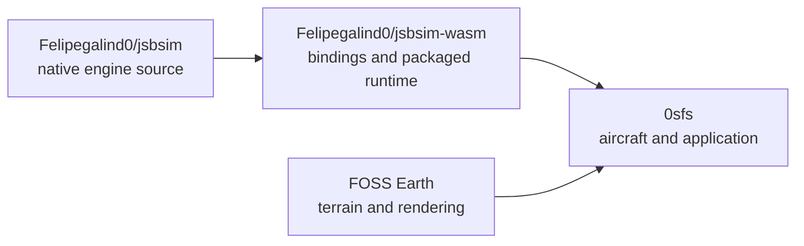

# Centralize the JSBSim fork, SDK and application dependency

Date: 2026-09-13. Status: implemented and locally accepted. Native and SDK are clean on ordinary integration branches; 0sfs runs the pinned fork tarball. See the [execution record](jsbsim-centralization-2026-09-13.md) for preservation, exact identities, completed checks, reviewable app changes and remaining upstream/calibration work. No remote publication was performed.

**Follow-up decision, 2026-09-13:** the user authorized folding the SDK into the native fork under `wasm/`, following JSBSim's Python package precedent. This specification preserves the completed first centralization phase; its separate-repository topology is superseded by [the in-tree integration record](jsbsim-in-tree-integration-2026-09-13.md). Preserve every prior fix and rollback artifact while moving daily work to one engine/SDK repository.

## Objective and decisions

Use the existing native JSBSim fork with the existing jsbsim-wasm fork, and make 0sfs consume an identifiable build of that SDK. Preserve every committed upgrade, working-tree change, test, aircraft package and relevant local evidence artifact while establishing one editable checkout per project.

The application combines flight dynamics with FOSS Earth. FOSS Earth remains the terrain/rendering dependency; it does not acquire a mandatory JSBSim dependency.

Implementation requirements:

1. Native changes are edited only in `/Users/felg/gh/Felipegalind0/jsbsim`; generic SDK changes only in `/Users/felg/gh/Felipegalind0/jsbsim-wasm`.
2. Binding generation, compilation, tests and provenance use one resolved native source identity per build.
3. Local development explicitly selects the canonical native checkout. Default reproducible builds use an exact revision of our native fork, materialized as an archive in an ignored build cache, without a nested Git working directory.
4. Our modified SDK has its own package identity and version. The application pins its packaged runtime and verifies which artifact reached the production bundle.
5. Preserve and reconcile the vendor dependency before removing it. No upgrade is discarded because it is uncommitted, outside the currently selected branch, in an ignored directory, or absent from this document's examples.
6. No native bug is hidden by an application property reset or manual cleanup fallback.
7. Reusable native/SDK improvements follow the [upstream contribution policy](../jsbsim-upstream-contribution-policy.md): contribute once complete, stable and verified; preserve existing PRs and record readiness separately from app adoption.

This work does not relocate 0sfs/FOSS Earth, combine projects into a monorepo, create task-named checkouts, rewrite existing history, retune aircraft coefficients, or declare aircraft calibration complete. Fork maintenance and upstream contribution continue in the owning repositories.

## Audited starting state

Read-only inventory on 2026-09-13, following the 2026-09-12 runtime investigation:

| Location | Revision/role | State that must survive |
| --- | --- | --- |
| `gh/Felipegalind0/jsbsim` | `24e085bf81b5ef8bab8500ab9d416571753b93cc`, branch `feature/wheel-spin-dof` | Committed wheel rotational dynamics; uncommitted turbine initialization and regression; portability changes |
| `gh/Felipegalind0/jsbsim-wasm` | `35d610095d71ea40c8f90a0f1e5a14e11006ee1c`, branch `feat/property-batch-gear-contacts` | Committed property batching and gear contacts; uncommitted lifecycle/diagnostics and build work |
| SDK `vendor/jsbsim` | Detached native revision `1a2e114d79af2430db02a4f7a4a85328cdc5d403` | Older native source; its full working diff matched the tracked compatibility patch at the preceding audit |
| `gh/0sfs` | `b72a26f67de00d996ee0117c72938f73eda942c4` | Current family UI, aircraft/evidence work, tests, local corpus and app dependency state |
| `gh/foss-earth` | `bcf49f10c07cc55ff2df62e56d4f3a1a32be7dda`, branch `fix/retry-failed-map-tiles` | Existing terrain/rendering work; working tree was clean at this inspection |

The canonical native and SDK repositories each have one registered worktree. The nested vendor directory is another native repository, not another SDK. VS Code's repository log identified those three Git roots. Refresh the inventory before implementation; these observations do not authorize replacing newer user changes.

At the starting audit, the app declared `@0x62/jsbsim-wasm: ^1.2.4-beta.4`, locked the registry release, and had an ordinary installed package directory rather than a link to the local fork. Its installed WASM SHA-256 was `2c79b90ff12c7cd94b36a9af8db07e0bde19ffe4e2716816dc6cea8ad4f8de92`; its SDK entry SHA-256 was `d54a8be7dcdaec9f4f70aed2580797d67e6e18aff60b1bf5bbfd2df915ac5bc7`.

The local SDK was rebuilt with compilation pointed at the canonical native checkout. However, `scripts/bindings-generator/paths.mjs` still selected `vendor/jsbsim/src`. **That build mixed binding-generation and compilation sources and is not an accepted migration artifact.** The metadata writer was authored but had not run. The app did not adopt this build.

Other paths that still assume vendor source include preparation/patch application, dependency updates, release metadata, release automation and potentially demo/test fixture handling. Updating only `build-wasm.sh` is insufficient. The current release script also stages all changes, commits, tags and publishes; it must not be used as a migration shortcut.

## Preservation contract

### Inventory and recovery before source consolidation

Before changing dependencies or removing any directory, pause concurrent writers and create a dated preservation record in a durable local location outside directories that build/cleanup commands replace. Do not rely on `/private/tmp` as the only copy. This specification itself is not that backup.

For all four owning repositories and the vendor submodule, capture:

- Absolute and resolved paths, remotes, branches, HEADs, local refs, tags, worktree registrations and submodule configuration/pin.
- Committed history needed to recover local work, including branches and referenced local commits that have not reached a remote. A Git bundle can preserve refs/history, but does not preserve working-tree or index changes.
- Reflogs and recoverable local commits not reachable from ordinary refs, especially in the detached vendor repository. Preserve the relevant Git object database or create documented preservation refs before bundling; a bundle of ordinary refs alone does not protect reflog-only work. Do not prune objects or delete submodule Git metadata before accounting for them.
- Staged and unstaged changes separately, including binary changes, deletions and file modes. Preserve untracked source, tests, documentation and assets with their actual contents. Do not use a stash as the only backup.
- A manifest of relevant ignored files: native/SDK generated outputs and build metadata, installed SDK rollback artifact, raw evidence, derived evidence, reports and source-processing inputs. Classify reproducible caches separately from unique work, but preserve uncertain items until reviewed.
- Recoverable source/content archives and checksums. A commit ID plus a dirty flag or diff hash cannot reconstruct uncommitted code. Preserve the files/diffs as well as identifying them.

Keep any private/local metadata and raw evidence in local preservation storage; do not add it to a public release or Git merely because it was backed up. Record file counts/bytes and validate copied checksums. Verify archived history and restore representative modified, staged, untracked, binary and ignored files into a scratch directory. Compare restored bytes to the captured manifest before declaring recovery verified.

No blanket `git add -A`, reset, clean, forced submodule deinitialization, branch replacement, or recursive deletion belongs in the preservation phase. A rollback must restore a selected application dependency or build artifact without overwriting unrelated working-tree work.

### Required retention matrix

This matrix is a minimum, not a whitelist. The implementation inventory must account for every additional discovered change.

| Work to retain | Current evidence/location | Required disposition |
| --- | --- | --- |
| Wheel rotational dynamics | Native commit `24e085bf`; upstream PR #1502 | Retain the feature and tests in the native fork's selected integration revision; do not replace the current branch with upstream master |
| Turbine zero-time N1/N2 consistency | `src/models/propulsion/FGTurbine.cpp`, `tests/TestTurbineTrimSpool.py`, `tests/CMakeLists.txt` | Preserve implementation and CTest registration together; verify before pinning |
| Emscripten portability | Native `FGfdmSocket.cpp`/`strutils.cxx`, PR #1504; SDK compatibility patch | Reconcile every patch section against the selected native revision, including ANSI-output behavior in `FGJSBBase.cpp`; preserve platform-specific behavior and tests |
| Property batching and gear contacts | SDK commits `f27720d` and `35d6100`; PR #8; `bindings/`, SDK wrappers and extension tests | Preserve C++ bindings, JS/TS API, ownership behavior and tests together |
| SDK lifetime and diagnostics | `src/sdk/jsbsim-sdk.ts`, `property-batch.ts`, `gear-contacts.ts`, `model-load-error.ts`, `src/index.ts`, `test/sdk-lifecycle.test.mjs`, `docs/sdk-lifetime-and-diagnostics.md` | Preserve native executive destruction, child invalidation, failed-initialization cleanup, bounded load diagnostics and existing boolean APIs |
| In-progress build work | `scripts/build-wasm.sh`, `scripts/write-build-metadata.mjs`, `package.json`, generated bindings/types and logs | Preserve it as input; complete its source-selection contract rather than treating the partial override as finished |
| Aircraft family UI | Catalog/IDs, `AircraftSelectionPanel.tsx`, `FlightControlPanel.tsx`, `createFlightSimApp.ts`, `createAircraftModel.ts`, styles, thumbnails and provenance | Preserve current collapsed details, staged per-family choices, G2+ label mapped to G2, persistence rollback, credits and presentation-only updates |
| UI/package regression work | `aircraftCatalog.test.ts`, `sf50Variants.test.ts`, `createFlightSimApp.test.ts`, `AircraftSelectionPanel.test.tsx` | Include new/untracked tests and their actual historical results |
| Aircraft physics/data | Canonical G1 XML, generated G2/G3 XML, shared engine/thruster, package manifest and profile routing | Keep model/source identities intact; do not silently substitute upstream aircraft data or regenerate with changed coefficients |
| Evidence software and reviews | `sf50ExpandedEvidence.ts` and tests; source manifests; AFM/window qualification ledgers; `variant-processing-summary-v2.json`; methodology/handoff/proposal | Preserve explicit units, nulls, source applicability, review gates and allocation rules |
| Local evidence corpus | `planes/Cirrus_Vision_Jet/tests/public-evidence/raw/`, bulk `derived/`, primary `SF50-POH.pdf`, pinned extraction inputs | Inventory and preserve original bytes; they are not automatically recoverable from Git or authorized for redistribution |
| FOSS Earth work | Existing commits, branches and any later working-tree changes | Preserve independently; this migration adds no mandatory flight-engine dependency to FOSS Earth |
| Historical runtime evidence | Relevant temporary build/source overlays, logs, reports and exact SDK artifacts | Copy unique material to durable local evidence storage with identities; distinguish source of truth, historical fixture and disposable rebuild cache |

For each retained item, the migration ledger records: original repository/ref/path/hash; owning destination; retained/ported/superseded disposition; destination commit or preserved source identity; supporting test/equivalence result; recovery location; and upstream destination/PR, readiness blockers and contribution evidence, or a reason to retain the item downstream. Superseded items remain recoverable, with an explanation. Recheck upstream PR state before integrating overlapping work; preserve existing branches and PR history rather than duplicating PRs.

## Target build design in jsbsim-wasm

### One source resolver

Introduce an SDK-owned resolver, for example `scripts/resolve-jsbsim-source.mjs`, and a tracked native source lock such as `jsbsim-source.lock.json`. Proposed entry points are `npm run build` for pinned builds and `npm run build:local -- --jsbsim-source=../jsbsim` for canonical-checkout development. These commands are requirements for future implementation, not currently available commands.

The lock records our native fork URL, an exact full commit, archive location, verified archive digest, and a canonical extracted-source content manifest/digest. A branch name, latest tag, or developer's current HEAD is not a release pin. Placeholder values must be rejected. Updating the lock is an explicit reviewed dependency change, not a side effect of building.

| Mode | Resolution | Permitted source state |
| --- | --- | --- |
| Pinned/default/CI/release | Verified archive of the locked commit from our fork, extracted under an ignored SDK build cache without `.git` | Exact locked source content; no unrecorded patches or edits |
| Explicit local development | Resolve the provided canonical native checkout; the documented local path is the sibling `../jsbsim` | Dirty development work is allowed only with preserved input content and manifest; clearly non-release |

Do not silently choose a different source because a sibling folder happens to exist, an environment variable is absent, a fetch fails, or a cache is available. Conflicting CLI/environment settings fail. Missing local source fails rather than falling back to vendor/upstream. An offline pinned build may use an already verified cache; otherwise it explains which locked artifact is missing.

Produce one resolved descriptor with mode, canonical source origin, materialized build root, commit/archive identity, source content digest, dirty-input information, patch dispositions and toolchain identity. Binding generation, CMake, test fixtures and both build/release metadata consume this descriptor. No consumer independently constructs `vendor/jsbsim` or infers a native revision from its own working directory.

For local builds, materialize a source snapshot without Git metadata in the ignored build cache, so edits during compilation cannot change the inputs halfway through a build. Freeze SDK authored sources, custom bindings and generator inputs as well as native inputs. Check stable before/after content manifests while capturing each snapshot; fail or retry capture if concurrent edits occur. Build, generate and test against the frozen inputs, not a later live source tree. Preserve all required build inputs, including relevant untracked files. Reject missing inputs, changed snapshots or symlinks that pull uncaptured content from elsewhere. These snapshots are immutable build inputs, not additional editable checkouts. Derive identity from canonical content, not temporary path names or mtimes.

Archive builds cannot assume a native `.git` directory. Supply native version/commit information from the verified descriptor; Git commands must not accidentally report the enclosing SDK repository as the native revision.

### Bindings, compilation and cache isolation

- Refactor `scripts/bindings-generator/paths.mjs` and every generator consumer to use the resolved native root. Record the source digest and relevant header inputs alongside generated C++ and TypeScript outputs.
- `scripts/build-wasm.sh` and `cmake/CMakeLists.txt` consume that same source. Fail if generated bindings describe another source identity, if headers changed, or if the CMake cache points elsewhere.
- Derive build/cache identity from native content, SDK/binding inputs, generated outputs, build options and pinned toolchain versions. Changing any of these requires a matching build directory or regeneration, not reuse of an incompatible cache.
- Scope generated C++/TypeScript and SDK compilation staging to that build identity. Concurrent pinned/local builds must not overwrite shared generated files or mix their outputs.
- Standalone preparation/generation/build commands use the same resolver or require its descriptor. Remove the partial environment-only override as an independent mechanism; a compatibility option may translate into the resolver but may not bypass it.
- Build a complete JS loader/WASM/types/metadata set in staging. Promote a completed set together only after checks succeed. A failed or interrupted build cannot replace the last accepted distribution with a mixture of old JS and new WASM.
- Avoid in-place replacement while a consumer is using a build. Prefer immutable versioned artifact directories or packaged tarballs with an explicit activation step.

### Portability and vendor retirement

First map the entire SDK compatibility patch to equivalent behavior in the native fork. The existing two native portability file edits alone do not prove that all vendor patch behavior has been preserved. For every hunk, record its purpose, destination implementation/commit, and verification, or a reviewed reason it is obsolete.

Keep generic portability fixes in native JSBSim. Once the selected fork revision contains their required behavior, default SDK builds should not patch that source into a dirty state. Any unavoidable temporary residual patch must be explicit in the lock and build identity and applied only to an immutable build snapshot; releases require its contents and applicability to be preserved.

Replace or retire SDK `prepare-jsbsim.sh`, `apply-jsbsim-patches.sh`, `update-jsbsim.sh`, `resolve-jsbsim-release.mjs`, release scripts, demo synchronization and `.github/workflows/update-jsbsim.yml` assumptions about a mutable upstream vendor checkout. Audit tests/docs as well as executable build scripts. Normal builds must neither fetch upstream master nor update package versions.

Only after preservation, a complete patch-disposition ledger, and successful builds with vendor unavailable may the implementation remove the tracked vendor gitlink and `.gitmodules` entry. Preserve any remaining unique submodule metadata/work before removing its local files. Do not run forced cleanup against a dirty submodule. Existing backup bundles and unrelated branches are outside this cleanup's scope.

## Artifact identity and application adoption

### SDK packaging

Use a package under a scope controlled by the fork owner, with a distinct fork version. Verify scope ownership before publication; an example name is not evidence that the namespace is available. Do not publish or label modified binaries as the unchanged upstream `@0x62/jsbsim-wasm@1.2.4-beta.4` artifact. Native and SDK revisions belong in metadata even when their human-readable version numbers differ.

Preserve the SDK's ESM API, declaration files, loader and WASM asset exports. Export build identity programmatically and include it in the package. Update `write-build-metadata.mjs` and `write-publish-metadata.mjs` to use the same actual build descriptor; the latter currently reads vendor Git state and would misidentify an external-source build.

Retain existing copyright/license notices and source/patch provenance during package renaming and artifact packaging.

The manifest must identify:

- Native fork/revision/content digest, local dirty state or verified archive digest, and all applied patches.
- SDK revision/content digest, dependency lock identity, bindings inputs/generated outputs, compiler/Emscripten/CMake versions and build options.
- Final SDK entry, loader, WASM, declarations and any data-file hashes; package name/version and the produced package archive's integrity.
- Build mode and validation report references with their scope. Release metadata must not leak local credentials or require private absolute filesystem paths.

Record in-package file hashes in a manifest that excludes itself. Record the final package archive hash externally after packing, avoiding circular hashes. Metadata is finalized against the frozen inputs and completed artifacts; it cannot assert that a later live source tree produced an earlier binary. A dirty-tree digest identifies a build but is not a substitute for archived source content.

Release builds require clean, preserved committed native/SDK inputs and a locked toolchain. Bit-identical rebuilds are a separate property: JSBSim/compiler timestamps may affect bytes. Either normalize and verify such inputs or explicitly record the variance; do not call an unchecked rebuild byte-reproducible. The exact distributed artifact is always hash-identified.

Separate build/pack/check from publish/tag/push. Rewrite the current release automation so a local build does not stage unrelated changes, commit, mutate the native dependency, publish, or push. Existing user authorization and repository release policy govern publication; writing this spec performs none of those actions.

### 0sfs consumption

The stable app dependency is an exact version of our packaged SDK, with the lockfile resolving the expected fork artifact. Update imports, type imports, SDK asset URLs and Vite's dependency-optimization exclusion consistently. Do not leave a registry SDK for the API while loading a different fork's WASM asset.

Local development may explicitly install/use a verified package built from the canonical SDK. Prefer an immutable local tarball over a live symlink to a changing `dist`. Keep that override identifiable and separate from the default release dependency/lockfile; never let a silent `npm ci` switch the tested runtime back to the old registry package. A sibling `file:` or link mode is allowed only as an explicit documented development mode with build-identity checks, not the sole reproducible release setup.

Publishing is not required to test a candidate locally: the acceptance harness can install the produced tarball directly. The stable dependency switch is not complete until its pinned artifact is available through the documented clean-checkout installation route. Preserve the previous package declaration, lockfile and exact installed artifact for rollback.

The app must expose the SDK/native build identity in developer diagnostics and attach it to validation reports. Its build verifies the dependency identity; runtime verification confirms the actual instantiated loader/WASM pair. Hash the emitted WASM asset and, during browser acceptance, account for caching so an old served binary cannot satisfy a new source label.

Retain current FOSS Earth integration, aircraft manifest routing, coordinate/terrain bridge, fixed timestep and application-owned models. The existing FOSS Earth local dependency still needs its documented checkout/build in app CI; this migration does not claim to make the entire app independent of that setup.

## Implementation sequence and stopping conditions

| Phase | Owner and deliverable | Gate before proceeding |
| --- | --- | --- |
| 0. Preserve | All repositories: full inventory, recoverable content/history, hashes and restoration evidence | Every discovered work item has a recovery location; no unexplained files or refs are scheduled for deletion |
| 1. Consolidate native | Native fork: retain wheel dynamics, turbine fix/tests and reconciled portability; select a tested integration revision using ordinary branches | Required upgrades map to retained commits/content and native regressions; existing PRs/branches remain intact |
| 2. Unify SDK source | SDK fork: source lock, one resolver, generator/compiler/test/metadata integration and isolated build outputs | Pinned and local modes pass; mismatched source/bindings/cache deliberately fail; build succeeds without vendor |
| 3. Preserve SDK behavior | SDK fork: retained batching/contacts/lifetime/diagnostics plus complete packaging and provenance | Owning SDK regressions and exact-artifact smoke checks pass; no app cleanup/property workaround is needed |
| 4. Adopt in application | 0sfs: explicit candidate installation, dependency/import/asset updates and report identity | App tests, package selection, built-bundle identity and matched runtime checks pass with the candidate actually installed |
| 5. Retire duplicate development paths | SDK/workspace docs: remove obsolete vendor wiring and misleading editor roots only after preservation/equivalence | Recovery verified, patch mapping complete, clean pinned build successful and app rollback available |
| 6. Record and resume | Owning docs/handoffs: final source/artifact identities, exact checks, remaining issues, contribution ledger and normal rebuild commands | Fresh contributor/CI can reproduce the intended chain; SF50 work resumes only on the identified artifact |

Failure stops the affected transition, not unrelated authorized work. Keep the previous accepted app artifact active if source selection, packaging or runtime checks fail. Do not make a failing check pass by dropping a feature, removing its test, clearing a native property in the app, widening aircraft tolerances, or replacing qualified reference data.

## Acceptance criteria

| Area | Required demonstration |
| --- | --- |
| Preservation | Inventory covers committed, staged, unstaged, untracked and relevant ignored work. Archived content/history is recoverable. Every patch hunk and upgrade has a disposition. |
| Source resolution | Both modes identify the intended fork/source. Missing local roots, conflicting overrides, changed archives, contaminated caches and mismatched generated bindings fail before compilation/adoption. |
| Complete build path | Generator, compiler, fixtures and metadata agree on native identity. A clean build using only the pinned archive works without `vendor/jsbsim` or developer-specific absolute paths. |
| Native behavior | Wheel rotational dynamics and existing native regressions remain; turbine zero-time/reset cases cover idle, intermediate and full throttle, indexed engine properties, and first-step continuity at the tested timestep. Include affected platform portability checks. |
| SDK contracts | Batch reads/writes and gear contacts work. Executive destruction occurs exactly once; repeated destroy is safe; child views invalidate on model replacement/failure; allocation failures clean up; model errors retain bounded relevant diagnostics. |
| Real SDK lifetime | A real-WASM regression proves `sdk.destroy()` releases the executive. The existing fallback in `sf50.integration.test.ts` that manually deletes `sdk.exec` cannot count as acceptance of SDK cleanup; replace it with assertions for the adopted SDK. |
| Native/WASM comparison | Use the same source and exact aircraft XML, loading/CG, atmosphere, initial state, controls and timestep. Record initial/reset states and finite deterministic smoke trajectories with declared numerical tolerances. Include C172 and G1/G2/G3 package routing. This is runtime agreement, not real-aircraft fidelity. |
| Aircraft-family UI | Preserve G1 legacy IDs, G2/G2+/G3 labels and G2+ runtime alias; staged drafts, one atomic Apply/reload, presentation-only updates, persistence rollback, credits, loading/errors and fallback images. Run current jsdom tests and bounded headless layout/keyboard checks. |
| Application artifact | Installed dependency and emitted/loaded WASM hashes match the selected SDK package. Typecheck, relevant tests and production build pass against that artifact, not just a separately supplied temporary SDK. |
| Evidence boundaries | The 600 fitting-candidate / 220 ISA+10 same-source-check allocation remains; no recorder window is promoted by migration. Preserve raw gal/Hr versus qualified US-gph, source clocks/nulls, variants and qualification ledgers. |
| Upstream disposition | Each reusable upgrade has an owning upstream, preserved existing PR where applicable, readiness evidence or explicit blockers. No historical test or open PR is treated as proof of current stability. Upstream merge timing does not block a verified local dependency migration. |
| Recovery | Restore the prior app dependency/artifact in a controlled check without overwriting newer source changes. Preserve final and prior identities and document how to return to the accepted candidate. |

Use terminal, APIs, jsdom and headless browser routes. Respect the owning repository's server requirements; no visible browser takeover is needed for this work. A component fixture is not a substitute for verifying the actual app's loaded SDK asset. Do not introduce GPU benchmarks unless relevant; any such benchmark must verify real hardware execution.

Provenance/contract tests should include adversarial mismatches, not merely duplicate implementation logic. Run the needed checks once on the final candidate; repeat only when changes or failures justify it. No arbitrary coefficient sweeps are part of acceptance.

## Historical results to retain, not overstate

These runs preceded this specification; no test or build ran to write it:

- Five focused evidence/catalog/package files: 58 tests passed.
- Twenty validation/JSBSim integration files: 138 tests passed against the then-installed registry SDK.
- App TypeScript and production build passed; the existing large renderer-chunk warning remained. Focused evidence/catalog/package lint passed after two test-formatting corrections.
- Offline processor v2 verified 101 raw artifacts and retained 820 AFM rows, 12 runway anchors, 53 TOLD tables/8,535 rows and 41 steady candidates. A readback confirmed candidate record/time boundaries unchanged and raw dashboard flow retained with qualified US-gph null.
- UI jsdom runs: `createFlightSimApp.test.ts` 21/21 and `AircraftSelectionPanel.test.tsx` 8/8 passed. Browser viewport/accessibility verification was planned but not implemented; existing React act warnings occurred in some app tests.
- Current native and local SDK builds completed before the pause, but the SDK's source mismatch described above remains. The interrupted native CTest log established CheckTrim passing and the next test starting, not a completed four-test run.
- The installed registry SDK reproduced stale N1/N2 and incomplete executive disposal. Local SDK adoption, complete matched native/WASM results and build-metadata generation were unfinished at the pause.
- A steady-propulsion diagnostic/API was discussed but is not implemented. `scripts/diagnose-sf50-cruise.mjs` was absent at this inspection. Treat it as subsequent bounded work, not something to preserve as completed code.

Counts overlap and must not be summed as unique tests. Software passes and successful evidence processing do not qualify installed thrust, drag, TSFC, loading/CG, controls, friction, or distinct G2/G3 performance. Historical source/artifact identities remain attached to their original results.

## Upstream contribution during consolidation

Use the [contribution policy and dated candidate ledger](../jsbsim-upstream-contribution-policy.md) to preserve our work while reducing long-term fork maintenance. The strongest new correctness candidates are turbine spool initialization and SDK lifetime/cleanup. Existing portability, wheel dynamics and batching/contact PRs must be continued rather than duplicated. Review comments contain outstanding work even where checks pass.

Keep extraction of a focused upstream contribution separate from selection of our tested integration revision. A turbine fix should not require unrelated wheel dynamics to be accepted upstream. Finish and verify general source-resolution/provenance mechanisms before proposing them upstream; our fork URLs, package naming and checkout layout are downstream choices.

Record contribution readiness, upstream review/merge and application adoption independently. After upstream merge, retain our patch until a selected upstream revision demonstrably contains its behavior and the replacement artifact passes adoption checks. No pushing, posting, release or PR creation occurs merely by writing this specification.

## Required documentation updates at completion

Update this spec's implementation status and the app's `docs/software-dependency-graph.md`, `docs/jsbsim.md`, `docs/jsbsim-upstream-contribution-policy.md`, SF50 handoff/methodology and relevant SDK/native build/contributor documentation. Update instruction files that still describe applying a dirty vendor patch only after the replacement workflow is implemented and verified.

Document one canonical editing location for each project, explicit local/pinned build commands, the native lock and package version, published/candidate artifact access, rollback instructions and verification commands. Keep clear VS Code folder labels such as JSBSim native fork and JSBSim WASM SDK fork; do not suppress Git changes to make the old ambiguity appear resolved. Do not reorganize unrelated workspace folders.

The migration is complete when all retained work is accounted for, the SDK has one coherent source selection, the app demonstrably runs the selected fork artifact, obsolete vendor development paths are retired safely, and the recovery path is documented and verified. Remaining aircraft-calibration blockers must still be reported separately.
