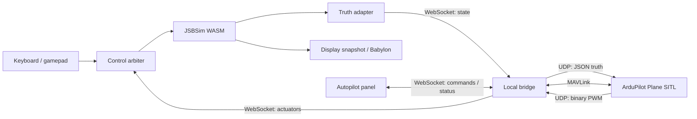

# ArduPilot Plane integration proposal

Status: Proposal complete and ready for review; implementation not started

Date: 2026-09-08

Reviewed: Flight Sim `ecd30ad8`, including the working-tree README

## Recommendation

Add ArduPilot Plane SITL as an optional controller of the existing browser-hosted C172P. Keep JSBSim/WASM as the sole flight dynamics engine and FOSS Earth as the scenery/runtime provider. Connect them through a small local bridge using ArduPilot's external JSON simulator interface for the physics loop and MAVLink for commands and status.

The first user-facing capability should be **“Circle here”**: after a manual climb, engage Plane LOITER to circle at the entry altitude, then take control locally with one action. LOITER matches the README's hands-off intent. FBWA is useful earlier for verifying stabilization, but still requires pilot throttle and does not hold altitude. See the official [LOITER](https://ardupilot.org/plane/docs/loiter-mode.html) and [FBWA](https://ardupilot.org/plane/docs/fbwa-mode.html) descriptions.

Treat this as a simulation integration and C172 controller-tuning project. A successful socket connection alone does not demonstrate that ArduPilot can fly this aircraft.

## First-release scope

Stages 0–2 deliver the first release: one browser, one local ArduPilot Plane SITL instance, and the bundled C172P. The user initializes on known ground, climbs manually, engages Circle here, sees confirmed autopilot status, and can take over locally. Basic telemetry, deliberate pause/resume, and recovery from a lost connection are part of that release.

Mission planning, autonomous takeoff/landing, additional aircraft and vehicle types, hardware controllers, remote/cloud bridges, and a browser-only ArduPilot build are deferred. Stage 3 describes possible follow-on work and is not required to complete the first release. Normal manual flight remains usable without the optional bridge or SITL installation.

## Review findings that shape the design

| Finding | Evidence | Consequence |
| --- | --- | --- |
| The ownership boundary is already suitable. Flight Sim owns JSBSim and flight UI; shared rendering is imported from FOSS Earth. | [Application composition](../../src/flight/createFlightSimApp.ts), [package boundary](../foss-earth-relationship.md) | Keep autopilot code in Flight Sim and its local tooling. |
| Manual controls are unconditionally applied before every physics step. | [createFlightSimApp.ts, lines 321–329](../../src/flight/createFlightSimApp.ts#L321), [input writer](../../src/flight/input/flightInputManager.ts#L170) | Introduce one explicit control arbiter; otherwise manual input overwrites ArduPilot. |
| The 120 Hz integrator is driven by render callbacks, with at most six accumulated substeps. Rendering pauses when the document is hidden. | [fixedStepLoop.ts](../../src/flight/physics/fixedStepLoop.ts#L6), app `runtime.setSimTick`; sibling FOSS Earth `createBabylonRuntime.ts` | External simulation needs synchronized stepping independent of display interpolation and frame rate. |
| `FlightState` is a display snapshot, with calibrated airspeed and vertical speed but no full velocity, gyro, accelerometer, or timestamp. | [FlightState](../../src/flight/physics/flightState.ts#L3), [readFlightState](../../src/flight/bridge/ecefBridge.ts#L5) | Add a dedicated simulator-truth adapter. Do not send interpolated HUD state. |
| Bootstrap documents geodetic latitude but writes `ic/lat-gc-deg`. | [bootstrapC172.ts, lines 5 and 51](../../src/flight/jsbsim/bootstrapC172.ts#L51); [reset uses geodetic latitude](../../src/flight/jsbsim/resetFlightLocation.ts#L33) | Correct bootstrap before sharing an origin with SITL. A real-WASM probe turned the default latitude `44.977753` into geodetic `45.170084596`, approximately 21 km north. |
| Bootstrap writes `simulation/dt`, which is read-only in the installed WASM runtime. | [bootstrapC172.ts, line 50](../../src/flight/jsbsim/bootstrapC172.ts#L50), SDK property catalog and bounded probe | Use `sdk.setDt()` and assert `getDeltaT()`. Current stepping happens to work because the SDK default is already 1/120 s; writing 1/200 through the property API did not change it. |
| Reposition, terrain correction, collision response, and fault restoration can rebuild JSBSim initial conditions. | [resetFlightLocation](../../src/flight/jsbsim/resetFlightLocation.ts), [restoreSimulation](../../src/flight/physics/safeFlightState.ts#L30), [terrainContact](../../src/flight/physics/terrainContact.ts), [visibleMeshCollision](../../src/flight/physics/visibleMeshCollision.ts) | Coordinate discontinuities and resets with SITL. A WASM probe confirmed `resetToInitialConditions(2)` rewinds simulation time to zero. |
| The manual adapter flips rudder sign; the aircraft model adds pitch trim to elevator before clipping. | [rudder conversion](../../src/flight/input/flightInputManager.ts#L174), [C172 flight controls](../../public/jsbsim-data/aircraft/c172p/c172p.xml#L239) | Calibrate each actuator explicitly and prevent stale manual trim from changing autopilot commands. |

The existing suite passed during this review: **19 files, 69 tests**, including real-WASM propulsion, roll, and yaw checks. The checks do not validate ArduPilot, sensor conventions, or controller tuning. No SITL process or browser server was started.

## Architecture

The [JSON simulator interface](https://ardupilot.org/dev/docs/sitl-with-JSON.html) connects an external physics engine to SITL over UDP. It is distinct from the README's linked Simulation on Hardware workflow. MAVLink supplies mode changes, arming, readiness, parameters, and later missions; it is not the high-rate physics transport in this design.

Propose a Python `asyncio` bridge with `websockets` and `pymavlink`, pinned in an isolated environment. This adds a small Python component alongside the TypeScript application and uses the existing ArduPilot Python tooling ecosystem. The bridge validates and translates messages, owns socket/session lifecycle, and exposes a narrow command API. It does not integrate aircraft physics or tune control outputs.

Support one local browser session and one Plane instance initially. Bind listeners to loopback, validate browser origin and a per-launch session token, and keep telemetry work from blocking physics messages. Start with the app served locally. Test hosted HTTPS-to-local connectivity separately before promising support from GitHub Pages.

ArduPilot's [native JSBSim backend](https://github.com/ArduPilot/ardupilot/blob/master/libraries/SITL/SIM_JSBSim.cpp) launches and controls a native JSBSim executable. It is a useful reference, but selecting that backend would not connect to this existing WASM instance. A native-physics renderer-only variant and an ArduPilot-to-WASM port are outside this proposal.

## Simulator truth and coordinate contract

Introduce `readAutopilotTruth(sdk, session)` alongside the existing render adapter. Read after each successful physics step, before interpolation. Required properties must exist in the SDK catalog and return finite values; missing properties must fail session setup rather than silently becoming zero.

Use SI units at the external boundary, NED earth axes (north/east/down), and FRD body axes (forward/right/down). The rendering quaternion uses different axes and must never enter the autopilot path.

| Quantity | Proposed source / conversion |
| --- | --- |
| Simulation time | Session step counter × fixed step; compare against `sdk.getSimTime()` to detect unexpected resets. Wall time is only for pacing and diagnostics. |
| Geographic truth | `position/lat-geod-deg`, `position/long-gc-deg`, `position/h-sl-ft` × 0.3048. |
| Local position | NED displacement relative to an immutable SITL startup origin; down is startup altitude minus current altitude, both in meters above mean sea level. Match the pinned backend's horizontal geographic reconstruction. |
| Earth velocity | `velocities/v-north-fps`, `v-east-fps`, `v-down-fps`, each × 0.3048. Do not derive it from airspeed or render positions. |
| Attitude | JSBSim roll, pitch, heading in radians, initially using JSON's Euler attitude field. |
| Body angular rate | `velocities/p-rad_sec`, `q-rad_sec`, `r-rad_sec`; these are body rates, not Euler-angle derivatives. |
| Accelerometer | Validate `accelerations/a-pilot-{x,y,z}-ft_sec2` × 0.3048 as body specific force at the pilot sensor location. |
| Airspeed | Use JSBSim equivalent airspeed, `velocities/ve-fps` × 0.3048, for the JSON `airspeed` field; confirm the pinned backend's EAS/pitot behavior in Stage 0. Do not reuse HUD calibrated knots or ground speed. |

The installed SDK exposes the listed angular-rate, earth-velocity, pilot-acceleration, equivalent-airspeed, and time properties. Availability is confirmed; their complete sensor interpretation remains a Stage 0 validation gate. JSBSim's [auxiliary acceleration implementation](https://jsbsim-team.github.io/jsbsim/FGAuxiliary_8cpp_source.html) includes rotational effects at the pilot eyepoint. Document that sensor location, or add a CG-mounted accelerometer model if tests require it. A stationary level accelerometer should report approximately `[0, 0, -9.81]` m/s²; do not subtract gravity again without verifying the source convention.

Use one agreed origin for browser initialization and SITL startup. Its latitude must be geodetic and its altitude must have a documented datum. The renderer currently consumes JSBSim's sea-level altitude directly, so do not claim surveyed terrain/datum accuracy. Check north/east/up displacements against SITL telemetry, including nonzero origin elevation and dateline handling. Camera floating-origin updates must have no effect on navigation coordinates. Scope the first scenario to a bounded area around its origin; long-distance globe navigation needs separate geographic-error validation.

JSBSim owns wind. Feed its resulting air data to SITL, avoiding a second independently configured wind model. The current [JSON backend](https://github.com/ArduPilot/ardupilot/blob/master/libraries/SITL/SIM_JSON.cpp) assigns supplied airspeed to its EAS/pitot variables; validate wind and density effects at altitude rather than depending on its missing-airspeed fallback. SITL remains responsible for generating its simulated sensor behavior from this truth; do not also inject a separate MAVLink sensor stream.

## Transport and time ownership

The upstream [JSON format](https://github.com/ArduPilot/ardupilot/blob/master/libraries/SITL/examples/JSON/readme.md) describes binary actuator requests and JSON state replies. For the initial 16-channel profile, validate a 40-byte little-endian packet containing magic `18458`, frame rate, frame count, and 16 PWM values. Listen on UDP 9002 and reply to the sender's endpoint. Delimit each JSON response with a leading and trailing newline. The required truth fields include timestamp, IMU gyro and acceleration, position, velocity, and attitude or quaternion. PWM values are in microseconds. The initial profile disables 32-channel output; reject unsupported packet variants explicitly and confirm byte order with a captured fixture from the supported SITL host.

The bridge's WebSocket envelope adds a protocol version, session ID, frame count, and typed message kind. These are our transport metadata, not extra guarantees from the upstream JSON protocol. Keep the bridge and browser's accepted frame/state reply cached until the next transaction completes.

Refactor a reusable **single physics step** from `fixedStepLoop.ts`, retaining its contact checks and fault validation. Keep the current accumulated-time driver for offline manual flight. An external-session driver must be the only caller of that step while connected:

1. Pause local advancement, agree the origin and aircraft profile, and initialize both sides. Answer the first actuator request with the validated initial state at session time zero, without advancing physics.
2. For each subsequent fresh actuator frame, select the current control owner, apply its controls, advance JSBSim once, and return the resulting truth with the next simulation timestamp.
3. Reply to retransmissions of the current accepted frame with its cached state. Ignore delayed frames older than the current transaction. A duplicate request or WebSocket retry must never advance physics twice.
4. Keep only one transaction in flight. Reject inconsistent frame rates, unexplained sequence gaps, stale sessions, and malformed state. Treat counter wrap explicitly; a SITL restart establishes a new session.
5. Pace against wall time to target real time, while advancing simulation time only through successful steps. Low frame rates may slow the simulation; they must not skip physics time or reuse old commands for an unbounded catch-up loop.

Start by testing `SIM_RATE_HZ=120` with JSBSim at 120 Hz and an integer step counter. This is a proposed profile, not a validated ArduPlane performance claim. Pin and inspect the actual emitted rate; the current upstream [SITL defaults](https://github.com/ArduPilot/ardupilot/blob/master/libraries/SITL/SITL.cpp) can select a much higher simulation rate. If 120 Hz does not satisfy estimator/control behavior, revise the physics rate or use a tested integer substep ratio before shipping. Do not confuse the vehicle scheduler rate with the external simulator rate.

Render callbacks should consume completed display snapshots and request new draws, without advancing an external session again. Initially run the external driver on the browser main thread with bounded work and no blocking waits. Measure round-trip latency and real-time factor before considering a Worker; moving JSBSim alone would still require a terrain-query design because current collision queries access the renderer.

## Controls and user behavior

Maintain separate state for **local control owner**, **confirmed ArduPilot mode**, and **simulation pause/fault**. A connected bridge is not proof that the autopilot is ready or engaged.

The single control writer accepts either manual commands or decoded actuator commands. Extract it from `flightInputManager.apply()` so autopilot output bypasses keyboard smoothing. Explicitly assign every control, including trim, flaps, and brakes, on ownership changes.

Propose a versioned C172 profile with conventional primary channels: 1 aileron, 2 elevator, 3 throttle, 4 rudder. Record ArduPilot functions and parameters separately from the fixed simulated actuator linkage. For centered surfaces, map PWM piecewise around the linkage's fixed neutral using its physical endpoints; for throttle use the linkage's full operating range. Do not recenter this mapping when ArduPilot changes `SERVOn_TRIM`, or apply `SERVOn_REVERSED` a second time: those effects are already present in the outgoing PWM. Apply only the calibrated linkage-to-JSBSim sign, clamp valid outputs, and reject invalid ones. The official [servo functions and calibration](https://ardupilot.org/plane/docs/servo-functions.html) describe the autopilot side of this boundary.

Real-WASM pulses confirmed that positive direct JSBSim elevator pitches down, positive aileron rolls right, and positive rudder yaws left. Use these as model-side evidence; establish the complete PWM-to-aircraft response with the pinned profile and single-axis tests.

Keep flaps and brakes at zero for the first airborne autopilot profile. Use an explicitly recorded JSBSim pitch-trim baseline; clear or transfer manual trim through a tested handoff so it cannot be added unexpectedly to autopilot elevator. Engine ignition and mixture remain the aircraft runtime's responsibility. Validate disarmed/arming output behavior and C172 speed, throttle, bank, pitch, and energy-controller settings before enabling engagement.

The initial panel contains Connect/Disconnect, readiness and mode status, Arm/Disarm where appropriate, Circle here, and Take control. Engagement requires fresh actuator traffic, confirmed Plane identity, usable navigation/estimator state, valid aircraft configuration, and a successful mode transition. Show pending and rejected commands, then mark engagement only after the requested mode is reported. ArduPilot documents [mode requests and HEARTBEAT mode reporting](https://ardupilot.org/dev/docs/mavlink-get-set-flightmode.html).

Take control changes local ownership immediately, without waiting for MAVLink or a functioning bridge. If external progress is blocked, atomically invalidate the session, cancel held/in-flight work, and return stepping to the offline manual driver. Preserve an explicit user pause until Resume. Seed manual throttle and surfaces from the last applied controls to avoid a discontinuity, then accept live inputs. A meaningful stick deflection or a dedicated takeover key performs the same action; camera input and ordinary gamepad noise do not. The HUD displays the actual control owner and applied throttle/trim.

While a healthy external session is in local-manual control, continue synchronized truth exchange and discard ArduPilot actuator authority. Request Plane MANUAL as housekeeping, and require confirmed mode/readiness before re-engaging. FBWA testing additionally needs deliberate [MAVLink RC input](https://ardupilot.org/dev/docs/mavlink-rcinput.html), with sender identity, RC calibration, mode-channel behavior, override release, and timeout configured. RC override is pilot input to ArduPilot, not a replacement for the simulator actuator channel.

## Pause, disconnect, and discontinuities

| Event | Proposed behavior |
| --- | --- |
| User pause or hidden tab | Stop generating new truth timestamps and hold the pending step. Keep the UI/bridge responsive; resume without accumulated wall-time catch-up. Prove SITL hold/resume behavior against the pinned build. |
| Missing required terrain | Hold the physics transaction until coverage is ready. Report terrain wait separately from link loss. |
| Stale link or bridge exit while ArduPilot owns controls | Pause at the last valid state, clear engagement, and offer local Take control / Resume. Do not silently keep flying on stale PWM or automatically re-engage on reconnect. |
| Link loss while locally controlled | End the external session and continue under the offline manual driver after clearing pending external work. |
| Reposition or a reset that changes JSBSim state/time | Invalidate the session, discard queued commands, apply the local reset, and restart/reinitialize SITL before another engagement. |
| Collision bounce, terrain correction, or fault rollback | Use the same discontinuity path initially. Do not feed a rewound clock or a gameplay state jump into an established estimator. |
| Destroy / route change | Close sockets, cancel callbacks, release RC overrides where possible, and prevent late packets from writing controls. Release the SDK instance when the application is destroyed. |

Use distinct wall-time watchdogs for actuator progress and low-rate MAVLink status. Initial values should be configurable and selected from measured latency. Deliberate pauses and terrain holds suspend progress alarms and classify missing MAVLink heartbeats as held/stale, since SITL telemetry can also stop in lockstep. Preserve the last reported mode as stale and refresh readiness before re-engagement. A disconnected socket remains a fault. The upstream [JSON backend implementation](https://github.com/ArduPilot/ardupilot/blob/master/libraries/SITL/SIM_JSON.cpp) governs retries and timestamp handling; implement and test against a pinned commit rather than relying on prose timeout values.

## Delivery stages and acceptance

| Stage | Deliverable | Exit criteria |
| --- | --- | --- |
| 0 — Reference profile and physics contract | Fix bootstrap latitude and timestep setter; add truth conversion and one-step API; select and record an ArduPilot commit, bridge dependency lock, and C172 parameter file; use a minimal protocol spike to verify ground initialization. | Real-WASM tests prove geodetic spawn, requested timestep, acceleration/rate signs, airspeed units, reset detection, and known NED displacements. A deterministic ground-start scenario reaches healthy SITL navigation without global arming-check bypasses. |
| 1 — Closed loop, developer workflow | UDP/WebSocket bridge, cached frame transactions, control arbitration, telemetry readiness, command acknowledgments, and lifecycle handling. Use MAVProxy for early inspection. | Same actuator sequence gives equivalent physics state across simulated render rates; duplicates never add steps; delay, pause, hidden-tab, terrain wait, reset, and disconnect cases behave as specified. A short FBWA exercise confirms corrective roll/pitch response. |
| 2 — First user-facing autopilot | Panel/HUD, Circle here, immediate takeover, C172 tuning, local setup instructions. | Ground initialization followed by manual takeoff/climb and LOITER stays stable for 10 simulated minutes. Proposed targets after settling: altitude error ≤30 m and airspeed error ≤5 kt in calm air, with no persistent actuator saturation or estimator faults. Record tuned targets and results; repeat in a defined 10 kt wind. Takeover applies by the next successful physics step. |
| 3 — Navigation extensions | Selected-target navigation, RTL, and mission upload through standard MAVLink mission handling. | Explicit home/altitude semantics, mission acknowledgments and progress, and repeatable route tests. Add autonomous takeoff/landing and flap control only after ground-contact and air-data behavior are validated. |

The first acceptance flight starts supported on known terrain, initializes SITL while stationary, then climbs manually within the same continuous session. The current default airborne spawn is not by itself a verified estimator initialization procedure. Any automated airborne test must have a separately validated initialization recipe.

Capture JSBSim truth, actual applied controls, actuator/frame counters, simulation time, wall-time latency, real-time factor, mode transitions, and SITL logs in a bounded diagnostic trace. The performance target is approximately 1× real time on a documented reference machine; report p50/p95 latency and render performance. Cross-platform determinism is not assumed.

## Implementation decision gates

The architecture and first-release behavior above are the proposed decisions. The following items require implementation evidence before the reference profile can be called supported; they are not prerequisites for reviewing this proposal.

| Gate | Evidence required | Response if it fails |
| --- | --- | --- |
| Reproducible upstream baseline | Record an exact ArduPilot commit, bridge dependency lock, C172 parameter file, and tested launch command. Capture a real actuator packet and initial-state exchange. | Resolve the protocol/profile mismatch before adding UI. The upstream `master` links in this document are research references, not version pins. |
| Clock and sensor compatibility | At the proposed 120 Hz rate, verify body specific force, angular rates, EAS, geographic origin, initial time-zero response, hold/resume, and sustained estimator health. | Revise the rate or adapter and rerun the reference scenario; do not compensate with invented timestamps or blanket estimator-check bypasses. |
| C172 control stability | Verify fixed linkage signs and trim, then corrective FBWA response and the Stage 2 LOITER tolerances using a recorded tuning profile. | Keep engagement unavailable until tuning and model behavior meet the criteria. Default Plane parameters are not assumed suitable for a C172. |
| Interactive performance and recovery | Measure the complete browser/bridge/SITL loop on a documented machine, including terrain waits, tab visibility, connection loss, and takeover during a stalled transaction. | Profile the bottleneck, revise scheduling or terrain access, and retest. A connection-only demo does not satisfy release acceptance. |

Deliver Stage 0 evidence first, then the tested bridge/session layer, then the user-facing controls. Each stage's exit criteria must pass before claiming the next capability. This sequence provides useful review points without committing to an unverified schedule.

## Proposed code footprint

All paths below are planned additions or edits, not existing integration features.

| Area | Files / responsibility |
| --- | --- |
| Physics | `src/flight/physics/fixedStepLoop.ts`: reusable single-step operation; standalone and external drivers share validation. |
| JSBSim | `src/flight/jsbsim/bootstrapC172.ts`: geodetic initialization and `setDt`; explicit discontinuity events from reset/contact paths. In `createJsbsimRuntime.ts`, retain listener references for removal and call the available `sdk.destroy()` during disposal. |
| Autopilot | `src/flight/autopilot/`: truth adapter, geographic conversion, C172 actuator profile, session state, WebSocket client, and synchronized driver. |
| Controls | `src/flight/input/`: separate input sampling from one normalized-control writer; add authority and takeover state. |
| App/UI | `createFlightSimApp.ts`, flight HUD and panel: lifecycle orchestration, confirmed status, mode actions, visibility/pause integration. |
| Local bridge | `tools/ardupilot_bridge/`: Python package, pinned dependencies, protocol checks, MAVLink command/status adapter, localhost launch tooling. |
| Reproducibility | `config/ardupilot/`: pinned revision metadata, C172 parameters, and reference scenario. Separate opt-in SITL tests from the normal browser test suite. |

The setup guide should specify an explicitly selected Plane JSON model, the matching startup origin, parameter file, dedicated MAVLink endpoint, and process shutdown steps. Verify exact launcher arguments against the pinned checkout in Stage 0 before publishing copy-paste commands. Begin with the developer's macOS environment plus a reproducible Linux validation path; Windows/WSL and packaged installers follow when needed.

Keep normal manual flight and static deployment usable without Python or ArduPilot. No FOSS Earth change is currently required by the design; any later renderer scheduling or surface-query capability should use its public package boundary.

## Suggested README alignment

The README can describe the roadmap accurately before implementation: replace the Simulation on Hardware link with the external JSON interface and distinguish physics traffic from MAVLink. Explain that optional autopilot mode requires a local SITL process and bridge. Basic mode/readiness telemetry belongs in the first functional milestone; missions and richer telemetry displays can follow.

Suggested replacement for the roadmap's integration explanation:

> ArduPilot support is planned as an optional autopilot for the bundled C172P. JSBSim will continue to run the aircraft physics in the browser. A local bridge will exchange simulator truth and actuator outputs with ArduPilot Plane SITL through its JSON simulator interface, while MAVLink carries commands and status. The first goal is a stable circling mode with immediate manual takeover; missions and additional aircraft will follow after the shared physics loop is validated.

This handoff changes only the proposal. The README wording above is a suggested follow-up; the existing README working-tree edits are preserved. Integration availability must be stated only after the release criteria pass.
