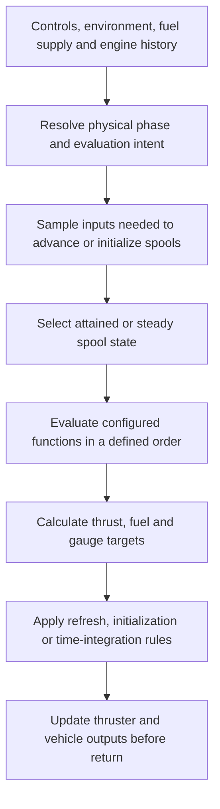

# Explicit turbine evaluation and initialization

Date: 2026-09-14. Updated 2026-09-19: the user accepted this direction and
requested an implementation plan. The [staged plan](../turbine-initialization/plan.md),
[behavior contract](../turbine-initialization/contract.md) and
[validation requirements](../turbine-initialization/validation.md) now govern
the planned work. Implementation has not started and nothing has been
submitted upstream as part of this redesign.

The user requested this proposal after discussing the defects in JSBSim PRs
[#1505](https://github.com/JSBSim-Team/jsbsim/pull/1505) and
[#1508](https://github.com/JSBSim-Team/jsbsim/pull/1508). The architectural
recommendation is to separate engine phase, evaluation intent and engine
calculations. Public compatibility choices still need agreement. This document
does not authorize implementation, changes to existing branches, package
adoption or GitHub publication. The remaining open-PR brainstorming topics are
not settled by it.

## Proposed outcome

A turbine should report a coherent operating state when initialization returns.
Normal simulation, zero-time reevaluation and steady initialization should share
the same engine equations, with explicit rules for how each operation changes
state. A stopped engine must not acquire running-engine spool speeds, powered
thrust or fuel flow merely because the caller evaluates it without advancing
time.

Implement the native behavior in `Felipegalind0/jsbsim`, targeting
`JSBSim-Team/jsbsim`. Any reusable SDK exposure belongs in that repository's
`wasm/`. OSFS consumes a verified package and owns application reset/audio tests.
The [contribution policy](../jsbsim-upstream-contribution-policy.md) governs
readiness and adoption.

This is a focused turbine and initialization proposal. It does not replace
FGTurbine with a thermodynamic model, recalibrate aircraft, prescribe a common
implementation for every engine type, or bundle the wheel and WASM-package PRs.

## Problem and evidence

The [open-PR review](../validation/jsbsim-open-pr-review-2026-09-14.md) records the
defect and its [native and WASM evidence](../../validation/evidence/jsbsim/engine-off-trim/).
The source and live review checked during this discussion were:

| Reference | Revision |
| --- | --- |
| Upstream master | `14c19022943f5850daf2c6b90554050b3139b853` |
| #1505, spool consistency | `07eba55fcd6fed530f6f404e857765c3224541fb` |
| #1508, fuel flow, including #1505 | `7511df10cda909c32dfc378dfde204eb44dc5a48` |
| Installed fork.7 source | `fea688020fb683c0696aa8339dbed9cdb238a39d` |

`FGTurbine::Calculate()` selects `tpTrim` whenever its timestep is zero, even
when the engine is off. Upstream `Trim()` calculates hypothetical steady thrust;
the PRs additionally assign persistent spool state and fuel flow there.
The separate trim-finished block updates more state only after time advances.
These paths divide responsibility for one operating state across several calls.
[Source](https://github.com/JSBSim-Team/jsbsim/blob/14c19022943f5850daf2c6b90554050b3139b853/src/models/propulsion/FGTurbine.cpp#L124-L165).

On the F-16 fixture, a never-started engine at throttle command 0.35 comes out
of #1508 RunIC at N2 85.9% and 7,275.5 lb/h, then consumes 0.3463 lb in 0.2 s.
Master leaves the spools and fuel flow at zero. Both report approximately
9,163.8 lbf during the zero-time evaluation: the off-engine thrust predates
these PRs.

The installed fork.7 check was rerun during this discussion. An SF50 engine-off
reset still produced N2 81.4%, 344.7 lb/h and an additional 0.0013 lb consumed
over the next second. The audio adapter can interpret that transient fuel flow
as combustion. This was a Node/WASM check, not a listening test.

An exploratory native patch guarded stored spool, TSFC and fuel-flow updates
with `Running`, preserving upstream's local thrust calculation. On the #1508
head, five CTest targets passed: `TestHoldDown`, `CheckTrim`, `TestTurbine`,
`TestTurbineTrimSpool` and `TestTurbineTrimFuelFlow`. Additional scratch checks
covered never-started engines, shutdown followed by RunIC, normal InitRunning,
and starvation/stall/seizure dispatch. The shutdown case preserved residual
N2 at about 0.57% and consumed no additional fuel after RunIC.

Those exploratory files remain local scratch material under
`/tmp/jsbsim-trim-guard-hpzclhb6`; they are not durable contribution evidence.
*(2026-09-18: gone; macOS empties `/private/tmp` on every restart.)*
There was no separate #1505 candidate build, corrected WASM build, immediate
cutoff-transition test, custom TSFC/injection fixture or runtime AugMethod 1
test. The experiment supports the narrow guard, not the architecture proposed
below. Exact-candidate evidence must be recorded when implementation is agreed.

## Engine-state contract

Treat physical phase and evaluation intent as independent inputs. The timestep
controls time integration; it must not be the sole signal to establish a
steady running engine.

| Intent | Spool and history | Outputs and completion |
| --- | --- | --- |
| Advance simulation | Integrate the resolved phase using the real timestep and existing dynamics. | Calculate outputs at the attained spool state; apply documented rate limits and account for actual fuel consumption. |
| Refresh current state | Preserve dynamic history; apply explicitly defined instantaneous command/fault transitions. | Reevaluate applicable algebraic outputs at the current state, without integrating time, burning fuel or seeking toward equilibrium. |
| Establish a steady operating point | Assign equilibrium state only for engines explicitly eligible to run. Preserve nonrunning histories unless a separate reset was requested. | Publish consistent steady spool, thrust, TSFC, fuel and specified gauge state before returning. No delayed initialization on the next frame. |

These are conceptual operations, not prescribed public API names or a
requirement to change the `FGEngine` interface immediately.

Required behavior:

1. Resolve commands, engine condition and fuel availability before deciding
   whether an engine is eligible for a running operating point. `Running`
   alone is insufficient when cutoff has just been commanded. Fuel exhaustion
   in the current evaluation must not rely solely on a previous frame's
   starvation flag. Preserve deliberate fuel-freeze behavior.
2. Zero-time work does not integrate spool/thermal dynamics, debit tanks,
   increment cumulative fuel use, or advance injection duration. Explicit
   initialization may assign documented equilibrium values; a seizure may
   impose an immediate constraint such as N2 = 0. These are not elapsed time.
3. An off engine produces no powered thrust. Existing windmilling or drag
   behavior is evaluated at its actual state; this proposal does not invent a
   turbine windmilling-drag model. Residual rotation need not be zero.
4. A cutoff engine cannot acquire a new positive running fuel-flow target.
   Existing decaying fuel-flow state and fault-specific fuel indications must
   be distinguished from combustion and tank consumption. Decide any change
   to those existing dynamics explicitly; do not silently zero every case
   where `Running` is false.
5. Starting, stalled, seized and starved engines retain their phase-specific
   rules. Preserve the existing fault precedence unless a separately justified
   correction changes it. A refresh may evaluate a legitimate phase transition;
   it must not clear faults as a side effect of being at zero time.
6. Repeated evaluation at identical inputs is stable for deterministic engine
   configurations. A successful steady initialization is independent of the
   preceding throttle settings. Arbitrary stateful/random XML functions need
   their own documented semantics, not an unsupported promise of purity.
7. When an initialization call returns, engine outputs and the vehicle forces
   and derivatives it promises must describe the same final state. The first
   normal frame may evolve that state physically; it must not repair unfinished
   initialization. Use numerical tolerances for evolution, not bitwise equality.

Fuel-conservation requirements concern evaluation with unchanged externally
supplied fuel/IC inputs. A requested reset, snapshot restore or tank-property
write can deliberately change fuel inventory without simulating combustion.

## Shared calculations and state application

The proposed flow is:

Extract shared algebra for spool targets/factors, dry thrust, bleed extraction,
augmentation, injection effects, corrected TSFC and fuel-flow targets. `Run()`
supplies the spool values actually reached by its dynamics. Explicit steady
initialization supplies the equilibrium values. Sharing this calculation must
not make normal running jump directly to its commanded steady thrust.

Configured spool-rate functions supply inputs to the transient update and must
be sampled before that update. Operating-point functions such as TSFC need the
state selected for output evaluation. Characterize those two sampling stages,
including the existing pre-function cache, before changing their ordering.

Separate target calculation from application. For example, fuel flow has both
a steady target and a rate-limited running state. A current-state refresh keeps
that dynamic state; a steady-running initialization assigns its target. Apply
the same distinction to nozzle position and thermal state. Keep configured idle
flow as an input to the common calculation, including its existing uses outside
dry running, rather than implementing another floor in each caller.

### Configured functions are part of the contract

This cannot begin as a trivially pure `Evaluate(throttle)` function.
`FGSimplifiedTSFC` reads member `N2norm`; XML functions may read tied properties.
Pre-functions are cached, and `FGFunction::GetValue()` can write a `copyto`
property. Restoring N1/N2 after a trial does not undo those effects.
[Function evaluation](https://github.com/JSBSim-Team/jsbsim/blob/14c19022943f5850daf2c6b90554050b3139b853/src/math/FGFunction.cpp#L972-L993).

Define the property state visible to each configured function and the order of
sampling. A practical design samples the inputs needed for spool evolution,
establishes the eligible evaluation state, samples the operating-point inputs,
computes a result from those values, then applies it according to intent. This
does not imply evaluating every function twice. The arithmetic core
can be pure even when the surrounding property evaluation is not. Preserve
existing evaluation counts/order where possible and characterize every
intentional change, including cached pre-functions and `copyto` effects.

Do not claim isolated hypothetical trim trials without accounting for all
affected function state, properties and caches. The initial proposal can retain
the solver's existing working-state model with an explicit completion/failure
contract. A general transactional property-tree evaluator is a separate design
unless evidence establishes that it is necessary for this turbine change.

### State with history

| Quantity | Current behavior to account for | Proposed distinction |
| --- | --- | --- |
| N1/N2 and spool factors | Spools seek targets; injection can modify factors. | Refresh retains attained spools; steady-running initialization establishes the selected equilibrium. |
| Thrust, corrected TSFC, EGT, oil pressure | Much of their running calculation is algebraic and phase-dependent. | Evaluate using the same selected state; preserve special start/fault formulas. |
| Fuel flow and nozzle position | Running behavior includes seeking/rate limits. | Preserve transient values on refresh; assign defined targets only for steady initialization. |
| Oil temperature | Carries thermal history and seeks a target. | Preserve history on refresh; explicitly specify warm-running initialization versus a cold/reset state. |
| EPR and augmentation state | Updates depend on the branch taken. | Define output/flag behavior for each branch and test transitions before consolidating formulas. |
| Injection timer/water state | Normal running consumes finite injection duration. | No synthetic elapsed duration during initialization; define a supported frozen-duration operating point or report that a requested equilibrium is unsupported. |

This is a state classification, not a decision to initialize every gauge to a
warm value whenever RunIC is called.

## Caller behavior and compatibility

| Entry point | Proposed responsibility | Compatibility work required |
| --- | --- | --- |
| Normal executive Run | Request ordinary advancement, or a current-state refresh when integration is suspended without a steady-initialization request. | Characterize existing callers that suspend integration and currently receive trim behavior. |
| RunIC | Reapply the documented initial configuration and complete the selected initialization policy for each engine, then return coherent vehicle outputs. | Preserve the useful immediate steady readings for an intentionally running engine; provide a distinct history-preserving refresh intent. Define the precedence of persistent engine-running IC flags versus live cutoff/fault state, including repeated calls. |
| InitRunning / `propulsion/set-running` | Explicitly request running initialization, with a defined policy for faults and fuel availability. | The current propulsion wrapper forces throttle/mixture to full before settling. Preserve that public behavior unless a separate change is agreed; test reapplication of requested controls and final zero-time initialization. |
| FGTrim | Request physically eligible steady operating points during its solve and finalize the accepted state before returning. | An off engine must not provide fictitious powered thrust to the accepted aircraft solution. Define success and failure restoration, including engine state and function effects. |
| Reset / snapshot restoration | Explicitly reset or restore the intended engine history, then use the appropriate evaluation operation. | Separate native reset semantics from application intent. A saved `Running = false` flag alone does not represent a partially started, windmilling or faulted engine. |

The concrete mode plumbing should follow this caller audit. Keep other engine
types on compatible behavior unless their implementation is deliberately
included and tested. In particular, `RunIC()` runs the model and initializes
derivatives before processing some engine-running IC requests; finalization
ordering must be verified, not assumed to be solved by changing `Trim()` alone.
[RunIC source](https://github.com/JSBSim-Team/jsbsim/blob/14c19022943f5850daf2c6b90554050b3139b853/src/FGFDMExec.cpp#L648-L698).

An IC running flag can request a restart independently of the live `Running`
flag. Treat that as an initialization request with a documented command/fault
policy, not as proof that the engine is physically running. The recommended
default is that initialization does not clear faults or override unavailable
fuel implicitly. A deliberate fault reset is a separate operation.

`FGPropulsion::GetSteadyState()` currently time-marches engines using synthetic
0.5-second steps and stops based on thrust convergence. For the turbine,
prefer the explicit equilibrium operation where supported. It must cover fuel,
spool and gauge state, not merely converge thrust. Preserve the existing path
for other engine types until their needs are established. Injection exposes why
advancing a hidden clock is not equivalent to assigning a steady state.
[Current settling loop](https://github.com/JSBSim-Team/jsbsim/blob/14c19022943f5850daf2c6b90554050b3139b853/src/models/FGPropulsion.cpp#L267-L350).

Remove or reduce the first-integrated-frame trim-finished block only after its
phase, cutoff, spool and thermal responsibilities have explicit destinations.
Relocating fuel-flow assignment to that block alone would leave immediate
post-RunIC reads stale. This is the distinction to discuss with
[seanmcleod70 on #1508](https://github.com/JSBSim-Team/jsbsim/pull/1508#issuecomment-5664642920).

### Failure and restoration

Use solver working state with an explicit engine-owned restoration boundary.
Before steady trials, capture turbine dynamic state and the engine-owned
outputs/cache state that trials can change. On success, retain the accepted
state and refresh dependent propulsion/vehicle outputs. On failure or an
exception, restore that engine state alongside the caller's agreed control/IC
restoration, then reestablish the corresponding dependent outputs.

This does not promise rollback of arbitrary XML writes elsewhere in the model.
Inventory those effects and define their evaluation/publication behavior before
calling the failure contract complete. Tests must distinguish engine restoration
from broader callback side effects; do not silently claim both.

Restore evaluation intent, timestep and trim status on every exit path. Nested
initialization or settling must not lose the outer operation's timestep or
intent. Check the existing suspension mechanism before relying on nested
`SuspendIntegration()`/`ResumeIntegration()` calls for this guarantee.

## Alternatives and recommendation

| Approach | Benefit | Cost or limitation |
| --- | --- | --- |
| Guard persistent assignments in current Trim | Small, experimentally supported repair for the introduced stopped-engine regression. | Leaves duplicated calculations, implicit evaluation intent and existing off-engine thrust. Immediate cutoff still needs coverage. |
| Assign only in the current trim-finished block | Reuses existing running-state dispatch. | Does not provide correct immediate initialization readback; delays completion until time advances. |
| Explicit turbine evaluation with shared calculations | Gives initialization and normal running one set of equations and a testable state contract. | Requires caller/function-order characterization, compatibility decisions and broader regression evidence. Recommended target. |
| General isolated evaluation framework for every engine/model | Could eventually support transactional solver trials across the simulator. | Much larger lifecycle/API change; not justified as a prerequisite by the current evidence. |

Correct off-engine powered thrust as part of the target contract, while
presenting it as an intentional legacy behavior correction distinct from the
regression introduced by #1505/#1508. Measure which existing trims change and
discuss migration with maintainers. Do not preserve a hidden fictitious-thrust
path indefinitely, or add a public compatibility switch without demonstrated
need and agreement.

## Implementation and review sequence, if agreed

Each stage has its own evidence. These stages describe future work, not work
started by writing this proposal.

1. **Settle caller semantics and record baselines.** Document the RunIC/refresh
   mapping, warm/cold policy, fault/fuel precedence and trim-failure behavior.
   Characterize relevant upstream fixtures, augmentation methods and XML
   functions before changing their order of evaluation.
2. **Extract shared calculations without intended behavior changes.** Keep
   characterization coverage and identify any unavoidable order changes as
   explicit behavior changes, rather than hiding them in a refactor.
3. **Implement explicit initialization and completion.** Add phase eligibility,
   defined state application, function sampling and final vehicle refresh.
   Exercise the public entry points; retain other engines' behavior.
4. **Correct off-engine trim behavior.** Add causal regressions and report
   changed trim solutions or newly valid failures. This can be a separate
   reviewable commit while belonging to the same target contract.
5. **Verify contribution candidates and adopt downstream.** Build each proposed
   native candidate and its relevant regressions. Then build an identified
   in-tree WASM package, test actual app reset/restore/audio behavior, and adopt
   an immutable new fork package with a rollback record.

The 2026-09-19 plan selects the narrow #1505/#1508 guards as independently
reviewable first corrections, followed by shared calculations and explicit
initialization in separate contributions. It includes native, SDK and app
acceptance. Do not expand or rewrite either existing PR implicitly. Package
version fork.8 was suggested in discussion; choose the next available version
at adoption.

The idle-fuel-flow feature remains separately scoped. Its current tests use
immediate post-RunIC fuel-flow values, so their exact upstream base must provide
that contract, or the independent tests must exercise a settled running engine.
Publishing phase/gauge properties is another focused follow-up once the
underlying semantics are settled. The turboprop question in
[discussion #1501](https://github.com/JSBSim-Team/jsbsim/discussions/1501) is useful
coordination context, not evidence that FGTurbine's equations apply to turboprops.

## Acceptance evidence required

| Area | Required demonstration |
| --- | --- |
| Stopped and cutoff | Never started; residual spin after shutdown; cutoff commanded immediately before evaluation; no acquired running thrust/fuel target. Test immediately after return and after time advances. |
| Starting and faults | Starter-only motoring, fueled start before Running latches, aborted start, windmilling/relight, starvation, stall and seizure. Cover simultaneous conditions and engine-specific precedence. |
| Fuel accounting | With unchanged external fuel/IC and other mass inputs, zero-time evaluation does not debit tanks, change fuel-related mass or increment cumulative fuel use. Distinguish explicit reset/restore writes. Exercise fuel exhaustion/selection and deliberate fuel freeze; distinguish dynamic fuel indications from combustion. |
| Steady running | Immediate spool/fuel/TSFC readback, throttle-order independence, repeated initialization, appropriate first-frame continuity and sustained running. Preserve existing #1505/#1508 regressions on the selected public contract. |
| Configured engine equations | Default and property-dependent TSFC/ATSFC, cached pre-functions, `copyto`, idle floor, bleed, augmentation methods 0/1/2 and transitions, injection effects and finite duration. |
| State classification | Current-state refresh preserves dynamic histories; explicit steady initialization sets exactly its documented state. Cold/reset behavior is distinguishable from warm-running initialization. |
| Trim lifecycle | Successful trim has consistent engine and vehicle outputs. Failed trim and initialization errors restore/document the agreed state, including callback/function effects. No accepted solution borrows powered thrust from an off engine. |
| Multiple engines and compatibility | Mixed running/off/faulted turbines, per-engine initialization, all-engine initialization, other engine types, nested suspension/settling, and script/IC running flags. |
| Native coverage | CxxTest exercises shared calculations and state application with invariant/analytical checks. Python tests cover actual executive, aircraft and trim entry points. Passing Python tests alone does not establish C++ coverage in upstream's current workflow. |
| WASM and application | Real package: SF50 bootstrap, location reset and snapshot restoration for engine-on/off states; adapter combustion and residual rotation; first audio snapshots and epoch transitions. Preserve existing normal-start behavior. |
| Artifact and listening | Record source, toolchain, package identity and exact bytes; verify the app loads them. Use terminal/headless tests without a server where possible. Report audible reset behavior separately from automated telemetry/DSP evidence; do not claim device qualification. |

Tests should fail for the behavior they are intended to catch on the relevant
baseline. Record numerical tolerances, changed legacy results and limitations.
The design is ready for contribution only after its contract decisions are
resolved and the exact contribution passes these applicable checks.

## Questions for maintainers and proposed reply

Keep the initial discussion to the decisions that affect callers:

1. Is the intended RunIC contract steady initialization of eligible running
   engines, with a distinct operation for history-preserving reevaluation?
2. Should an off engine provide no powered thrust during aircraft trim, and
   what migration is needed for callers relying on the current behavior?
3. Which thermal/injection histories should explicit steady initialization set
   or preserve, and do maintainers prefer this work after narrow #1505/#1508
   corrections or as a coordinated revision?

Implementation details such as helper names and internal result structures can
be handled in the fork. The public behavior needs discussion. We are confident
in the architectural separation; the complete implementation is not yet proven.

Draft for #1508, not posted:

> Thanks @seanmcleod70 for checking the mass behavior and suggesting the
> trim-finished block. The distinction I want to preserve is that callers can
> read the initialized fuel flow immediately after RunIC; that block runs only
> once time advances.
>
> I also found an introduced regression: our Trim changes update stored spool
> state and fuel flow for engines that are off. A scratch Running guard fixes
> the reproduced cases while preserving the existing turbine tests, but it
> leaves the broader initialization split in place.
>
> I propose separating the physical engine phase from the evaluation intent,
> sharing the operating-point calculations between normal running and explicit
> steady initialization, and completing initialization before returning. I
> would also investigate correcting the existing off-engine trim thrust as a
> separately identified compatibility change. The zero-time caller semantics,
> configured function evaluation and thermal/injection history need an explicit
> contract before implementing that broader work.
>
> Would you prefer narrow corrections in #1505/#1508 followed by this design,
> and is steady initialization of running engines the RunIC behavior we should
> preserve? I can share the proposal and a focused validation matrix. The same
> lifecycle questions may be useful to your turboprop investigation, without
> assuming the two engine models need the same solution.

Publication of this reply, any upstream proposal, or any PR change requires the
user's explicit instruction. Nothing has been posted as part of this document.
