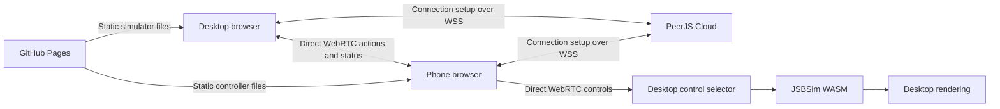

# Phone controller specification

Status: **Draft for review — implementation not started**  
Date: 2026-09-08  
Reviewed checkout: Flight Sim `4d54d204e584`

## Intended result

A user opens **https://felipegalind0.io/flight-sim/** on their computer, clicks **Phone controller**, scans a QR, and flies the simulated aircraft from a touch controller in their phone's browser.

Both interfaces remain static files deployed to GitHub Pages. Use **free PeerJS Cloud for connection setup** and direct WebRTC for controls. Production requires no Vite process, local helper, Cloudflare Tunnel, or backend that we operate.

[PeerJS documents free cloud signaling](https://peerjs.com/client/faq). It is a shared external dependency; its maintainers recommend separate hosting for high-traffic applications. This spec does not assume an availability guarantee or unlimited capacity. [PeerServer Cloud](https://peerjs.com/server/cloud).

### Proposed first-release decisions

| Area | Decision |
| --- | --- |
| Devices | One desktop simulation tab and one paired phone. |
| Pairing | One QR scan opens the controller and connects automatically; phone-side **Fly** explicitly takes control. |
| Primary network | Phone and computer on a reachable home LAN, with Internet access for page loading and signaling. |
| Transport | Direct WebRTC, 60 Hz full control snapshots, no retransmission of controls. |
| Controller | Touch pitch/roll, rudder, throttle, trim, flaps, brake, pause, and camera view. |
| Lost input | Pause and return control to the desktop; never resume automatically. |
| Infrastructure | Existing GitHub Pages + PeerJS Cloud + public STUN. No application backend or paid service. |
| Relay policy | Explicit STUN-only configuration in v1; no TURN relay or HTTP/WebSocket control fallback. Failed direct connections receive a clear error. |
| Later work | Tilt steering, relay connectivity, automatic transport reconnection, multiple phones, video streaming, and autopilot integration. |

The relay policy and touch layout are proposed v1 scope choices for this review. Same Wi-Fi is a useful test target, not a connectivity guarantee: guest isolation, firewalls, and browser policy can prevent a direct connection. Separate networks may work through direct ICE connectivity, but are not a release guarantee.

## User experience

### Desktop

1. Add **Phone controller** to the existing flight HUD bar. Networking initializes on demand when this button is clicked.
2. Open a dialog showing **Preparing connection…**, then a locally generated QR, **Copy link**, **New QR**, **Cancel pairing**, and an expiry countdown. An unused QR expires after **2 minutes**.
3. Once authenticated, dismiss the QR and show **Phone paired · Desktop controls**. The phone is not yet allowed to affect the aircraft.
4. After the phone requests and receives ownership, show **Phone controls**, with **Take control** and **Disconnect phone** available.
5. Opening/closing the dialog and scanning the QR do not pause, resume, or change aircraft controls. Closing the dialog merely hides it; Cancel pairing explicitly invalidates an unused invitation.

The desktop remains authoritative. Take control works immediately without waiting for a phone acknowledgement. Meaningful local flight input also takes over. Camera gestures do not.

### Phone

Scanning opens this route in the normal browser:

```text
https://felipegalind0.io/flight-sim/?mode=remote#v=1&peer=<desktop-id>&join=<secret>
```

The controller displays connection progress, then the aircraft's current settings and **Fly**. It must not offer Fly until authentication and both channels are ready.

Fly requests ownership. If the aircraft is already paused, ownership can transfer while it stays paused; the phone then offers **Resume**. There is no second desktop approval dialog.

The phone shows airspeed in knots, altitude in feet, heading, throttle percentage, simulation pause state, and current control owner. Connection details and measured RTT are available in a small expandable diagnostics area. The default UI uses plain statuses such as **Connected**, **Connecting…**, and **Connection lost · Simulation paused**.

| Phone input | Behavior |
| --- | --- |
| Right stick | Left/right rolls left/right. Push up pitches the nose down; pull down pitches up. Springs to neutral on release. |
| Left rudder pad | Horizontal movement commands yaw left/right. Springs to neutral on release. |
| Throttle slider | Absolute 0–100%; holds its value when released. |
| Trim control | Absolute pitch trim, with a center/reset control. |
| Flap presets | Absolute settings derived from the bundled aircraft's allowed detents, rather than repeated increment messages. |
| Brake | Held while pressed; releases on pointer up/cancel. |
| Pause / Resume | Explicit desired state, acknowledged by the desktop. |
| Camera view | Explicit cockpit/chase selection. |
| Release control | Pause and return ownership to desktop. |

Support simultaneous pointers, safe-area insets, and portrait and landscape layouts. Landscape is preferred without making orientation lock/fullscreen mandatory. Minimum button target: 44 CSS pixels. Suppress browser drag/zoom gestures within control surfaces, preserve ordinary accessibility behavior elsewhere, and provide labels and keyboard-operable buttons/sliders.

Port gdog's small joystick interaction into isolated TypeScript components: [pointer capture and clamping](../../../gdog-remote/src/App.jsx#L259). Add lost-capture, visibility, and orientation handling. No robot tuning or voice UI belongs in the controller. No microphone, camera capture, or motion-sensor permission is required; optional screen wake lock must degrade gracefully.

## Production architecture



PeerJS Cloud forwards the setup information that lets the browsers establish their connection. It does not own application sessions, authenticate the phone for Flight Sim, or receive our control snapshots. The desktop implements pairing and ownership locally. Public STUN assists ICE address discovery; it does not relay aircraft controls.

The application remains usable with local controls if PeerJS Cloud is unavailable. An already established healthy peer connection can continue through a signaling-only outage. New pairing requires signaling availability.

### Static routing and dependencies

- Add a lazy `mode=remote` branch before flight/globe imports in [main.tsx](../../src/main.tsx). The phone route must not initialize or fetch Babylon, JSBSim, globe assets, terrain, or map services.
- Build a clean URL from the configured public app base. Production default: `https://felipegalind0.io/flight-sim/`. Keep `/flight-sim/` and the trailing slash. Include only the controller mode and invitation fields, never desktop map keys or other query parameters.
- Read and validate the fragment, retain its data in memory, then remove it with `history.replaceState`. Refreshing the phone page requires a new invitation in v1.
- Bundle and lock the PeerJS client and QR encoder with the application. Generate QR locally; do not send its secret to a QR image service.
- Start with **PeerJS 1.5.5 pinned exactly**, the release whose source was inspected for this design. Changes of version require repeating the transport compatibility gate below.
- Use secure PeerServer Cloud connections on port 443 and no custom server host. Both clients must explicitly supply the same STUN-only ICE configuration. Public service addresses are configuration; no private API key is required.

The installed PeerJS release includes TURN endpoints in its defaults, so leaving `config` unspecified would violate the proposed direct-only scope. Explicitly configure `iceServers: [{ urls: "stun:stun.l.google.com:19302" }]`. Do not ship the library's default relay list unintentionally. [Pinned default configuration](https://github.com/peers/peerjs/blob/v1.5.5/lib/util.ts#L35).

## Pairing and authentication

The desktop owns this state machine:

```text
off → preparing → invitation → authenticating → paired → phone controls
                       ↘ expired/error         ↑            │
                                                └─ takeover ─┘
paired / phone controls → disconnected → new invitation
```

Keep connection state, control ownership, and simulation paused/fault state separate in code. A connected socket never implies permission to fly.

1. The desktop creates a PeerJS peer and waits for its assigned ID. Generate a 256-bit random join secret with `crypto.getRandomValues`, a random invitation ID internally, and a 2-minute deadline measured on the desktop.
2. The QR contains the peer ID and secret. The peer ID alone grants no authority.
3. The phone creates its PeerJS peer and opens one reliable DataConnection to the advertised desktop. Only public protocol/version information may enter PeerJS connection metadata.
4. Over the opened, encrypted data channel, the phone sends `hello` with protocol version and the join secret. Do not put the secret in signaling metadata, logs, analytics, or persistent browser storage.
5. The desktop validates version, deadline, and secret, and consumes the invitation when claiming the first valid connection. Claim synchronously before asynchronous setup work so two phones cannot both win. A second phone or reused/expired link is rejected without affecting the active controller.
6. The desktop responds with a random session ID and current status, then completes native control-channel setup. The phone discards the join secret after success. The invitation remains consumed if later setup fails; New QR starts over.
7. Disconnect, page refresh, or destruction invalidates the session. V1 requires a new QR after transport closure; it does not persist credentials for automatic reconnection.

Limit pending unauthenticated connections to four, with a 5-second hello deadline, and close invalid or oversized messages. These are desktop resource bounds, not a claim of service-wide abuse protection. The hosted signaling service remains trusted for brokering connections; no application identity guarantee is inferred from a PeerJS ID.

Starting another flight tab creates an independent invitation. No stored “last phone” is automatically trusted.

## WebRTC channels

Use **one PeerJS peer connection with two data channels**:

| Channel | Delivery | Content |
| --- | --- | --- |
| PeerJS `flight-session-v1` | Reliable, ordered | Hello, authentication, channel setup, ownership, pause/view actions, acknowledgements. |
| Native `flight-controls-v1` | Unordered, zero retransmissions | Full control snapshots, host freshness heartbeat, telemetry, latency probes. |

Open the PeerJS channel with `reliable: true` and `serialization: "json"`. PeerJS handles offer/answer and candidate exchange through its cloud service.

**Do not use `reliable: false` as a substitute for zero retransmissions.** In the inspected release it changes ordering only. Its incoming-channel handler also assumes the channel belongs to the existing DataConnection. [Pinned negotiator implementation](https://github.com/peers/peerjs/blob/v1.5.5/lib/negotiator.ts#L34).

After authentication, the desktop selects an unused SCTP stream ID and announces it over the reliable channel. With only the initial channel present, choose 1 if its ID is 0, otherwise 0; validate the available stream range. Both endpoints create:

```ts
const controls = connection.peerConnection.createDataChannel(
  "flight-controls-v1",
  {
    negotiated: true,
    id: agreedStreamId,
    ordered: false,
    maxRetransmits: 0,
  },
);
```

Use the public [DataConnection peerConnection reference](https://peerjs.com/client/api/data-connection#peerconnection-object). Explicit matching IDs avoid PeerJS's incoming-channel handler; neither endpoint creates an additional in-band channel. Both confirm local channel-open state over the reliable channel before declaring transport ready. An existing SCTP association permits this without another ICE connection. This follows the [WebRTC negotiated-channel contract](https://www.w3.org/TR/webrtc/#dom-rtcdatachannelinit-negotiated).

This adapter is **source/spec checked, not yet browser tested**. Before feature implementation proceeds, verify on actual iPhone Safari and Android Chrome against desktop Chromium: identical IDs, `ordered === false`, `maxRetransmits === 0`, intact PeerJS handlers, simultaneous reliable actions and native input, and shared teardown. Failure blocks this transport design; do not silently switch to a retransmitting control stream.

## Application protocol and scheduling

All post-authentication messages include `v: 1`, session ID, message type, and a desktop-issued control epoch where relevant. Reject unsupported versions with a readable “Reload both devices” error.

A control frame has this shape:

```ts
interface ControlFrameV1 {
  v: 1;
  type: "controls";
  session: string;
  epoch: number;
  seq: number;
  lease: number; // Echoes a recent host heartbeat ID.
  controls: {
    elevator: number;
    aileron: number;
    rudder: number;
    throttle: number;
    pitchTrim: number;
    flaps: number;
    brake: number;
  };
}
```

Use finite values in `[-1, 1]` for surfaces/trim and `[0, 1]` for throttle/flaps/brake. Local pointer processing clamps to these ranges; network validation rejects invalid values rather than repairing malformed input. Frame size is at most **2 KiB UTF-8 JSON**. Unknown message types, invalid sessions, and unsafe/noninteger/negative counters are rejected.

Sequence starts at zero for each new epoch and increases for every transmitted snapshot. Keep only frames newer than the last accepted sequence; reset the counter with a new epoch before exhausting safe integer range. Old epochs, duplicates, and reordered frames cannot alter controls or refresh freshness.

| Parameter | Initial setting |
| --- | --- |
| Phone snapshots | 60 Hz, including unchanged input while phone-owned and during handoff |
| Contact/release | Send promptly, with an overall 120 messages/second sender cap |
| Host heartbeat | Every 50 ms, also while paired/paused; includes current session and epoch |
| Telemetry | At most 10 Hz, coalesced on the native channel |
| Input stale limit | 250 ms |
| Host heartbeat validity | 250 ms from its desktop issue time |
| Native send backlog | At most 2 KiB already buffered before coalescing |
| Reliable action backlog | At most 8 pending actions, at most 2 KiB each |
| Setup timeouts | 10 s peer registration; 15 s connection/setup after registration |
| Action acknowledgement / handoff | 2 s; cancel an incomplete handoff and show failure rather than queueing more requests |

These timing values are proposed tuning defaults, not measured guarantees.

Pointer handlers update mutable current state independently of React rendering. Send the latest complete snapshot on the scheduler; do not integrate throttle from packet rate. Native send requires an open channel. If `bufferedAmount + frameBytes` would exceed 2 KiB, retain only the newest unsent state and send it when the buffer drains. Never replay a history of stick motion or use PeerJS's send queue for the high-rate stream.

Periodic complete frames repair a lost release packet. Prioritize host heartbeats over optional telemetry when coalescing outbound traffic. Throttle, flaps, trim, and brake each have a single canonical representation in the snapshot; actions must not concurrently write them.

Reliable actions use unique IDs, explicit states such as `setPaused(true)` and `setViewMode("third")`, and desktop acknowledgements. Deduplicate within an epoch and bound the cache. Duplicate requests return the existing result. Do not automatically replay actions after epoch/session change. Cross-channel ordering is unspecified, so authority changes require the acknowledged handoff below. A delayed Resume must fail its session/epoch/freshness checks.

### Freshness independent of device clocks

The host heartbeat carries a monotonically increasing lease ID. The desktop records each ID's issue time; the phone echoes the newest received ID in controls and authority-sensitive actions.

For an arriving control frame, validate its lease and record the local receive time only after all validation passes. Before applying phone controls and advancing physics, require both:

- The most recent accepted frame arrived within 250 ms of desktop monotonic time.
- Its echoed host heartbeat was issued within 250 ms and belongs to this session/epoch.

A receive-time watchdog alone cannot detect a continuously delayed stream. Echoed heartbeats reject such traffic using only the desktop's clock. Do not subtract phone and desktop timestamps to decide freshness. Keep only the small live heartbeat window. A paired phone may request control using a current lease before it has sent any control frames; Resume while phone-owned additionally requires fresh accepted controls.

## Authority, handoff, and simulation integration

Use `local | phone` ownership and extract a single normalized `applyFlightControls()` writer from [flightInputManager.apply](../../src/flight/input/flightInputManager.ts#L170). Preserve the rudder conversion exactly once. This is the same control boundary anticipated by the separate [ArduPilot proposal](ardupilot-sitl.md); this feature does not implement autopilot or change who advances physics.

Network handlers validate and replace a latest-state mailbox. They do not call JSBSim. The application selects controls immediately before [the existing physics input callback](../../src/flight/createFlightSimApp.ts#L321).

### Granting phone control

1. Fly sends `requestControl` while paired. Require local flight keys released, local transient commands near neutral, and phone sticks/brake released. Explain **Center controls to take over** if necessary.
2. Desktop creates a pending epoch and sends current **applied** throttle/trim/flaps plus neutral transient controls and a fresh lease for that pending epoch. Continue issuing leases during handoff. This baseline is not interpolated HUD state.
3. Phone adopts the baseline, acknowledges it, and sends a fresh centered snapshot for that epoch. Desktop remains owner until both arrive. Local control changes, pause changes, reset, or expiry during the handoff cancel it.
4. Desktop activates the epoch and acknowledges the grant. Phone then enables live controls. Existing pause is preserved; Resume is a separate explicit action.

Persistent settings transfer unchanged; transient controls begin neutral. This does not promise continuous nonzero surface deflection across handoff.

### Returning to desktop

Take control or a deliberate local flight input immediately revokes phone authority and changes epoch. Seed local persistent controls from the last applied state, clear old held keys/transient state, then apply the new intentional input. Existing `resetControls()` clears trim/flaps, so add a dedicated state-adoption method.

An attached idle gamepad must not overwrite phone input or a transferred throttle. Detect deliberate axis movement relative to its takeover baseline outside a tested deadband; treat new button presses as activity. Camera gestures and small resting noise do not take over. Local throttle/trim slider interaction does.

Desktop Take control preserves the existing pause state. Phone Release control and desktop Disconnect while phone-owned pause first. Disconnect while desktop-owned does not disturb local flight.

### Loss and lifecycle

A watchdog runs separately from render callbacks, with the same check immediately before every physics step. On stale input, expired lease, lost control channel, or lost reliable channel while phone-owned:

1. Revoke phone authority and invalidate the epoch.
2. Clear transient surfaces/brake, retain persistent settings, and synchronize local state.
3. Pause through [the existing pause path](../../src/flight/createFlightSimApp.ts#L203).
4. Show the reason on both devices where communication remains available.

If detected inside the physics callback, return `false` as well as setting pause; otherwise [the current loop](../../src/flight/physics/fixedStepLoop.ts#L35) could still execute one step. During a main-thread stall timers cannot run, so check freshness before any subsequent physics advancement.

If channels remain healthy after an input timeout, remain paired and permit a fresh Fly handoff after recovery. Never reactivate or resume just because packets return. If either channel closes, require re-pairing. Signaling-only disconnection does not revoke a healthy direct session; attempt bounded signaling reconnection without recreating/destroying the healthy peer connection.

Phone hide/page exit sends a best-effort release; the receiver watchdog covers undelivered messages. Pointer up/cancel/lost capture releases affected controls. Rotation cancels gestures before resizing. Desktop hiding while phone-owned explicitly pauses and revokes ownership. Returning either tab to the foreground does not resume flight.

Reset/reposition invalidates input and returns ownership to desktop before using the existing reset flow. Resynchronize the paired phone; departure presets retain their existing paused behavior. Teardown closes both channels and PeerJS, cancels timers/listeners/wake locks, and invalidates async callbacks.

### Avoiding application-side latency

Phone analog controls bypass [keyboard smoothing](../../src/flight/input/flightInputManager.ts#L112). Its current rate of 8 takes about 268 ms to reach 90% of a step at 60 FPS, calculated from the recurrence. Preserve local keyboard behavior; start phone controls with a deadzone/response curve but no time filter.

[120 Hz physics](../../src/flight/physics/fixedStepLoop.ts#L6) is driven by render callbacks. Incoming network handlers cannot interleave with synchronous substeps on the same thread, so it does not guarantee an 8.3 ms input response. Preserve the physics driver for v1 and measure rendering contention. A Worker is outside this feature.

## Errors and operating limits

| Condition | Required behavior |
| --- | --- |
| PeerJS Cloud cannot be reached | Stop after the registration timeout; show **Pairing service unavailable. Retry.** Local flight continues. |
| Direct connection fails | Show **Could not connect directly. Try the same non-guest Wi-Fi network.** Offer Retry/new QR. No tunnel/server setup instructions. |
| Invitation expired/consumed | Require a new desktop QR. If the peer itself is unreachable, show a combined expired/unavailable message rather than claiming a precise cause. |
| Unsupported protocol | Tell the user to reload both devices; do not accept controls. |
| Phone already paired | Reject the new connection without interrupting the current phone. |
| Poor connection | Show stale/lagging status; freshness rules determine whether flight must pause. |
| Stale controls | Pause only if phone-owned; remain paused until explicit recovery. |
| Unavailable browser API | Explain that phone control is unsupported; preserve local flight. |

V1 introduces no paid infrastructure. Free services can change or become unavailable. A TURN solution can be specified later if connection success requires it; do not embed paid relay credentials in public static assets or claim all networks are supported.

## File-level implementation plan

| File or area | Responsibility |
| --- | --- |
| `src/main.tsx` | Lazy controller route before globe/flight initialization. |
| `src/remote/createPhoneControllerApp.tsx`, touch components/CSS | Lightweight mobile controller and progress/error states. |
| `src/remote/protocol.ts` | Types, bounded parsing, validation, counters, action acknowledgements. |
| `src/remote/peerTransport.ts` | Pinned PeerJS adapter, native negotiated channel, backpressure, status, teardown. |
| `src/remote/pairing.ts` | Public URL construction, invitation parsing, local secret/deadline handling. |
| `src/flight/remote/createPhoneControlSession.ts` | Host authentication, one-phone claim, mailbox, leases, watchdog. |
| `src/flight/input/controlAuthority.ts`, `applyFlightControls.ts` | Exclusive owner, applied-state baseline, handoff, one JSBSim writer. |
| `src/flight/input/flightInputManager.ts` | Local state adoption and intentional takeover detection. |
| `src/flight/hud/createFlightHudBar.ts`, pairing dialog | Phone button, QR, status, takeover and disconnect. |
| `src/flight/createFlightSimApp.ts`, HUD updates | Composition, pause/reset/destroy wiring, applied-control diagnostics. |
| `package.json`, lockfile, README | Client dependencies, production configuration, usage and limitations. |

Keep feature code in Flight Sim. No FOSS Earth modification or `services/signaling/` deployment is planned.

## Acceptance criteria

Implementation is complete only after these checks pass:

1. **Production-only flow:** Open the deployed app and scan its QR with no local process running. The phone reloads the `/flight-sim/?mode=remote` route successfully; its network requests contain no simulator/globe payloads or map keys.
2. **Real devices:** Current iPhone Safari and Android Chrome pair with desktop Chromium on a home LAN; also verify desktop Safari. Record OS/browser versions, selected non-relay candidate pair, and actual channel delivery settings. Confirm PeerJS's wrapped channel remains intact.
3. **Pairing:** Expired/reused/wrong invitations, second phone, malformed links, and version mismatch cannot control the aircraft. The secret stays out of signaling metadata, requests to static hosting, logs, and persistent storage.
4. **Authority:** Pairing does not alter flight. Both handoffs preserve non-default throttle/trim/flaps. Idle gamepad cannot overwrite phone controls. Deliberate desktop takeover works without network acknowledgements. Old epochs cannot regain control.
5. **Protocol and queues:** Reject malformed/oversized/nonfinite/out-of-range input; discard duplicate/reordered frames and expired leases. Saturated output coalesces rather than replaying old motion. Lost releases recover through snapshots; duplicate actions apply once.
6. **Lifecycle:** Screen lock, backgrounding, tab exit, channel loss, desktop hide, reset, and an injected main-thread stall cannot advance physics with expired phone input. Test watchdog behavior while rendering is idle and that the pre-step failure path aborts advancement.
7. **Controls:** Simultaneous touch works; pitch/roll/yaw directions match the actual C172 response. Pointer cancellation, lost capture, rotation, and leaving the page release controls. Pause and resume preserve authority/freshness rules.
8. **Failure isolation:** Block signaling and direct connectivity separately. Errors are actionable, attempts are bounded, and local simulation remains usable. A healthy peer session survives signaling-only loss.
9. **Cleanup and regression:** Repeated pair/disconnect/destroy cycles leave no live connections/timers/listeners or late SDK writes. Existing keyboard/gamepad, pause, reset, collision, and JSBSim tests pass with lint and production build.
10. **Latency evidence:** Run at least a five-minute session on each primary phone platform at stable desktop 60 FPS, then repeat under terrain/tile-streaming load. Record actual send rate, sequence gaps, backlog, ping/pong RTT, receive-to-applied-physics delay, and p50/p95/p99.

Target **p95 touch-to-visible-applied-input below 50 ms** on the reference home-LAN setup at stable desktop 60 FPS. Measure this with a high-frame-rate recording of touch plus an applied-input indicator, separately from aircraft inertia. The target is not yet demonstrated. Report event sample counts and the loaded-scene results; do not treat half-RTT or subtraction of unsynchronized clocks as measured one-way latency. If the target fails, investigate the measured source before increasing complexity.

First implementation milestone is the bounded PeerJS/native-channel compatibility check. Then implement the input seam and full QR/controller flow, followed by lifecycle and deployed-device acceptance. Review of this document does not imply those checks have run.

## Review focus

The main product choices to review are: **touch controls before tilt; explicit Fly/Resume; pause on lost phone input; direct-only networking initially; and a new QR after transport closure.** Architecture and acceptance criteria above use those defaults consistently.

Only this specification has been written. No implementation, dependency installation, server start, or deployment was performed.
