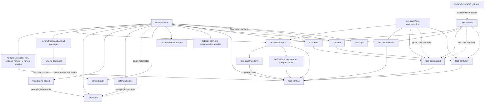

# Repository split specification

Status: draft, 2026-10-08. This is the flight project's coordination proposal
for a migration across 0sfs, FOSS Earth and UMN-VR. Shared-world specifications
remain authoritative in FOSS Earth; campus specifications remain authoritative
in UMN-VR. New repository destinations below are proposed; this document does
not create or transfer repositories. Repository creation, history rewriting
and recreation are separate migration
actions. Current ownership remains in effect until a component is extracted
and its consumers are updated.

The default is **one feature tab, one feature repository**. The feature owns
its implementation, parameters, primary panel, diagnostics and validation.
Aircraft and engine repositories supply complete versioned content packages.
The simulator composes them with FOSS Earth and JSBSim.

The three organizations keep their own responsibilities. FOSS Earth owns the
world and shared application infrastructure; 0sfs owns the flight simulator,
aircraft and engines; UMN-VR owns the club and campus experience. 0sfs and UMN-VR
consume FOSS Earth. FOSS Earth and UMN-VR have no runtime, build or developer
setup dependency on 0sfs. Each application owns its manifests, content,
documentation and research; sharing a viewer or a tool does not transfer those
inputs to its implementation owner.

An organization name alone does not establish an import cycle. Ownership and
package dependencies are enforced separately: the owning project keeps its
source/contracts/data, and the package graph follows public exports without
reverse imports. This proposal concerns the existing globe, flight and UMN
club-site/tour applications; unrelated UMN organization projects are outside
this migration. The current checkouts can hold the draft boundaries and
prototypes while they are reviewed; no new remote repository is needed now.

## Rules for repository boundaries

1. A feature tab normally identifies the repository to change. Start with that
   boundary and record a concrete exception when the tab combines independent
   owners or several tabs edit the same subsystem.
2. A feature repository publishes usable code or content, with a public
   interface, independent checks, release identity and representative examples.
   A directory move alone does not finish an extraction.
3. Each quantity, computation and resource has one owner. One simulation clock,
   one weather world, one applied control command per axis and one renderer
   scheduler remain authoritative across the split.
4. Repository names follow recognizable subjects: `autopilot`, `weather`,
   `sound`, `exhaust`, `fuel`. Each README states its responsibility and links
   its primary tab. Moving a control to a different tab does not by itself move
   its implementation to a different repository.
5. Code, tests and evidence that establish a component's released behavior
   travel together. Shared native dynamics stay in JSBSim; controller handling
   stays in gamepad-tools. Consumers use public exports.

## Applications and organizations

| Proposed repository | Responsibility |
| --- | --- |
| `foss-earth/engine` | Reusable globe library: terrain/maps, coordinates/surface queries, globe camera/input and world adapters, consuming the renderer's public scene interface |
| `foss-earth/foss-earth.github.io` | Globe application's assembly, release/workspace manifests, site content and deployment, consuming the library |
| `foss-earth/ui` | Generic windows/tabs/widgets, settings registry, panel contributions, status log and diagnostic/report contracts; feature tab content stays with its owner |
| `foss-earth/renderer` | Scene/device/backend creation, GPU resources and frame scheduling, plus its optional Renderer panel; no globe imports |
| `foss-earth/toolbar` | Bottom HUD layout, launchers and readout presentation, populated through host callbacks/contributions |
| `foss-earth/about` | Shared About presentation, provenance/graph schema, validation and graph viewer, consuming host-supplied metadata |
| `foss-earth/dev` | Shared `?dev=1` activation and Dev-panel contribution helpers; hosts supply the actual panels |
| `foss-earth/sky`, `foss-earth/weather`, `foss-earth/panorama` | Shared astronomy/lighting, environmental fields, and panorama formats/viewer/tools, with their optional panels |
| `foss-earth/dev_installer`, `foss-earth/ci` | Reusable workspace setup and common checks, consuming project-owned manifests and policy configuration |
| `UMN-VR/UMN-VR.github.io` | Club website, navigation and published access to the independently released campus tour |
| `UMN-VR/tour` | Campus-tour application, scene placements, campus content and import adapters, release/workspace/graph manifests, and tour-specific panels |
| `UMN-VR/twin-cities-content` | Optional versioned campus-media package when media delivery requires an independent release; external versioned hosting can provide the same boundary |

The library/site split makes FOSS Earth's dependency explicit: flight and tour
applications consume `foss-earth/engine`, not a website's deployment source.
Map and Location remain public modules inside that library initially. Renderer,
UI and bottom toolbar are separate target repositories with explicit contracts.
The club/tour split separates club publishing from the tour's renderer/content
release and build, while preserving the club site's tour entry routes. These
are parts of the same coordinated migration as the flight split, with pinned
intermediate releases. Neither separation requires independent repositories
for every internal module; the additional UMN media boundary remains optional.

## Flight application, documentation and research

| Repository | Responsibility |
| --- | --- |
| `0sfs/simulator` | Flight application composition, accepted fixed-step execution, JSBSim integration, flight cameras, saved-flight lifecycle, world/aircraft adapters and final control application |
| `0sfs/about` | Flight About content and build/graph-manifest adapter, consuming the shared `foss-earth/about` viewer |
| `0sfs/dev` | Flight-specific Dev panels and observations, registered through `foss-earth/dev` |
| `0sfs/logo` | Flight-brand logo generator sources, build/provenance and exported brand assets |
| `0sfs/0sfs.github.io` | Public entry site and deployment of an explicitly pinned simulator release; no second copy of simulator source |
| `0sfs/docs` | Flight user/developer documentation, ownership map, aircraft/engine integration guides and flight release compatibility; this coordination proposal links authoritative upstream/campus specifications |
| `0sfs/research` | Studies, literature/source records, competing approaches, cross-engine or cross-aircraft comparisons, research experiments and their reproducible methods |
| `0sfs/dev_installer` | Flight-workspace onboarding and engine-development adapter, consuming shared installer mechanics and flight-owned manifests |
| `0sfs/ci` | Flight/aircraft/engine integration and release workflows, consuming shared CI checks |
| `0sfs/.github` | Flight organization contribution policy, community defaults and templates, including explicit adoption of required checks |

Each organization owns its documentation and research catalogs. `0sfs/docs`
and `0sfs/research` cover flight; `foss-earth/docs` and `foss-earth/research`
cover globe/shared-world work. UMN-VR retains campus/club documentation and
research in its own applications or dedicated catalogs. Cross-project links
connect these sources; none is a replacement for another organization's
authoritative specification.

Each implementation repository retains its README, local build/contribution
instructions, API contracts,
release-specific technical notes and validation ledger. The documentation site
can assemble or link those at a pinned version; it must not maintain a second
manually edited copy of their specifications. Draft feature designs begin with
their owning component; each project's coordination documents link the affected
owners' decisions.

Each research catalog owns questions and investigations in its subject area.
When a finding becomes an implementation requirement, the adopting repository
records the chosen model, inputs, limits and regression evidence, linking the
versioned research. Research results do not automatically qualify a released
aircraft or engine. Regression tools and release validation live with their
implementation; comparative experiment tools live with the research owner.
Aircraft/engine studies remain flight-owned, globe/sky/weather/panorama studies
remain FOSS Earth-owned, and campus studies remain UMN-owned. Aircraft/engine
assets stay in 0sfs, shared-world catalogs/data stay in FOSS Earth, and campus
photographs/placements/media stay in UMN-VR.

The existing `build/` trees include working sources and irreplaceable evidence.
They are not inputs to move, publish or delete wholesale during this split.
Retained public evidence follows the [validation layout](../validation/layout.md),
with source rights and personal data checked before publication.

## Developer setup CLI

`foss-earth/dev_installer` owns reusable workspace-manifest handling,
prerequisite checks, safe checkout/build orchestration and diagnostics.
`0sfs/dev_installer` supplies flight onboarding and the explicit JSBSim
development path. The globe site and UMN applications own their own onboarding
entry points and manifests; their setup never calls the flight wrapper.
The proposed CLI has `init`, `doctor`, `sync` and `check` commands: establish
a workspace,
explain prerequisites/state, update an existing workspace, and run selected
checks. Command spelling can be finalized with the prototype. It must offer a
complete setup as the default path and let contributors explicitly select a
smaller set when they only need one component.

A versioned workspace manifest names canonical repositories, compatible
revisions/artifacts, destination paths relative to a chosen workspace root,
prerequisites and dependency/build order. It distinguishes source packages,
prebuilt native/WASM artifacts and optional content. The simulator release
assembly owns the flight workspace's compatible set; each globe/tour release
owns its own compatible set. The shared installer reads the selected manifest
through a public contract. It does not maintain a second hardcoded list.
About receives a resolved build manifest derived from the same assembly inputs;
workspace setup and installed-build provenance are different views.

The CLI must be repeatable and resumable. It detects dirty checkouts and
diverged branches and reports the required resolution without overwriting
work, resetting history or deleting build/evidence directories. It previews
checkout and installation actions, verifies downloads/artifacts, reports which
steps completed, and provides an actionable summary after a failure. Existing
credentials stay in the user's configured tools, outside manifests and logs.

`doctor` checks available tools, package revisions, local links and adopted
artifacts without running a benchmark or starting a server. Installing system
tools and starting servers are explicit actions. The normal contributor setup
for flight uses the pinned JSBSim tarball; rebuilding native/WASM engines is
an explicit engine-development path, following their owning repositories'
procedures.
Document supported operating systems and test each before calling its setup
supported. One workspace command should reach a working build without requiring
the contributor to discover the repository dependency order themselves.

## Shared CI and checks in each repository

Both layers are required. `foss-earth/ci` owns reusable authorship enforcement,
common policy/artifact checks and language/build jobs. `0sfs/ci` owns flight
integration/release orchestration and consumes those shared jobs. FOSS Earth
and UMN applications retain their own integration/release callers, independent
of the flight wrapper. Each repository owns a small `.github/workflows/` entry
point, event triggers, permissions,
required-check integration and component-specific tests/commands. The entry
point calls a reviewed immutable revision of the shared workflow. It also makes
the same relevant checks runnable locally, including through `dev_installer`.
GitHub's [reusable workflow contract](https://docs.github.com/en/actions/how-tos/reuse-automations/reuse-workflows)
supports these calling workflows and commit-SHA pins.

Tests proving aircraft, engine, rendering or other domain behavior stay with
that component. Consumer integration jobs use pinned dependency sets and
explicitly test changed dependency candidates. Central CI
changes are checked on representative consumers before their pins are updated.

`0sfs/.github`, `foss-earth/.github` and `UMN-VR/.github` each supply their own
policy documents and templates; none automatically installs running checks
into other repositories. Shared CI is a development/build dependency and
must be shown as that relation in the dependency graph, not
as code shipped in the simulator. Protect shared workflow sources and each
repository's calling workflow, and keep required check identities stable.

## About and the dependency graph prototype

`foss-earth/about` owns shared About presentation and the dependency-graph
schema, validator and viewer. It consumes `foss-earth/ui`; the UI
does not import About or any application. `0sfs/about` supplies flight-specific
content and adapts the simulator build manifest to that shared presentation.
The globe site and UMN tour supply their own content and manifests without
importing `0sfs/about`. Release assembly supplies the graph; About does not
import every dependency to discover its identity.

There are three separately owned prototype data files, each at
`docs/proposals/repository-split-graph.json` in the existing flight, FOSS Earth
and UMN application checkout. Each application owns its proposed graph data
and the generated `repository-split-graph.html` beside it. The HTML is generated
from the shared viewer owned by FOSS Earth, with its graph data embedded so it
opens directly without a server or external service. Generating three artifacts
does not create three viewer implementations or new remote repositories.
The [flight graph prototype](repository-split-graph.html) shows the flight set;
the [globe graph](../../../foss-earth/docs/proposals/repository-split-graph.html)
and [UMN graph](../../../UMN-VR/UMN-VR.github.io/docs/proposals/repository-split-graph.html)
show their own sets. Selecting a repository shows dependencies and consumers;
filters distinguish code, content/data, tooling and publishing/research links.
All three describe proposed architecture rather than an audited running build.
Their editable sources are the [flight JSON](repository-split-graph.json),
[globe JSON](../../../foss-earth/docs/proposals/repository-split-graph.json)
and [UMN JSON](../../../UMN-VR/UMN-VR.github.io/docs/proposals/repository-split-graph.json).

For the production About feature, the manifest records each package/repository
identity, source revision, installed artifact/version, licensing/provenance
links and dependency relations. Shared libraries appear once with multiple
consumers; separately installed versions remain distinguishable. Browser
code, native/WASM artifacts and content packages are represented explicitly.
The production graph includes third-party and transitive dependencies, collapsed
by default where useful. The brainstorming prototype focuses on proposed project
repositories and the existing external engine/controller owners.
Only installed or included artifacts appear as runtime/content dependencies;
actual developer/build tools use their own relation type. Optional packages
can be shown as available separately. Local checkout paths, credentials
and personal data are not part of the public manifest.

Every arrow has a defined type and direction. For dependencies, **A → B means
A consumes B**. A data-supply or research-reference relation must not masquerade
as an executable dependency. The manifest validator checks IDs, unresolved
edges, incompatible identities and cycles within the declared acyclic dependency
types. The graph must stay readable through search, selection, immediate
dependency/dependent views and an accessible textual representation. Graph
layout is presentation; it must not change the underlying dependency records.

The prototype data and architecture explanations remain with their applications
until their own documentation destinations are established. Shared production
graph code belongs in `foss-earth/about`; flight About content and its adapter
belong in `0sfs/about`. Each application remains the owner of the manifest/data
describing its build.

## Dev panels and flight branding

`foss-earth/dev` supplies the shared `?dev=1` activation contract and Dev-panel
contribution helpers. It accepts host-provided sections and diagnostics without
importing a globe, flight or campus implementation. `0sfs/dev` owns flight Dev
panels; the globe and UMN hosts supply their different panels from their own
applications/features. Existing feature diagnostics stay with their feature;
Dev assembles views over them. Opening a Dev panel does not start a server,
benchmark, capture or independent simulation loop.

`0sfs/logo` owns only the flight brand: generator sources, reproducible exports,
format/size metadata and provenance. The flight website, simulator and flight
documentation consume its exports. FOSS Earth and UMN retain their own branding
and assets; neither depends on the flight logo package.

## Current flight tabs and target owners

The complete source audit is the [flight tab inventory](tab-inventory.md):
**21 current tabs, comprising twelve flight definitions and nine shared tabs**.
Every row records a dedicated repository or an explicit reason to share one.
The corresponding inventories live with
[FOSS Earth](../../../foss-earth/docs/proposals/tab-inventory.md) and the
[UMN tour](../../../UMN-VR/UMN-VR.github.io/docs/proposals/tab-inventory.md).
Each of those hosts has 13 registered IDs, with 11 available on the globe and
nine while viewing a panorama. Dev is proposed, not counted as a current tab.

The following are the twelve flight tab definitions in
[`FlightControlPanel.tsx`](../../src/flight/hud/FlightControlPanel.tsx). They
describe the current UI, not proposed new capabilities.

| Current tab | Proposed repository | What the repository owns |
| --- | --- | --- |
| Weather | `foss-earth/weather`, with a simulator adapter | Canonical world weather definitions, sampling, sources, weather presentation and shared panel. The flight adapter supplies accepted samples to JSBSim. |
| Aircraft | `0sfs/aircraft`, plus one repository per aircraft | Common manifest/schema, catalog/loading contracts, visual installation and selection panel. Aircraft packages supply their own models, systems/configuration, variants and evidence. |
| Fuel | `0sfs/fuel` | Fuel panel, read/write/distribution interfaces and external-tank installation behavior. Aircraft packages supply tank geometry/configuration; JSBSim retains native fuel and mass dynamics. |
| Autopilot | `0sfs/autopilot` | Hold controller, modes, engagement, pilot takeover policy, backend interface, parameter definitions and panel. It returns control intents to the host. |
| Controls | `0sfs/controls` | Flight action mapping, keyboard response, assists and flight haptic interpretation, plus their panel sections. It consumes gamepad-tools and accepts shared globe-input sections. |
| Remote Control | `0sfs/remote-control` | Phone application, pairing, transport/protocol, control sharing, phone settings and camera transport/playout, with explicit host adapters. |
| Sound | `0sfs/sound`, with registered source plugins | Sound panel, lifecycle/worklet, mixing/propagation, volume/resource controls and plugin contracts. `0sfs/engine-sound` synthesizes engines; `0sfs/wind-noise` models aerodynamic airframe noise. |
| Exhaust | `0sfs/exhaust` | Gas optics and rendering, smoke, plume depth handling, exhaust hot-surface rendering and Exhaust panel. Engine packages provide optical data; aircraft packages provide installations. |
| Engine | `0sfs/engines` | Common engine-package contracts/loading, observations, monitor/instruments, live history, control interface and test-stand interface. Engine packages provide specific engine definitions; JSBSim owns dynamics. |
| G-forces | `0sfs/g-forces` | Pilot-load interpretation, meter, blackout/redout/consciousness behavior, overlays and panel. It reports pilot availability; host control integration enforces it. |
| Logging | `0sfs/logging` | Flight data recorder, channels, bounded history, segments/marks, export and Logging panel. It records accepted simulation state and applied controls. |
| Debug | Simulator composition, with sections supplied by owners | Aggregates frame budget, forces, contacts, aircraft visuals and other diagnostics. Each implementation owns its diagnostics; the host assembles the tab. |

The shared `aircraft` repository exports its SDK as a package entry point; it
does not need a second repository solely for the SDK name. Flight cameras and
startup/reset orchestration remain simulator responsibilities even where their
controls appear under Aircraft.

Logging here means the flight data recorder. The shared status log moves with
the UI into `foss-earth/ui`. The G-forces model retains its documented gameplay
and qualification limits after extraction.

### Autopilot

The current implementation supplies roll, pitch and heading hold, airspeed or
throttle-lever hold, pilot override, and gear/flap holding through
[`ourAutopilot.ts`](../../src/flight/autopilot/ourAutopilot.ts) and
[`controlArbiter.ts`](../../src/flight/autopilot/controlArbiter.ts).
ArduPilot currently has disconnected status and a disabled connection control;
a working SITL bridge is still the subject of the
[ArduPilot proposal](ardupilot-sitl.md).

The extracted controller takes observations, elapsed accepted simulation time,
pilot inputs and settings. It returns commands and engagement/authority status.
The host composes pilot, remote, autopilot and aircraft control-law inputs and
writes the final command once. Aircraft-specific fly-by-wire laws remain with
their aircraft/native implementation; an autopilot repository does not absorb
every controller in the simulator.

### Weather and sky

The current flight Weather panel supplies wind speed/direction and adapts them
to JSBSim. The wider weather model, clouds and sources are specified in the
[world weather proposal](../../../foss-earth/docs/proposals/weather.md).
Creating `foss-earth/weather` establishes that shared owner without implying those
features already exist.

Weather owns a single versioned environmental state sampled by the globe and
flight. The application supplies time, coordinate/height conversion and surface
access through explicit interfaces. Weather core imports neither the globe
runtime nor JSBSim. Its renderer and panel are optional entry points.

`foss-earth/sky` owns astronomy, the clear atmosphere, stars and physical lighting,
along with Sky and Date and time panels. Weather supplies cloud/atmospheric
conditions to sky/rendering through an explicit contract. The host supplies one
scene time and one lighting/exposure result for ground, aircraft and exhaust.
The split must not introduce a second Sun, independent weather for audio, or a
different cloud field for aircraft and visuals.

### Exhaust

Use the repository name **`0sfs/exhaust`**. It covers the gas plume, its light,
smoke and exhaust-related hot surfaces. Native combustion and thermal state
come from JSBSim; engine-specific geometry and optical tables come from engine
packages. Mechanical engine geometry and nozzle articulation contracts belong
to those engine packages and their installation, not a catch-all effects repo.

Afterburner source synthesis belongs to `0sfs/engine-sound`; its volume setting
belongs to `0sfs/sound` even when the control appears in Exhaust. The Exhaust
panel receives that Sound section through composition, preserving one UI home.
Physical afterburner engagement remains native engine behavior.

### Sound source plugins

`0sfs/sound` owns the Sound tab, audio lifecycle/worklet, mixing, propagation,
volume/resource controls and pure plugin contracts. `0sfs/engine-sound` owns
engine-family-independent synthesis; F135/FJ33/other engine packs supply their
acoustic profiles. `0sfs/wind-noise` owns the aerodynamic/airframe noise model,
using host observations and aircraft installation/configuration. These are
target owners, not claims of additional sound capabilities today.

The host imports and registers source plugins with `sound`; `sound` never
statically imports them. Plugins depend on `sound`'s pure contracts and return
source output/status through the admitted ABI. Engine profiles are passed into
`engine-sound`, which does not import concrete engine families. Move common DSP
primitives only where real callers need them; a shared pure primitives entry
point must not import a plugin or create a reverse dependency. Preserve the
snapshot/parameter ABI or version and verify deliberate changes; retain
missing-data behavior and WASM provenance.

## One repository per aircraft and engine family

`0sfs/aircraft` and `0sfs/engines` are the two common packages. Aircraft owns
shared manifests, loading, visual/animation interfaces and selection; Engines
owns shared engine-package contracts, loading/registration, observations and
monitoring. Their core/contracts entry points remain usable without the UI.
Specific aircraft and engine repositories depend on these contracts and supply
their definitions through registration. The common registries do not import
all concrete packs. An engine family depends on `engines` contracts; `engines`
never depends back on that family. Native dynamics algorithms remain in JSBSim.

| Aircraft repository | Initial engine package | Aircraft-owned content |
| --- | --- | --- |
| `0sfs/F-35B` | `0sfs/F135` | Aircraft flight model/systems, airframe/cockpit assets, powered-lift installation, rigging, fuel/contact geometry, control-law configuration and validation |
| `0sfs/SF-50` | `0sfs/FJ33` | SF50 models and generations, systems, engine installation, fuel/contact geometry and validation |
| `0sfs/C172` | `0sfs/IO320` | Current C172P package, installed propeller/engine references, systems, geometry and validation; package identity follows the currently installed `eng_io320.xml` |

An engine type/family gets its own repository. Variants with the same model
lineage live in that repository. For example, FJ33-5A belongs in `FJ33`; a future
FJ44 package gets `FJ44` when implemented, rather than being advertised as part
of an FJ33 release. Repository names and engine identity must follow the actual
model and provenance; extraction is not an opportunity to silently relabel it.

Each engine repository owns:

- Engine-specific JSBSim definitions and model/calibration data, including variant
  identity and the supported native-engine/SDK version.
- Geometry, shaft/nozzle/attachment descriptions and their generation sources.
- Acoustic source definitions, data/assets and tuning with their stated limits.
- Exhaust optical inputs/tables, provenance and regeneration tools.
- Licenses, reference records, validation cases and release evidence.

The engine package can publish separate `definition`, `geometry`, `sound` and
`exhaust` entry points/artifacts so an aircraft need not download every asset
to inspect its catalog entry. Common engine synthesis stays in `engine-sound`,
audio orchestration in `sound`, common plume rendering in `exhaust`, and
turbine/piston algorithms in JSBSim.
This proposal therefore uses complete engine repositories instead of parallel
`sound-f135` and `exhaust-f135` repositories for the same engine.

The capability manifest makes geometry, sound and exhaust optional and records
their schema/renderer compatibility and supported source count. Missing
capabilities remain explicit. The current C172 package has no engine-sound
installation; the F135 supplies one main-engine sound source, with no separate
lift-fan sound, and the current engine-audio renderer admits one source. Extraction
must not imply broader sound coverage or additional renderer capacity.

Aircraft packages reference exact engine package versions and own installation
details: engine position/orientation, inlet/nozzle integration, mounting,
source positions, tank plumbing and aircraft-specific control configuration.
Engine packages never import a particular aircraft. Shared native and upstream
definitions retain their provenance and a documented update path.

Propellers, thrusters and propulsion accessories need an explicit owner too.
Keep the C172's `prop_75in2f.xml` and the F-35B's empirical liftfan/sidefan
definitions with their aircraft propulsion installation unless a dedicated
accessory package is introduced. The generic `direct.xml` thruster remains a
single shared JSBSim-derived resource supplied by the assembly contract;
aircraft installations reference it. A file's current location under
`public/jsbsim-data/engine/` does not make it part of a particular engine family.

Manifests define logical asset IDs, package-relative URLs, content hashes and
native model/engine/system paths. The host resolves the exact transitive
package set into JSBSim's virtual filesystem, validating references and rejecting
conflicting files/IDs before installation. Model definitions and referenced
paths move together; former `public/` paths cannot remain hidden requirements.

`0sfs/ground-contact` is an additional feature repository without its own tab.
It owns aircraft/world contact adaptation and collision queries/response
integration, with settings in Aircraft and diagnostics in Debug. Terrain
queries remain FOSS Earth's; native gear/contact-force laws remain JSBSim's;
aircraft packages retain collision geometry. Experimental solvers retain their
experimental status. Creating a repository does not qualify them or replace
the native solver.

## Shared tabs and the exceptions to one tab per repository

The shared shell's current tabs are defined in
[`WindowOverlay.tsx`](../../../foss-earth/src/shell/WindowOverlay.tsx).
Optional tabs appear only when supplied by the host. Scenes and panorama tabs
are available to FOSS Earth/tour hosts; they are not currently passed into the
flight panel. Dev is a proposed additional contribution, labeled below.

| Shared tab | Initial owner after the proposed split | Reason |
| --- | --- | --- |
| Sky | `foss-earth/sky` | One coherent shared-world feature. |
| Date and time | `foss-earth/sky`, with host-supplied scene clock | The existing `sky.time.*` controls and solar dials share astronomy with Sky; a second repo would divide one model. |
| Location | `foss-earth/engine` | The globe navigation entry point shares its destination contract with camera/surface services; a panel-only repo would divide that entry point. Independently released search providers could justify a later boundary. |
| Map | `foss-earth/engine` | Map sources, terrain/imagery loading, residency and authoritative surface queries are the globe engine's central feature and resource owner; another `map` repo would currently duplicate that boundary. |
| Renderer | `foss-earth/renderer`, with sections supplied by features | Backend, scene resources and frame scheduling move behind a globe-independent interface; aircraft instrument/external-tank sections retain their owners. |
| Controls | `foss-earth/engine` input + gamepad-tools; `0sfs/controls` only in flight | One user-facing tab assembles the relevant input owners. Globe and UMN need no flight controls package; a shared panel-only wrapper would not own the input behavior. |
| Interface | `foss-earth/ui` + `foss-earth/toolbar` | The tab assembles generic panel/widgets and bottom-bar settings, with readouts/services supplied by owners. An extra `interface` repo would add composition without a separate state or lifecycle. |
| Settings | `foss-earth/ui` | This is the settings registry's management view: presets, saved records and import/export use the same registry/migrations as feature panels. Globe/UMN also provide App files and Diagnostics sections; flight provides Diagnostics without App files. |
| About | `foss-earth/about`, with host-owned content/manifest adapters | Flight supplies `0sfs/about`; globe and UMN hosts supply their own content. |
| Bug report | `foss-earth/ui` | Form, redaction and report lifecycle consume the UI diagnostics/log contracts. Keep that management view with those contracts; hosts supply observations and reporter configuration. |
| Dev (proposed) | `foss-earth/dev`, with host-owned panel contributions | Shared activation/registration; `0sfs/dev` supplies flight panels and globe/UMN supply their own. |
| Scenes | `foss-earth/panorama` | Generic scene definitions, loader and tools are shared with the active panorama. |
| Active 360 image | `foss-earth/panorama` | The tab title changes with the current image; it is an instance of the same viewer. |
| 360 image settings | `foss-earth/panorama` | Shares camera, image loading, budgets and lifecycle with the other panorama tabs. |

These are explicit exceptions, not a general license to keep unrelated code
in the application. Renderer is now a target extraction; Map remains in
`foss-earth/engine`. Their current resource lifecycles are coupled, so establish
scene/resource/request-render interfaces before moving implementation. The globe
consumes `foss-earth/renderer`; the renderer never imports the globe. Both owners
must validate readiness, disposal and scheduling through those interfaces.

`foss-earth/ui` is a required foundation before independently packaged panels.
It imports neither the globe runtime nor feature implementations.
It owns preset application/storage mechanics; application-wide preset values
are host composition inputs and feature presets belong to their owners.
Settings and Bug report are views over registered features. About is supplied
by its own repository through the same registration mechanism. The existing
combined app-settings singleton stays with host composition or is replaced by
explicit host registry construction.

`foss-earth/toolbar` consumes UI primitives and host-registered launchers,
readouts and tab callbacks. It owns bottom-bar layout, not feature state, search
or camera behavior. Neither UI nor toolbar imports every feature to populate
itself; feature panels keep their code, parameters and lifecycle in their owner.

For UMN, move the campus application and its placements together into
`UMN-VR/tour`, separate from club publishing. `UMN-VR/twin-cities-content` is an
optional additional media boundary; versioned external hosting can provide the
same delivery separation. Generic formats/viewer/preparation tools move into
`foss-earth/panorama`; photographs, placements and campus/platform import
adapters remain UMN-owned. The tour consumes FOSS Earth, never 0sfs. See the
[content delivery design](../../../UMN-VR/UMN-VR.github.io/docs/content-delivery.md).

## Public interfaces and dependency direction

Each feature publishes separate entry points where applicable: `core`,
`settings`, `panel`, renderer adapter, diagnostics and assets. Core entry
points must work without React, browser globals or renderer initialization.
Panels receive settings/services; they do not obtain a global app singleton.

The host registers each feature's parameter definitions and tab/section
contributions with `foss-earth/ui`. Parameter IDs, units, defaults, bounds,
saved-record migrations and tab IDs are preserved during extraction. The
large `flightParameters.ts` becomes composition of feature-owned catalogs.
Presets and export still operate on one application record.

Shared contracts are small, data-oriented and explicit about units, frames,
timestamps, generation/reset identity and missing data. Aircraft manifest
contracts live in the `aircraft` SDK. Other features own their input/output
contracts; adapters translate at the host boundary. Avoid a shared package
containing the entire mutable application state.

Solid arrows indicate package consumption; dotted arrows indicate supplied
data or a published release. Flight graph adapters do not receive globe/tour
manifests. The shared About viewer receives each host's manifest as input;
it never imports host manifests or application code. The globe and tour have
no path to a 0sfs package. Shared contracts stay with their component owners;
the graph does not introduce a common mutable application-state package.
The host passes accepted native observations to consumers. Presentation never
advances engine physics. Ground-contact and weather adapters participate in
the host's step boundary; they do not create independent simulation loops.
Source plugins consume pure contracts from `sound`, which has no plugin import edge.

Concrete dependency repairs required by the current code:

- Sky runtime currently imports a terrain-lighting plugin. Move the sky model
  and rendering behind injected lighting/ground-probe/render-request interfaces;
  retain terrain adaptation in FOSS Earth. Do not create a
  `foss-earth/engine → foss-earth/sky → foss-earth/engine` runtime cycle.
- Extracted panels receive the settings registry and tab-opening callbacks
  instead of importing `getAppSettings()`. Move generic registry/types/widgets
  into `foss-earth/ui`; keep feature catalogs and panels with their
  owners. Separate subpaths inside the current FOSS Earth package do not by themselves remove a
  package release dependency cycle.
- Split the shell barrel's feature-panel exports. Inject Location search
  providers into the shared overlay, adapt panorama context to a generic tab
  lifecycle contract, and supply position/height readings to the HUD. Search,
  geoid/datum and world navigation implementations stay in `foss-earth/engine`,
  outside `foss-earth/ui` and `foss-earth/toolbar`.
- Separate device/scene/resources and render scheduling from terrain/map
  ownership behind `foss-earth/renderer` interfaces; never import the globe
  into the renderer to recover an internal callback.
- Autopilot settings stop importing the entire flight parameter catalog.
  Controller outputs stop depending on internal input-manager types.
- Phone and engine panels receive observations and commands through their
  public contracts instead of importing application internals.
- The shell accepts contributions from the host; it does not import every
  feature repository. Diagnostics follow the same rule.

All resource limits remain user-visible named parameters. Module extraction
must preserve render-on-demand, readiness-before-display, camera momentum and
input propagation. A new package does not get a second timer or cache merely
because it has its own lifecycle API.

## Releases and acceptance of an extraction

Every code/content repository has a machine-readable version and compatibility
contract, source revision, licensing/provenance, a documented build and its own
checks. The simulator release pins the complete compatible set, including
aircraft, engine assets, JSBSim artifact and schema versions. Preserve the
existing displayed build-version scheme independently of package compatibility.
About reports what was actually installed.

Local development may link sibling checkouts. CI and release builds use
committed exact artifact/revision pins and lockfiles, not whichever branch a
sibling checkout currently contains. Cross-repository changes land in their
dependency order; consumers update only after the dependency is available.
Repositories may publish several artifacts without duplicating source.

An extraction is complete when:

1. Its owner builds/tests from a documented clean checkout and public inputs.
2. Consumers use public exports and contain no duplicate implementation or
   deep imports into the former owner.
3. Existing behavior, parameter homes and saved state survive the move; new
   capabilities are verified separately.
4. Related checks pass in the owner and affected consumers, then their required
   full checks run once at the completed change. Test output is retained.
5. The release includes the needed assets, provenance and validation evidence;
   documentation and the ownership map name the new canonical source.

GPU benchmarks and WASM rebuilds remain subject to the existing task-specific
rules. A split alone does not justify new qualification claims or rebuilding
an unchanged native artifact. JSBSim and audio artifact verification retain
their current provenance requirements.

## Authorship policy and history migration

Every repository, including `docs`, `research`, content packages and shared
infrastructure, carries this rule in its contribution and agent instructions:

> YOU CANNOT HAVE AI AS A CO-AUTHOR, OR YOUR CONTRIBUTIONS WILL BE REJECTED.

AI author/committer identities and equivalent identity-bearing attribution
trailers are prohibited as well. Human authorship, third-party notices and asset
provenance are preserved. Technical discussion of AI tools is not an authorship
violation. New aliases require review; a known-name denylist cannot guarantee
recognition of every possible AI identity. An approved identity registry can
provide stricter admission, with legitimate human contributors onboarded and
any non-AI automation exceptions explicitly recorded.

The shared validator in `foss-earth/ci` inspects raw commit metadata and
attribution trailers, including co-authors, using full history for every branch/tag proposed for
publication. A shallow checkout must not silently pass a full-history audit.
Each repository explicitly installs the workflow and required merge check;
organization default documentation alone does not enable it. Protect the
validator and required workflow against changes that bypass their own check.

PR history and any final merge/squash commit must satisfy the rule. Account for
generated merge-message trailers; validate the final commit through the merge
path, and configure merge behavior accordingly. Audit published branches/tags,
including deployment history. A post-push job can report a violation only
after admission; protected branches, required checks and restricted direct
pushes/bypasses enforce rejection before integration. Local hooks give earlier
feedback but are not the enforcement boundary.

Before a history migration, inventory refs, dirty work, remotes, releases,
consumers and repository metadata. Keep recoverable backups and an old-to-new
revision map. Remove prohibited co-author trailers while preserving genuine
human attribution. An AI-primary-author commit needs provenance review;
do not invent a human identity for it. Audit the extracted histories before
publishing them.

Quarantine old histories and clones so they cannot be merged back into the
clean publication. Backup refs can remain in protected local storage; they
must not be included in the refs pushed to the new canonical repositories.
Require fresh clones or documented reconstruction at cutover. Native JSBSim
upstream ancestry and focused upstream PRs need their own integration path;
do not rewrite unrelated upstream history to apply app governance.

Repository deletion/recreation is a separate optional migration with an exact
repository list, preserved assets/metadata and a verified restoration plan.
It follows preparation of clean histories and enforcement, since publishing
the old histories again restores the prohibited attribution. GitHub documents
[caching of contributor API data](https://docs.github.com/en/rest/repos/repos#list-repository-contributors);
the UI alone is not proof that a particular commit is still reachable.

## Migration sequence

1. **Policy and inventory:** establish each organization's scoped policy/templates
   and `foss-earth/ci`, with required calling workflows and project-owned
   integration jobs; `0sfs/ci` supplies flight orchestration. Establish
   the authorship guard, enumerate current
   repositories and published refs, and make the backup/cutover plan. Freeze
   ownership names for the first extraction wave.
2. **Documentation and research:** establish each project's catalogs and publishing
   approach, move material into its subject owner with redirects/links, and keep
   implementation-specific contracts and evidence with their owners.
3. **Shared library, renderer and UI:** separate `foss-earth/engine` from the
   globe site. Establish scene/resource interfaces and extract
   `foss-earth/renderer`, `foss-earth/ui` and `foss-earth/toolbar`; split feature
   catalogs from host registry construction and toolbar contributions.
   Validate globe, flight and tour consumers before they depend on external panels.
   Extract `foss-earth/about` and `foss-earth/dev` against that foundation.
   Each host owns its manifests and panel/content contributions; `0sfs/about`
   and `0sfs/dev` supply flight-specific adapters. Use the three host-owned
   JSON graph prototypes and shared viewer to establish graph semantics.
4. **Aircraft and engine contracts:** define manifests, compatibility and asset
   resolution; extract `aircraft`, then F135/FJ33/IO320 and F-35B/SF-50/C172
   packages. Native algorithms remain in JSBSim. Update app assembly and assets
   incrementally so every intermediate release has a valid package set.
   Establish `foss-earth/dev_installer` against the public workspace contract
   and `0sfs/dev_installer` against the flight-owned manifest as the repository
   set grows. Globe and UMN onboarding use their own manifests/callers. Verify
   onboarding from a clean supported machine.
5. **Feature repositories:** extract `autopilot`, `logging`, `g-forces`,
   `remote-control`, `fuel`, `controls`, `engines`, `sound`, `engine-sound`,
   `wind-noise` and `exhaust`, one at a time after establishing each public
   interface. Choose the actual order by
   dependency readiness; ship equivalent behavior before adding features.
   Extract `ground-contact` after the aircraft/native/surface interfaces are
   explicit, preserving support-query and accepted-step behavior.
6. **Shared world and campus applications:** extract `foss-earth/sky`,
   `foss-earth/weather` and `foss-earth/panorama`, following weather's staged
   specification. Validate globe, flight and tour consumers as applicable.
   Separate `UMN-VR/tour` from club publishing and decide the optional
   UMN-owned media boundary. These changes share the coordinated release plan;
   UMN never acquires a flight dependency.
7. **Application and publication:** complete simulator/website, globe library/site
   and club-site/tour boundaries, pin releases, and establish `0sfs/logo`
   generation/exports. Assemble each project's documentation and update About
   provenance and contributor guidance across all consumers.
8. **Canonical cutover:** publish audited clean histories, retire stale push
   paths and recreate only repositories selected in the separate migration
   decision. Recheck attribution and release reproducibility after cutover.

Renderer extraction is part of this migration; a separate Map repository
remains later work. Every new repository is useful at its
first release; planned features and reserved names stay identified as planned.

## Source specifications

- [Current FOSS Earth relationship](../foss-earth-relationship.md)
- [Flight settings and parameter homes](flight-settings.md)
- [Sound](../sound.md) and [audio implementation ledger](../validation/audio-implementation-ledger.md)
- [Aircraft assets](../aircraft-assets.md) and [JSBSim integration](../jsbsim.md)
- [Sky](../../../foss-earth/docs/proposals/sky.md) and [weather](../../../foss-earth/docs/proposals/weather.md)
- [Shared UI layout](../../../foss-earth/docs/ui-layout.md) and [settings](../../../foss-earth/docs/proposals/settings.md)
