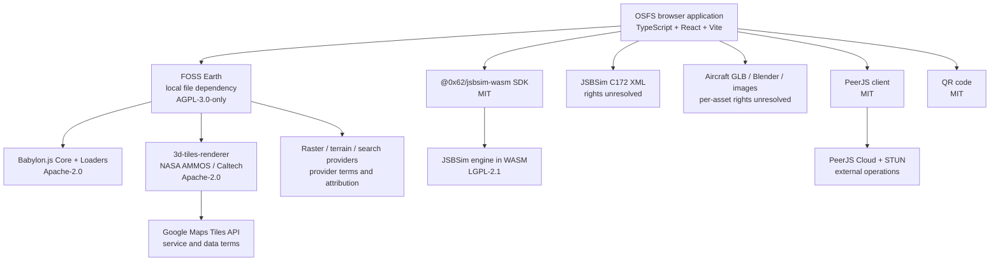

# OSFS software dependency graph

This graph separates distributable software from live services and creative
assets. A line to a service does not mean OSFS owns, redistributes, or licenses
that service's data.

The immediate release-critical paths are the local FOSS Earth dependency, the
JSBSim C172 XML, and aircraft assets. Their license/provenance evidence must be
complete before OSFS can offer a single project-wide release license. The
software inventory is in [THIRD_PARTY_LICENSES.md](../THIRD_PARTY_LICENSES.md);
the exact JSBSim integration is in [JSBSim WASM](jsbsim-wasm.md).

## SF50 handoff: ownership and canonical repositories (2026-09-12)

The SF50 integration exposed a recurring ownership issue: generic engine/SDK fixes must not accumulate as application workarounds just because the app is the currently open workspace.

| Work | Owning repository used in this integration |
| --- | --- |
| Aircraft-family gallery, variant selection, app-specific loading, SF50 model XML and public-evidence processing | `/Users/felg/gh/0sfs` |
| Generic JSBSim engine initialization/dynamics | `/Users/felg/gh/Felipegalind0/jsbsim` |
| Generic WASM bindings, SDK lifecycle/disposal and model-load diagnostics | `/Users/felg/gh/Felipegalind0/jsbsim-wasm` |
| Earth/terrain/rendering dependency | `/Users/felg/gh/foss-earth` |

The user's preferred layout is `gh/owner/repo`, with work on ordinary branches in the canonical repositories. Do not recreate special task-named repository copies/worktrees. The app path above is the actual path used in this work, not a request to relocate it.

Existing upstream PRs and portability patches predate this handoff. Their present status was not rechecked here; consult their existing documentation and current upstream state before duplicating work. Production adoption of a historical native fix or temporary SDK build must not be assumed. PR creation follows confirmation that the relevant changes work.

See [the SF50 development handoff](validation/sf50-development-handoff.md), [aircraft-selection UI prompt](prompts/aircraft-selection-ui-work-app-prompt.md) and [SF50 resume prompt](prompts/sf50-resume-work-app-prompt.md) for the preserved integration state and next-task boundaries.
