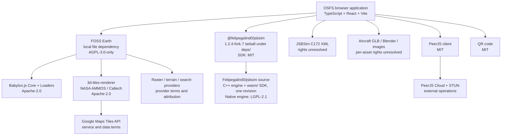

# OSFS software dependency graph

This graph separates distributable software from live services and creative
assets. A line to a service does not mean OSFS owns, redistributes, or licenses
that service's data.

The current development source is one `Felipegalind0/jsbsim` checkout containing
the C++ engine and `wasm/` SDK. OSFS installs the clean in-tree `1.2.4-fork.7`
package from that repository, which adopts the IDBFS-linkage and
native-exception build corrections from the upstream package contribution. Its
144 focused app/runtime/UI/artifact tests,
production build/typecheck, emitted-byte checks and actual browser SDK boot/byte
checks for all four runtime aircraft passed, together with 50 SDK tests,
11 native regression targets, native build isolation, browser IDBFS persistence
and four matched native/WASM scenarios. Focused ESLint passed the four
changed identity/artifact files. See the [in-tree execution record](validation/jsbsim-in-tree-integration-2026-09-13.md)
and the [adopted corrections](jsbsim.md#adopted-idbfs-and-native-exception-corrections)
for exact artifacts and outcomes. The [earlier centralization spec](proposals/jsbsim-dependency-centralization.md)
and [record](validation/jsbsim-centralization-2026-09-13.md) retain preservation
and rollback history; their separate native/SDK editing layout is superseded.
The [upstream contribution policy](jsbsim-upstream-contribution-policy.md)
records reusable upgrades and existing PR follow-up.

The immediate release-critical paths are the local FOSS Earth dependency, the
JSBSim C172 XML, and aircraft assets. Their license/provenance evidence must be
complete before OSFS can offer a single project-wide release license. The
software inventory is in [THIRD_PARTY_LICENSES.md](../THIRD_PARTY_LICENSES.md);
the exact JSBSim integration is in [JSBSim WASM](jsbsim.md).

## Identified SDK dependency

`package.json` declares `file:deps/felipegalind0-jsbsim-1.2.4-fork.7.tgz`
and Node `>=22.18` for the shared artifact validator; the tested Node version
is 26.8.2. Retain the tarball, declaration and lock together for portable SDK
installation without a source sibling or npm publication. The SDK package
version is distinct from the native engine version.

The accepted tarball SHA-256 is
`9312e2b657fd5f396f6ed55904616b907d387c9cd76d98ca66ad756cf3d8aa52`.
Both engine and SDK come from commit
`e727e6f1bdb9c616c14858025844b36cc47bc7b2` in the same repository snapshot.
`buildIdentity` schema 2 records the shared commit/dirty flag, `sdk.path: "wasm"`,
full repository and SDK subtree content digests and actual build inputs.
Metadata identifies the shared repository with null external native archive
and source-lock fields. No separate engine selection participates in this build.

`npm run verify:jsbsim` requires clean in-tree source identity and checks the
installed SDK against the declared archive, SHA-512 lock integrity and all 14
recorded distribution files. A dirty diagnostic candidate cannot become the
stable dependency. Exact schema-1 fork.1 and schema-2 fork.2/fork.3/fork.4
verification remain supported for deliberate rollback using their retained
tarballs, which keep the pre-rename `@felipegalind0/jsbsim-wasm` name, together
with their matching declarations, locks and identity module;
there is no automatic fallback to another runtime. `npm run build` performs
preflight, TypeScript/Vite compilation and emitted loader/WASM hash checks.
Headless browser acceptance separately checks the actually instantiated
production-bundle loader/WASM and selected aircraft files. Build success alone
does not establish browser-loaded bytes or aircraft fidelity.

FOSS Earth remains `file:../foss-earth` and does not acquire a mandatory JSBSim
dependency. Its existing checkout/build requirements are separate.

SDK destruction owns native executive cleanup. App startup/reset sequences
use normal native initialization after engine setup and preserve application
controls/actuator positions; they do not reset N1/N2 properties. Details,
commands, final identities/checks and historical diagnostic failures are in
[JSBSim WASM](jsbsim.md). The actual browser run deliberately blocked
external terrain requests; it establishes SDK boot/byte identity, not complete
terrain readiness or aircraft fidelity. The separate aircraft component check
passed three keyboard/layout viewports and recorded a minor clipped lower
LOD-select focus outline in the wide/narrow shell.

## SF50 handoff: current ownership and canonical repositories (2026-09-13)

The SF50 integration exposed a recurring ownership issue: generic engine/SDK fixes must not accumulate as application workarounds just because the app is the currently open workspace.

| Work | Owning repository used in this integration |
| --- | --- |
| Aircraft-family gallery, variant selection, app-specific loading, SF50 model XML and public-evidence processing | `/Users/felg/gh/0sfs` |
| Generic JSBSim engine initialization/dynamics | `/Users/felg/gh/Felipegalind0/jsbsim` |
| Generic WASM bindings, SDK lifecycle/disposal and model-load diagnostics | `/Users/felg/gh/Felipegalind0/jsbsim/wasm` |
| Earth/terrain/rendering dependency | `/Users/felg/gh/foss-earth` |

The [flight development workspace](../flight-development.code-workspace) names
the three active repository roots explicitly. Engine and SDK work share one
JSBSim checkout and branch. The old separate SDK was reversibly moved under
`gh/.preservation/jsbsim-in-tree-20260913T233508Z/retired-jsbsim-wasm`; it remains
a migration/PR reference outside the active workspace. The user's preferred layout is `gh/owner/repo`, with work on ordinary branches in the canonical repositories. Do not recreate special task-named repository copies/worktrees. The app path above is the actual path used in this work, not a request to relocate it.

Existing upstream PRs and portability patches predate this handoff. Their status and discussions were subsequently checked on 2026-09-13 in the [contribution ledger](jsbsim-upstream-contribution-policy.md#existing-pr-evidence-and-open-discussion); refresh those observations before extending work. Production adoption of a historical native fix or temporary SDK build must not be assumed. PR creation follows confirmation that the relevant changes work.

See [the SF50 development handoff](validation/sf50-development-handoff.md), [aircraft-selection UI prompt](prompts/aircraft-selection-ui-work-app-prompt.md) and [SF50 resume prompt](prompts/sf50-resume-work-app-prompt.md) for the preserved integration state and next-task boundaries.
