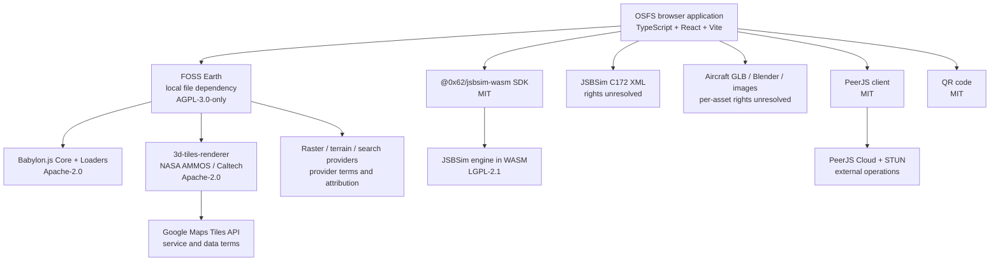

# OSFS software dependency graph

This graph separates distributable software from live services and creative
assets. A line to a service does not mean OSFS owns, redistributes, or licenses
that service's data.

The immediate release-critical paths are the local FOSS Earth dependency, the
JSBSim C172 XML, and aircraft assets. Their license/provenance evidence must be
complete before OSFS can offer a single project-wide release license. The
software inventory is in [THIRD_PARTY_LICENSES.md](../THIRD_PARTY_LICENSES.md);
the exact JSBSim integration is in [JSBSim WASM](jsbsim-wasm.md).
