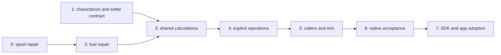

# Turbine initialization implementation plan

Date: 2026-09-19, revised 2026-09-20. Status: stages 0 and 2 are reviewed
locally; stage 1's characterization and evidence are accepted and the five
contract groups the [follow-up review](reports/01-follow-up-review.md) left
open are now closed, awaiting coordinator review. Nothing is published. Stage 3
remains pending until the revised contract is accepted. See the status table
below.
The user agreed to plan the broader initialization change after reviewing the
limitations of the #1505 guard. This turn prepares the work; it does not
change engine source, branches, packages or GitHub. The user values a complete
solution even where it requires substantial work.

This is the execution plan for the
[earlier design proposal](../proposals/jsbsim-turbine-evaluation.md).
[Behavior contract](contract.md) defines the target;
[validation](validation.md) defines the evidence. The earlier proposal remains
the rationale and records historical experiments, not completed validation.

## Outcome

Make the caller's request explicit: advance an engine, refresh its current
state, or establish a chosen initial state. Keep this separate from the
engine's physical phase. Share the calculations used by running and
initialization, and finish engine and dependent vehicle outputs before the
operation returns.

The finished work must support cold starts, immediate running starts,
repeated initialization, paused evaluation, cutoff/faults, mixed engine
states, aircraft trim, and preservation of turbine history during the app's
location changes and recovery. It must fix both introduced off-engine
regressions and the existing hypothetical powered thrust from an off turbine.

It does not replace the empirical turbine model, recalibrate aircraft, build
a general transaction system for every property in JSBSim, or redesign other
engine types. Engine initialization and state capture belong in JSBSim;
bindings and reusable wrappers belong in its `wasm/`; app intent and snapshot
composition belong in 0sfs.

## Verified starting point

Read-only source checks and live #1505/#1508 reads on 2026-09-19 established:

| Item | Identity / observation |
| --- | --- |
| Canonical JSBSim checkout | `/Users/felg/gh/Felipegalind0/jsbsim`, clean on `feature/wheel-spin-dof`, `499c38326bb6f39b6360bd82d74c5c00e64faeaf` |
| Fork master | `f0d1023a41d8eedf3bbcd2b17a91117f76a90f04`; includes turbine and SDK integration, not the latest wheel review round |
| #1505 original head | `07eba55fcd6fed530f6f404e857765c3224541fb`, branch `fix/turbine-trim-spool`, open |
| #1508 original head | `7511df10cda909c32dfc378dfde204eb44dc5a48`, branch `fix/turbine-trim-fuel-flow`, open; carries #1505 |
| Common original upstream base | `14c19022943f5850daf2c6b90554050b3139b853`; refresh upstream master before extraction |
| Installed app dependency | `@felipegalind0/jsbsim@1.2.4-fork.7`; no correction installed |
| Sean acknowledgment | [Posted by the user](https://github.com/JSBSim-Team/jsbsim/pull/1505#issuecomment-5744958064); do not duplicate |

`RunIC()` makes two zero-time model passes, initializes derivatives and then
processes IC engine-running requests. `Calculate()` uses zero engine-input dt
to select `tpTrim`; it also performs more initialization when leaving that
phase. `InitRunning()` and `GetSteadyState()` are additional paths. The latter
uses artificial 0.5-second engine steps and tests convergence of thrust.
See [executive documentation](https://jsbsim-team.github.io/jsbsim/classJSBSim_1_1FGFDMExec.html)
and [propulsion implementation](https://jsbsim-team.github.io/jsbsim/classJSBSim_1_1FGPropulsion.html).

Important audit details: executive dt and `FGEngine::Inputs::TotalDeltaT`
are distinct values; directly suspending the executive does not refresh the
copied engine input. Suspension uses one saved timestep, not a stack.
`ConsumeFuel()` updates fuel eligibility after engine calculation and skips
work in trim mode. Each matters to the new contract; source inspection alone
does not establish a failing scenario or dictate a generic executive rewrite.
Stage 1 measured all three: the copied dt stays at 0.008333 while the
executive is at 0 until the next `Run()`; nesting a `RunIC()` inside a
suspension leaves the executive suspended permanently; and the skipped
`ConsumeFuel()` is why the published fuel-flow rate freezes on trim, fuel
freeze and starvation. The bounded fixes are in [decisions.md](decisions.md),
not a generic executive rewrite.

The app's `src/flight/physics/safeFlightState.ts` captures a single engine
running flag, not turbine history. `restoreSimulation()` resets and starts
engines again. It is also used by terrain/contact recovery. A complete
turbine restoration path therefore requires native state capture, not extra
app writes to N1/N2. Do not promise whole-aircraft checkpoint equivalence.

## Work sequence and agent handoffs

Stages 0 and 2 are reviewed and committed locally, not pushed; see the status
table below. Stage 1's characterization and evidence are accepted, and the
contract corrections the [follow-up review](reports/01-follow-up-review.md)
required have been made. Stage 3 requires acceptance of the revised contract.
Stage 2 depended on stage 0, not stage 1, so completing it
first did not skip a prerequisite.
Tasks are bounded execution briefs. Later tasks
start only after their dependencies have a reviewed source identity and
recorded results; they must not guess an API while its contract is unsettled.
The coordinating agent performs those reviews as normal work, without
requesting a new user permission at each stage.

| Stage | Work / handoff | Depends on | Exit condition |
| --- | --- | --- | --- |
| 0 | [Repair #1505](../pr1505-off-engine-regression-prompt.md) | Clean current PR slice | Both off-engine regressions fail before/pass after; running and thrust behavior preserved |
| 1 | [Characterize callers and freeze the detailed contract](tasks/01-characterization.md) | Current source inventory | Retained baselines, fixture matrix, exact API/state/order decisions with no unresolved blocker for stage 3 |
| 2 | [Repair stacked #1508](tasks/02-pr1508-repair.md) | Reviewed stage 0 | Off-engine fuel regression repaired; existing fuel/spool tests pass on the exact stack |
| 3 | [Extract shared turbine calculations](tasks/03-shared-calculations.md) | 1 and 2 integrated locally | Normal dynamics and legacy initialization unchanged by extraction; configured-function order characterized |
| 4 | [Implement explicit operations and state capture](tasks/04-explicit-operations.md) | 3 | Advance/refresh/initialize/restore core contract passes native tests |
| 5 | [Route callers, finalize trim, handle failure](tasks/05-callers-and-trim.md) | 4 | Public native entry points satisfy the contract; off-engine powered trim thrust removed; failures restore documented state |
| 6 | [Verify native candidates and prepare contributions](tasks/06-native-validation.md) | 5 | Exact-candidate native acceptance, affected-script report, focused upstream slices and draft descriptions |
| 7 | [Integrate SDK, app and immutable package](tasks/07-sdk-and-app.md) | 6 | Real WASM and app checks pass on identified bytes; adoption and rollback records complete |

### Status

| Stage | State | Tested/reviewed identity |
| --- | --- | --- |
| 0 | **Reviewed and committed locally, not pushed** (2026-09-19) | `6f95bfb0a590d1a45de9f883857c17af0819f6ad` on `fix/turbine-trim-spool`, parent `07eba55f`. Exit condition met: both off-engine regressions fail before and pass after, thrust identical in twelve cases, focused 11-target suite 11/11. [Report](../validation/pr1505-off-engine-regression.md) and [evidence](../../validation/evidence/jsbsim/engine-off-trim/pr1505-candidate-2026-09-19/); the reviewed commit differs from the tested tree by one comment only. The stage report sits under `docs/validation/` rather than `reports/`, as its handoff specified |
| 2 | **Reviewed and committed locally, not pushed** (2026-09-19) | `482da811f1bc6ab42c3cb76c8079eab7af75f49d` on `candidate/pr1508-off-engine-fuel`; production correction `8945b0e3`, parent `c803eeef` (the spool-only control), itself `6f95bfb0` cherry-picked onto the #1508 head `7511df10`. Exit condition met: the off-engine fuel regressions fail on both the published head and the spool-only control and pass on the candidate; the three existing `TestTurbineTrimFuelFlow` checks pass throughout; thrust is bit-identical in twelve cases; 18/18 affected targets, 80/80 CTest targets with Python enabled and 21/21 with it disabled pass. The tests-only follow-up closes the review gaps: nonzero residual-flow preservation and measured configured TSFC/ATSFC `copyto` effects. The coordinator reviewed the diff, retained results and matching source/binary hashes; no additional test run was needed for this review. [Report](reports/02-pr1508-repair.md) and [evidence](../../validation/evidence/jsbsim/engine-off-trim/pr1508-candidate-2026-09-19/). The earlier independent re-verification reproduced every gate and separated the nine tests, showing each new fuel test failing on its own against both controls and passing on the candidate ([record](../../validation/evidence/jsbsim/engine-off-trim/pr1508-candidate-2026-09-19/reverify-2026-09-19.md)) |
| 1 | **Contract corrections applied; awaiting coordinator review; stage 3 pending** (2026-09-20) | The [follow-up review](reports/01-follow-up-review.md) accepted the characterization and evidence — all six follow-up extension hashes and all three tool hashes verified, zero differences across 2137 ordinary values per instrumented/uninstrumented pair and 5137 shared diagnostic values per old/new pair — and left five contract groups open: per-field operation semantics, mixed-engine eligibility and failure results, the executive completion sequence, the recovery snapshot, and fuel and legacy IC precedence. All five are closed in [decisions.md](decisions.md) and [contract.md](contract.md), with the three reporting corrections and the dispositions in the [report](reports/01-characterization.md). Three focused probes were added on the already-verified binaries and retained in [`follow-up-2/`](../../validation/evidence/jsbsim/turbine-initialization/01-characterization/follow-up-2/); nothing was rebuilt and no earlier probe was rerun. JSBSim remains clean at `482da811`; no production change, commit or publication was performed |
| 3–7 | Pending | — |

Stage 1's read-only inventory could proceed independently of stages 0/2. Source-changing
tasks sharing the checkout are sequential. Parallel reviewers may inspect
code or immutable build snapshots. Worktrees are reserved for actual concurrent
source work; no second checkout is needed merely to build a baseline.

The small repairs are real fixes with independent regression evidence. They
are not the completion criterion for this plan. Preserve legacy thrust only
in stages 0/2 so those PRs stay focused; remove that behavior deliberately in
stage 5 and report its compatibility effects.

## Source, branch and contribution strategy

During execution, record the current clean branch before switching. Preserve
all existing user work. Stage 0 uses its existing PR slice and leaves a
reviewable uncommitted diff as its prompt specifies. The coordinator reviews
and records that change in a local commit before stage 2 needs its identity.
Stage 2 uses a new local candidate branch derived from the recorded #1508
head, applies the spool correction and then the fuel correction. Preserve
published refs while preparing it. Rewrite a public stack only as part of a
later explicitly authorized publication operation.

For stages 3 onward, create `feature/turbine-initialization` from the then
current fork `master` in the canonical checkout. Integrate only reviewed
turbine corrections not already present, checking for equivalent patches
because the fork already contains the originals. Record the combined base.
Do not merge unrelated wheel/package review changes to simplify this task.
Use reviewable local commits by stage during execution; never stage the
whole tree when unrelated edits are present.

Stage 6 prepares native-only contributions on current upstream plus the
necessary corrected turbine prerequisites, using ordinary branches in the
canonical checkout. Test those exact source trees separately from the fork
integration. Keep #1505/#1508 as focused repairs; propose shared calculations
and explicit lifecycle behavior in follow-up slices. Do not turn either open
PR into the whole redesign. If upstream merges/squashes a prerequisite,
verify equivalence and use that upstream commit instead of duplicating it.

Upstream review and local readiness are separate. Prepare a concrete API and
compatibility note for maintainers after stage 1; local implementation need
not wait for an architectural endorsement. Do not post it without an explicit
instruction to communicate. Record maintainer decisions when they arrive;
they can change the public API or contribution split without erasing local
validation. Stage 7 includes native corrections in a clean integration source
before packaging; it does not substitute the upstream PR slice for the full SDK.

## Decisions and review responsibility

The target choices in [contract.md](contract.md) are this plan's defaults.
Stage 1 proposed a concrete design for the remaining implementation choices —
native API signatures, the legacy `RunIC()` mapping, the state inventory,
configured-function sampling order, fuel-flow indication versus consumption,
and failure boundaries — in [decisions.md](decisions.md). The
[contract](contract.md) is updated in place: the items it had explicitly left
for stage 1 are filled in, and five changed target because the measurements and
the two reviews found problems its wording did not anticipate — the operation
table gained a distinct steady operation, item 7's thermal rule became
per-field, item 8 gained the remaining-water condition and the missing-function
guard, item 9 gained the completion sequence with its propagation-input
refresh, and item 10 became all-or-none for zero-time requests. The corrections
the [follow-up review](reports/01-follow-up-review.md) required are applied;
the decisions and the contract still await coordinator acceptance before they
guide implementation.

The coordinating agent resolves engineering choices from source and tests.
Ask the user only if evidence requires changing the agreed product behavior
or scope. Do not ask them to choose C++ helper names, test layouts or ordinary
branch mechanics. A task encountering a contradiction should report the
specific contract/evidence conflict and continue independent work rather
than improvising a silent fallback.

## Evidence and working rules

Read `0sfs/AGENTS.md`, `docs/jsbsim.md`, the contribution policy, the
validation layout, and any owner-repository instructions before execution.
No server or visible browser is needed for planned checks. All scratch and
raw output live under the owning repository's `build/`, with dated directories
and an explicit in-repo temporary directory. Never use historical `/tmp`
experiments as evidence. New retained downstream tools use the dated output
convention in `scripts/outputDirectory.mjs` where applicable.

Permanent engine tests live in JSBSim `tests/` and `tests/unit_tests/`.
Reusable downstream comparison tools live under
`scripts/validation/jsbsim/turbine-initialization/`. Human stage reports live
under `docs/turbine-initialization/reports/`; selected logs, numeric results,
source identities and commands live under
`validation/evidence/jsbsim/turbine-initialization/<stage>/`. These directories
are created when there is actual work to retain; their mention is not a claim
that evidence already exists.

Each stage records source HEAD plus any working diff, fixture/test hashes,
build flags, toolchain, loaded binary/module identity, commands and statuses.
Maintain a status table here with tested and reviewed commits as work proceeds.
Unchanged evidence can be reused when exact inputs/artifacts are verified;
rerun affected checks after changes. No fabricated pass counts or time estimate
substitutes for the gates. The first characterization stage will reveal the
size of compatibility work.

## Definition of complete

- All required rows in the validation matrix pass or have an explicitly
  reviewed, documented disposition; no required behavior is silently omitted.
- Initialization and refresh behave correctly immediately and across the next
  frame, with physical starting/shutdown and ordinary running still correct.
- A same-model turbine snapshot preserves the engine's supported history.
  Aircraft trim cannot accept a solution powered by an off turbine.
- Native contribution candidates and the integration source are individually
  tested; public submission/merge states are reported separately.
- The app consumes a new immutable tarball, its loaded bytes are verified,
  and bootstrap/reset/recovery work with real WASM. The prior package and
  matching rollback metadata remain available. No device audio qualification
  or real-aircraft calibration claim follows from these software checks.
