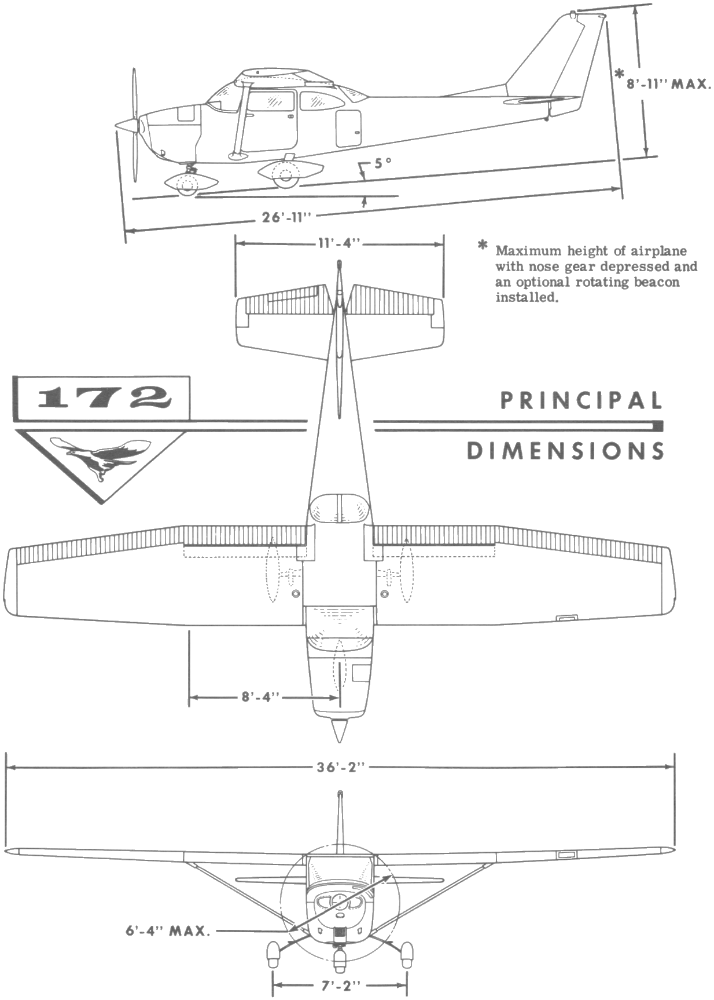
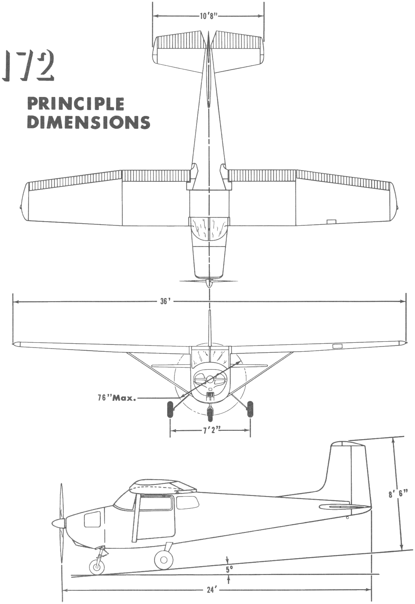
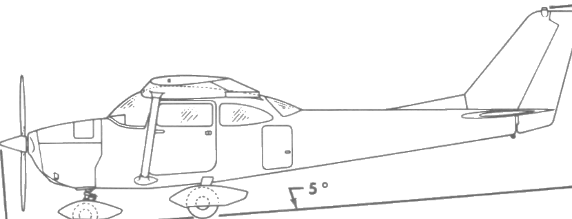
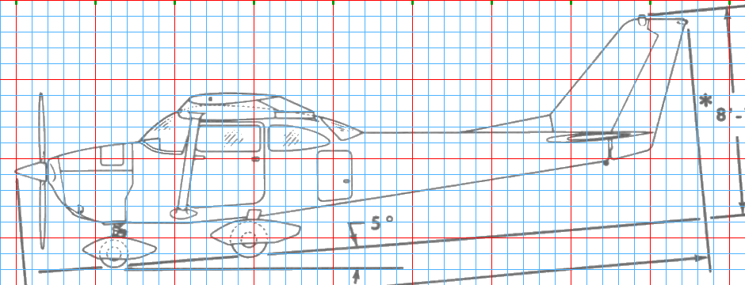
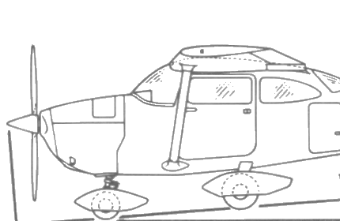
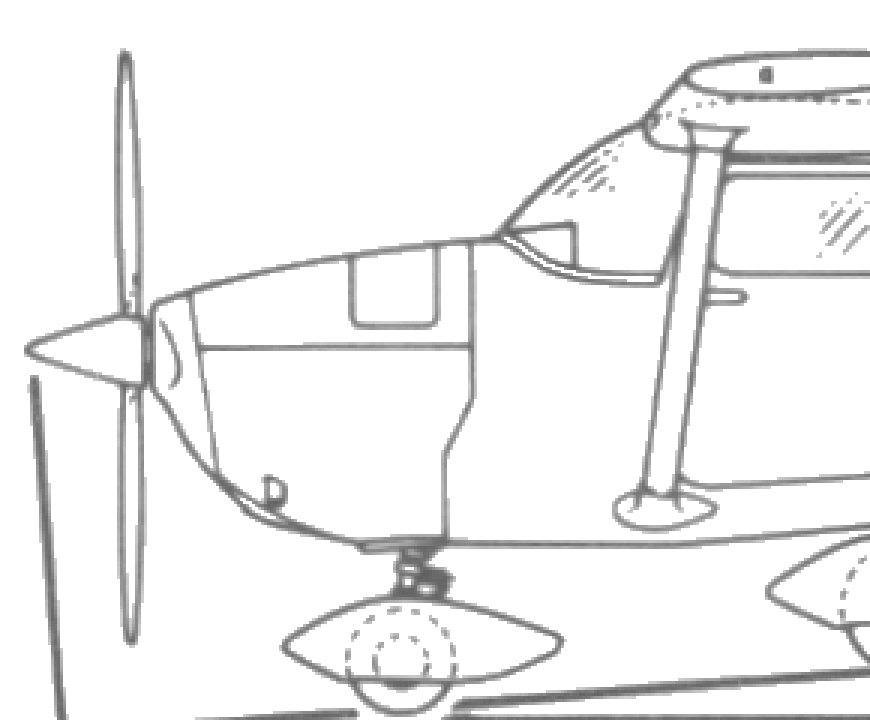
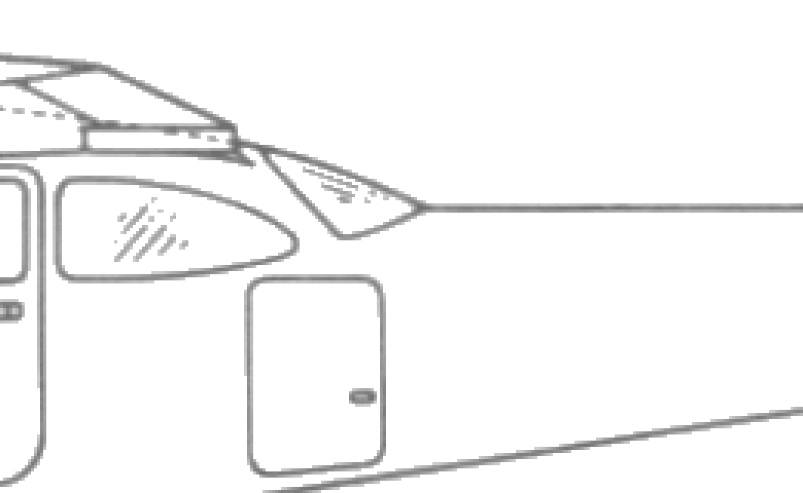
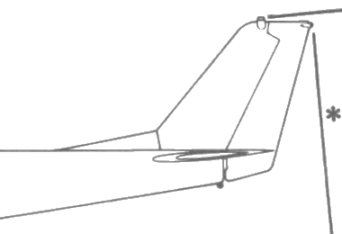
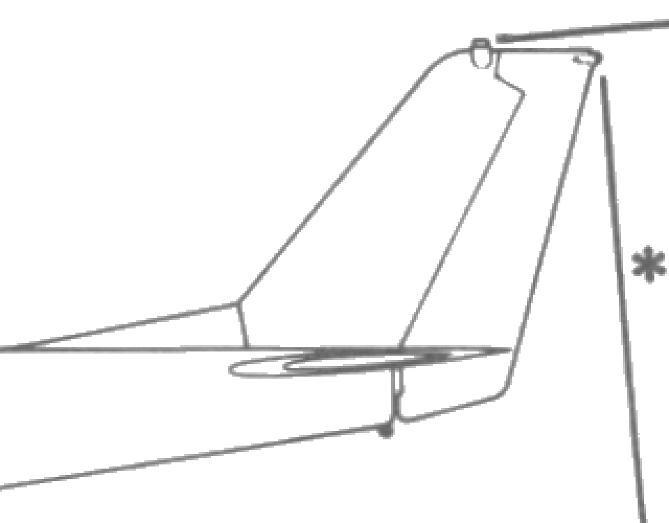

# Cessna 172 Skyhawk — reference gallery

Every image the model was built from, in one place, with where it came from and
what it settled. `c172_reference_dimensions.md` carries the numbers; this
carries the pictures and their provenance.

**Read the licence column before shipping anything.** `ASSET_LICENSES.md`
records that the Cessna reference material does not yet meet the minimum record
for release, and that a "not to be sold" statement in the C172 JSBSim data
blocks a blanket open-source release. The model geometry is original work;
these files are not.

This airframe was built before the SF50, and it shows in the gallery: its crops
were cut by hand rather than by a script, so unlike
`../../../Cirrus_Vision_Jet/agent_workspace/scripts/make_crops.py` there is no
one command that regenerates them. That is worth fixing if this model is ever
re-measured — see "What the two builds disagreed about" in
`docs/creating-an-aircraft-model.md`.

---

## Drawings

Every dimension in the model comes from these two.

| | |
|---|---|
|  | **`ref_Cessna_172G_Skyhawk_3-view_line_drawing.png`** — the drawing the station table was extracted from. [Wikimedia Commons](https://commons.wikimedia.org/wiki/File:Cessna_172G_Skyhawk_3-view_line_drawing.png). **It is posed, and that matters:** the aircraft is drawn nose-low by 1.35°, measured from the offset between the nose and main wheel contact points, so every vertical reading needs correcting for it. It is also a **172G**, while the published dimensions the model is scaled to are a **172S** — the gear track follows the modern figure while the shape was measured from the older drawing, which is recorded in the report as a known inaccuracy. |
|  | **`ref_Cessna_172_3-view_line_drawing.png`** — a second line drawing, used to cross-check the planform. [Wikimedia Commons](https://commons.wikimedia.org/wiki/File:Cessna_172_3-view_line_drawing.png). |

Scale was fixed from two known dimensions in different views — 859 px for
8.204 m in the side view and 1157 px for 11.02 m in the plan view, both giving
104.7 px/m. **That agreement is the check.** Unlike the SF50's, this drawing is
uniformly scaled.

---

## Measurement crops

Regions of the drawings above, cut at the resolution each reading was taken at.

| crop | what it is for |
|---|---|
|  | `crop_side` — the side view. The longitudinal split read off this is the measurement that mattered most: the first blockout had 2.75 m ahead of the wing leading edge and 5.53 m behind, against a measured **1.94 and 6.34**. That single error is what made it read as a stubby generic high-wing |
|  | `ruler_side` — the side view with the pixel scale marked, which is how 104.7 px/m was established and checked |
|  | `crop_nose` — cowl and spinner |
|  | `crop_nose2` — the same at a second scale |
|  | `crop_rearcabin` — the cabin roof under the wing and the rear window. The roof follows the wing's lower surface across the chord, so the two are one structure with no gap |
|  | `crop_tail` — the fin, its dorsal fillet and the forward-raked rudder hinge |
|  | `crop_tail2` — the tail-cone top line, which is nearly level; almost all the taper comes from the belly sweeping up, and converging both lines symmetrically gives a generic dart |

---

## Published figures

Not images, but the other half of the record — the dimensions the drawing was
scaled against.

- [Cessna 172S Skyhawk — This Day in Aviation](https://www.thisdayinaviation.com/tag/cessna-172s-skyhawk/) — overall dimensions
- [Cessna 172 Skyhawk — Dimensions.com](https://www.dimensions.com/element/cessna-172-skyhawk-aircraft) — three-view dimensions
- [Cessna 172 specifications — flugzeuginfo.net](https://www.flugzeuginfo.net/acdata_php/acdata_cessna172_en.php) — chords, dihedral, wing area

Wing area is the figure that did real work: 16.17 m² cannot be produced by a
simple root-to-tip taper, which forced a constant-chord inboard section running
to about 2.3 m from the centreline. That is visible in the planform and would
have been missed by eyeballing the drawing.

---

## Downloaded models, treated as hypotheses

Both are in `../../tests/` and neither contributed a dimension.

| model | verdict |
|---|---|
| `cessna_172_low_poly_flight_sim_optimized.glb` | 724 tris. Dimensions exactly right, **shape wrong** — a lens-shaped "banana" fuselage, no cabin, no tail cone, stick-and-ball gear. Kept as a negative example: correct overall dimensions do not imply a correct shape, which is the reason Stage 1 of the process doc says not to start from an existing model |
| `Low-Poly_Cessna_172/Low-Poly_Cessna_172.glb` | 5490 tris. Genuinely reads as a C172 and was useful for planform and front-view proportion only; far over budget, arbitrary pose, kitbashed materials (`F16_*`), and a bulbous side profile |

**No photographs.** That is the gap. The SF50's build showed what photographs
settle that a drawing cannot — window counts, fairing size, which way a gear
leg folds — and this airframe was measured without any. Its report's list of
known inaccuracies is where that shows.
